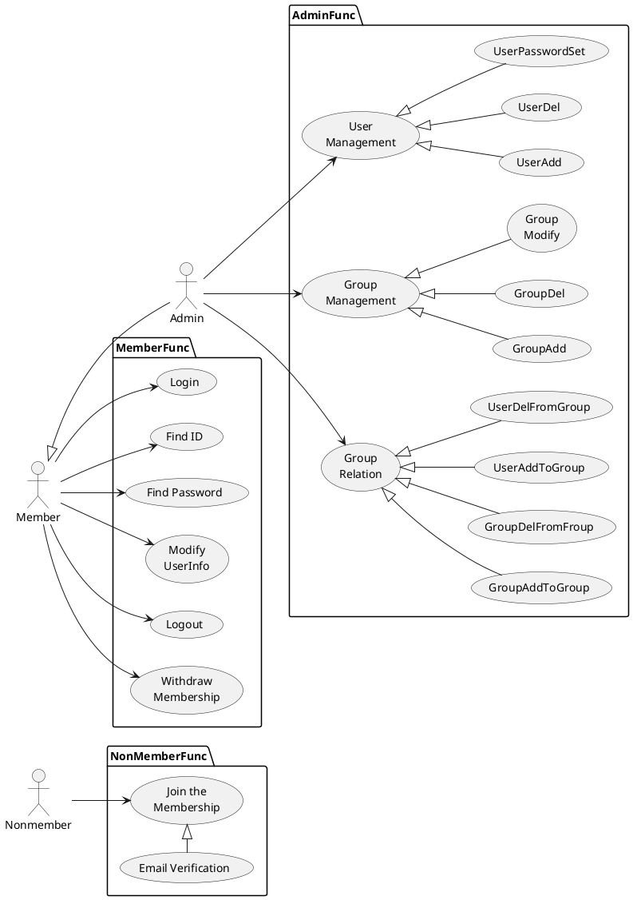
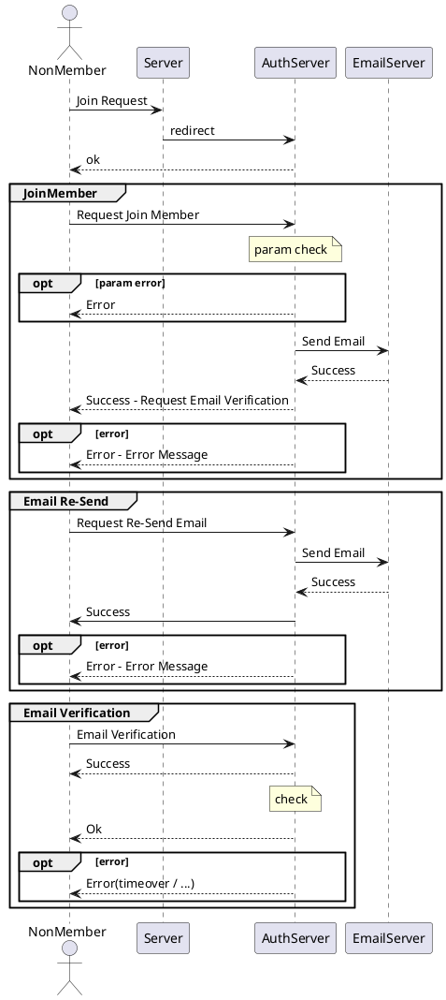
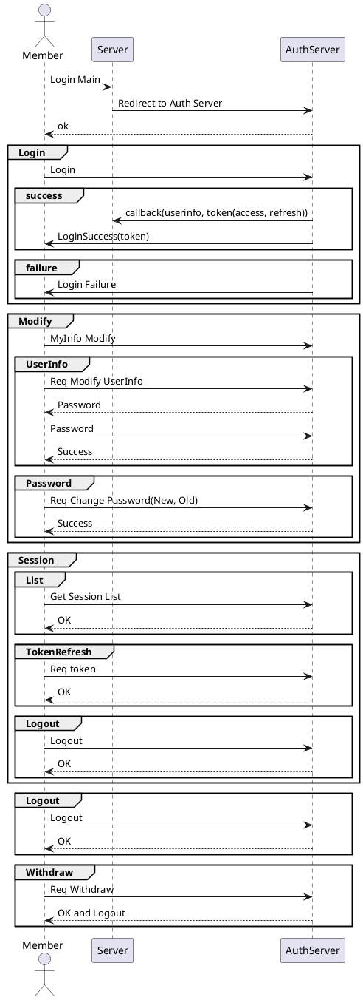
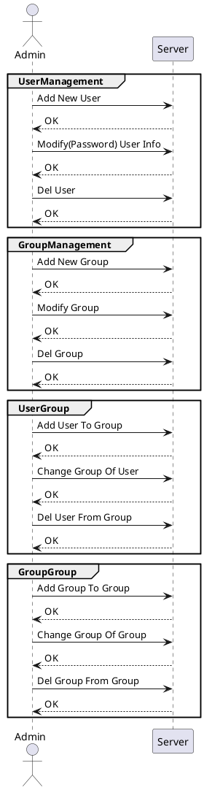

---
사용자 관리 설계 문서
---

# 사용자 관리

## 1. 개요

본 문서는 사용자의 활동을 기록하고 관리하기 위한 기능(Audit)설계 문서로 유스케이스, 인터페이스, 시퀀스, 클래스, 데이터베이스 설계서를 포함한다.

## 2. 요구사항

- 일반 요구사항  
  - 아이디는 이메일 형태  
  - 다중 세션을 허용  
    - 다중 세션의 범위는 보안 요구사항(접속 알림, 다중국가 불가)을 만족하면서  
  - 사용자는 여러개의 그룹에 소속될 수 있음  
  - 그룹은 트리 형태로 구성
- 사용자 보안 요구사항  
  - ID/패스워드 기반 로그인  
    - 사용자 ID는 고유해야 하며, 중복 등록을 방지해야 한다.  
    - 패스워드는 안전한 해시 알고리즘(Bcrypt, Argon2 등)으로 저장해야 한다.  
    - 패스워드의 최소 길이는 8자 이상으로 하고, 대문자, 소문자, 숫자, 특수문자를 포함하도록 한다.  
    - 로그인 실패 시 일정 횟수(예: 5회) 초과하면 계정을 잠그고, 일정 시간 후 다시 시도할 수 있도록 한다.  
  - 비밀번호 정책  
    - 사용자는 일정 기간(예: 90일)마다 비밀번호를 변경해야 한다.  
    - 최근 사용한 비밀번호(예: 5개)는 재사용할 수 없도록 한다.  
    - 패스워드는 최소한 다음 기준을 충족해야 한다.  
    - 대소문자, 숫자, 특수문자 포함  
    - 공백 포함 불가  
    - 일반적으로 사용되는 쉬운 비밀번호(예: 12345678, password1 등) 차단  
  - 자동 로그아웃  
    - 사용자가 일정 시간(예: 10분) 동안 활동이 없을 경우 자동으로 로그아웃 처리한다.  
    - 민감한 작업(예: 비밀번호 변경, 결제 정보 변경 등) 수행 시 재인증(패스워드)을 요구한다.  
  - 세션 및 토큰 관리  
    - JWT 사용 시, 토큰은 암호화 및 서명하여 저장해야 한다.  
    - 세션 쿠키는 HttpOnly, Secure, SameSite=Strict 옵션을 적용해야 한다. ?? 
    - 사용자가 로그아웃하면 해당 세션과 인증 토큰을 즉시 무효화해야 한다.
- 계정 보안 요구사항
  - 계정 잠금 및 복구
    - 여러 번 로그인 실패(예: 5회) 시 계정을 잠그고, 이메일 또는 관리자 승인 후 해제해야 한다.  
    - 계정 복구 시 이메일 인증, 보안 질문 또는 2FA를 요구해야 한다.  
  - 로그 및 감사(Audit Logging)
    - 사용자 로그인, 로그아웃, 비밀번호 변경, 계정 생성/삭제 등의 이벤트를 기록해야 한다.
    - 로그는 최소 6개월 이상 저장하고, 변경할 수 없도록 보호해야 한다.
  - 의심스러운 활동 탐지
    - 동일한 계정으로 여러 위치에서 로그인 시 알림을 제공해야 한다.
    - 비정상적인 로그인 시도(예: 여러 국가에서 로그인 시도)를 감지하고 차단할 수 있어야 한다.
- 권한 관리 보안 요구사항  
  - 역할 기반 접근 제어(RBAC)
    - 사용자 그룹(예: 관리자, 일반 사용자, 게스트 등)에 따라 접근 권한을 설정해야 한다.
    - 최소 권한 원칙(Principle of Least Privilege, POLP)을 적용해야 한다.
    - 관리자는 시스템 내에서 특정 역할을 가진 사용자만 생성할 수 있어야 한다.
  - 권한 상승 방지
    - 사용자가 임의로 자신의 권한을 변경할 수 없도록 해야 한다.
    - 관리자 계정의 생성 및 수정은 로그로 기록하고, 감사가 가능해야 한다.
  - API 접근 권한 설정
    - API 호출 시 사용자 인증 및 권한 검사를 수행해야 한다.
    - 관리 기능을 수행하는 API는 추가적인 인증(예: API 키, OAuth 2.0 등)을 요구해야 한다.
- 기타 보안 요구사항
  - 데이터 보호 및 암호화
    - 비밀번호는 평문 저장을 금지하고, 안전한 해시 함수(Bcrypt, PBKDF2, Argon2 등)를 사용해야 한다.
    - 사용자의 중요한 정보(예: 이메일, 전화번호 등)는 저장 시 암호화해야 한다.
  - 외부 공격 방어
    - 브루트포스 공격을 방지하기 위해 CAPTCHA 또는 지연 응답(예: 1초 딜레이)을 적용한다.
    - CSRF(Cross-Site Request Forgery) 보호를 위해 CSRF 토큰을 사용한다.
    - XSS(Cross-Site Scripting) 방지를 위해 입력 값을 필터링 및 인코딩한다.
  - 탈퇴 및 데이터 삭제 정책
    - 사용자가 계정을 탈퇴하면 모든 관련 데이터를 안전하게 삭제해야 한다.
    - 일부 데이터(법적 요구사항에 따라 보존해야 하는 기록)는 별도로 관리해야 한다.

### 2.1. Rate Limiting

사용자 관련 API에서 Rate Limit(속도 제한) 을 적용해야 하는 주요 부분

(1) 로그인 API (Authentication)  
예: POST /api/auth/login  
이유:  
브루트포스 공격(무차별 대입 공격) 방지  
자동화된 로그인 시도(봇 공격) 방지  
추천 제한:  
동일 IP에서 510회 실패 시 515분 동안 로그인 차단  
CAPTCHA 적용 후 일정 횟수(예: 10회) 초과 시 추가 차단  

(2) 회원가입 API (Sign-Up)  
예: POST /api/auth/register  
이유:  
자동화된 계정 생성(스팸 가입) 방지  
추천 제한:  
동일 IP에서 10~20회/시간 이상 요청 시 차단  
CAPTCHA 또는 이메일 인증을 필수로 요구  

(3) 비밀번호 찾기/재설정 API  
예: POST /api/auth/reset-password 또는 POST /api/auth/forgot-password  
이유:  
무차별 대입 공격을 통한 계정 탈취 방지  
과도한 요청으로 이메일/SMS API 비용 증가 방지  
추천 제한:  
동일 IP에서 5~10회/시간 이상 요청 시 차단  
동일 사용자(이메일, 전화번호) 기준 3~5회/시간 요청 제한  

(4) API 토큰 생성 API  
예: POST /api/auth/generate-token  
이유:  
API 키 및 토큰 생성 남용 방지  
추천 제한:  
동일 사용자당 3~5회/시간 이상 요청 시 제한  

(5) 사용자 프로필 업데이트 API  
예: PUT /api/user/profile  
이유:  
과도한 요청으로 인해 서버 부하 증가 방지  
추천 제한:  
동일 계정에서 5~10회/시간 이상 요청 시 제한  

(6) 게시글 작성/댓글 API (스팸 방지)  
예: POST /api/posts 또는 POST /api/comments  
이유:  
자동화된 스팸 댓글, 도배 방지  
추천 제한:  
동일 IP 또는 계정에서 10~20회/분 이상 요청 시 제한  

(8) 검색 API (DDoS 방지)  
예: GET /api/search?q=...  
이유:  
과도한 검색 요청으로 인한 서버 부하 방지  
추천 제한:  
동일 IP에서 10~20회/분 이상 요청 시 제한  

#### Rate Limit 적용 방법

1. IP 기반 제한
    - 동일 IP에서 일정 횟수 이상 요청 시 차단 (예: X회/분, Y회/시간)
    - 공용 네트워크(회사, 카페 등)에서는 예외 처리 필요
2. 사용자 계정 기반 제한
    - 로그인한 사용자 기준으로 일정 횟수 이상 요청 시 제한
    - 계정 탈취 시도 방지를 위해 적용
3. 지수적 백오프(Exponential Backoff)
    - 실패 횟수 증가 시 대기 시간 늘리기 (예: 5회 실패 → 5분 대기, 10회 실패 → 30분 대기)
4. Rate Limit 헤더 제공
    - 클라이언트가 남은 요청 횟수를 알 수 있도록 X-RateLimit-Limit, X-RateLimit-Remaining, X-RateLimit-Reset 헤더 추가
5. 서버 측 로그 기록 및 알림
    - 이상 탐지 시 관리자에게 알림 (예: 특정 계정에서 짧은 시간 동안 로그인 시도 100회)

## 3. Usecase

## 4. 시퀀스 & 인터페이스

- 비회원  
  - 회원가입  
  - 이메일인증요청  

- 회원(관리자)
  - 로그인  
  - 아이디 찾기
  - 비밀번호 찾기  
  - 사용자 정보 변경  
  - 세션
    - 세션 조희  
    - 세션(토큰) 갱신
    - 세션 로그아웃
  - 로그아웃  
  - 회원탈퇴  
  

- 관리자
  - 사용자  
    - 추가  
    - 수정  
    - 삭제  
  - 그룹
    - 추가  
    - 수정  
    - 삭제  
  - 사용자_그룹  
    - 추가  
    - 수정  
    - 삭제  
  - 그룹_그룹
    - 추가  
    - 수정  
    - 삭제  

---

회원가입 / 로그인 / 로그아웃의 경우 인증서버와의 연동에 따라 개발 필요성이 없을 수 있다.
따라서 이 문서에서 인터페이스를 정의하지 않는다.  

> 인증 시스템에서 보안과 관련된 내용 확인 필요  

1. Non Member  
   1. SignUp  
        Reqquest  
        Response  
   2. Email  
        Reqquest  
        Response  
   3. EmailLink...

2. Member
   1. Login
   2. Find ID
   3. Find PW
   4. Modify User Info
   5. Session
      1. List
      2. Refresh
      3. Session Logout
   6. Logout
   7. Withdraw

3. Admin
   1. User Management
   2. Group Management

## 5. 클래스

| 유형                    | 기호    | 목적                                                                   |
| ----------------------- | ------- | ---------------------------------------------------------------------- |
| 의존성(Association)     | `-->`   | 객체가 다른 객체를 사용함. ( A `-->` B)                                |
| 확장(Inheritance)       | `<\|--` | 계층 구조에서 클래스의 특수화. (부모 `<\|--` 자식)                     |
| 구현(Implementation)    | `<\|..` | 클래스에 의한 인터페이스의 실현. (Interface `<\|..` Class)             |
| 약한 의존성(Dependency) | `..>`   | 더 약한 형태의 의존성. A 클래스 메소스 파라미터로 B를 사용( A `..>` B) |
| 집합(Aggregation)       | `o--`   | 부분이 전체와 독립적으로 존재할 수 있음( 클래스 `o--` 부분 클래스)     |
| 컴포지션(Composition)   | `*--`   | 부분이 전체 없이 존재할 수 없음( 클래스 `*--` 부분 클래스)             |

```plantuml
@startuml
' abstract        abstract
' abstract class  "abstract class"
' annotation      annotation
' circle          circle
' ()              circle_short_form
' class           class
' class           class_stereo  <<stereotype>>
' diamond         diamond
' <>              diamond_short_form
' entity          entity
' enum            enum
' exception       exception
' interface       interface
' metaclass       metaclass
' protocol        protocol
' stereotype      stereotype
' struct          struct

class           User
class           Group
class           Relation
@enduml
```

## 6. 데이터베이스

**User**  

| Column       | Data Type                             | Constraints               | Index | Desc                  |
| ------------ | ------------------------------------- | ------------------------- | :---: | --------------------- |
| `id`         | UUID                                  | PRIMARY KEY               |   v   | 사용자 테이블 PK Key  |
| `email`      | VARCHAR(255)                          | UNIQUE, NOT NULL          |   v   | 사용자 아이디(이메일) |
| `password`   | VARCHAR(255)                          | NOT NULL                  |       | 사용자 암호           |
| `name`       | VARCHAR(255)                          | NOT NULL                  |       | 사용자 이름           |
| `nickname`   | VARCHAR(255)                          | NOT NULL                  |       | 사용자 별칭           |
| `phone`      | VARCHAR(255)                          |                           |       | 사용자 연락처         |
| `status`     | ENUM('Active', 'Inactive', 'Dormant') | DEFAULT 'Inactive'        |       | 사용자 계정 상태      |
| `created_at` | TIMESTAMP                             | NOT NULL                  |       | 사용자 계정 생성일    |
| `updated_at` | TIMESTAMP                             | DEFAULT CURRENT_TIMESTAMP |       | 사용자 계정 수정일    |

---

**Group (그룹)**  

| Column        | Data Type    | Constraints               | Index | Desc        |
| ------------- | ------------ | ------------------------- | :---: | ----------- |
| `id`          | UUID         | PRIMARY KEY               |   v   | 그룹 아이디 |
| `name`        | VARCHAR(255) | UNIQUE, NOT NULL          |   v   | 그룹 이름   |
| `nickname`    | VARCHAR(255) |                           |       |             |
| `description` | TEXT         |                           |       |             |
| `created_at`  | TIMESTAMP    | NOT NULL                  |       |             |
| `updated_at`  | TIMESTAMP    | DEFAULT CURRENT_TIMESTAMP |       |             |

---

**GroupUserRelation( 그룹 - 그룹 or 그룹 - 사용자 관계 정보 테이블)**  

| Column       | Data Type             | Constraints                                     | Index |
| ------------ | --------------------- | ----------------------------------------------- | :---: |
| `parents_id` | UUID                  | FOREIGN KEY → `Group(id)`, NOT NULL             |   v   |
| `child_type` | ENUM('Group', 'User') | NOT NULL                                        |   v   |
| `child_id`   | UUID                  | FOREIGN KEY → `Group(id) or User(id)`, NOT NULL |   v   |
| `joined_at`  | TIMESTAMP             | DEFAULT CURRENT_TIMESTAMP                       |       |

---

**Session**  

| Column            | Data Type   | Constraints                                   | Index | Desc                                 |
| ----------------- | ----------- | --------------------------------------------- | :---: | ------------------------------------ |
| `session_id`      | CHAR(64)    | PRIMARY KEY                                   |   v   | 세션 고유 식별자(sha256 해시)        |
| `user_id`         | UUID        | FOREIGN KEY → `User(id)`, NOT NULL            |   v   | 사용자 테이블의 아이디               |
| `access_token`    | TEXT        | NOT NULL                                      |       | 세션 액세스 토큰(JWT 또는 랜덤 토큰) |
| `refresh_token`   | TEXT        | NOT NULL                                      |       | 리프레시 토큰                        |
| `ip_address`      | VARCHAR(45) | NOT NULL                                      |       | 사용자 로그인 IP                     |
| `user_agent`      | TEXT        | NOT NULL                                      |       | 사용자의 브라우저/기기 정보          |
| `created_at`      | DATETIME    | NOT NULL, DEFAULT CURRENT_TIMESTAMP           |       | 세션 생성 시간                       |
| `expires_at`      | DAATTIME    | NOT NULL                                      |       | 세션 만료 시간                       |
| `last_activity`   | DATETIME    | NOT NULL, DEFAULT CURRENT_TIMESTAMP ON UPDATE |       | 마지막 요청 시간                     |
| `is_active`       | BOOLEAN     | NOT NULL, DEFAULT TRUE                        |       | 세션 활성 여부(로그아웃 FALSE)       |
| `failed_attempts` | INT         | NOT NULL, DEFAULT 0                           |       | 로그인 실패 횟수                     |

---

## 4. Role (역할)

| Column       | Data Type   | Constraints                  | Index |
|-------------|------------|------------------------------|-------|
| `id`        | UUID       | PRIMARY KEY                  | ✅    |
| `name`      | VARCHAR(255) | UNIQUE, NOT NULL            | ✅    |
| `description` | TEXT      |                              |       |

---

## 5. User_Role (사용자 - 역할 관계)

| Column    | Data Type | Constraints                       | Index |
|-----------|----------|-----------------------------------|-------|
| `user_id` | UUID     | FOREIGN KEY → `User(id)`, NOT NULL | ✅    |
| `role_id` | UUID     | FOREIGN KEY → `Role(id)`, NOT NULL | ✅    |

---

## 6. Group_Role (그룹 - 역할 관계)

| Column    | Data Type | Constraints                       | Index |
|-----------|----------|-----------------------------------|-------|
| `group_id` | UUID    | FOREIGN KEY → `Group(id)`, NOT NULL | ✅    |
| `role_id`  | UUID    | FOREIGN KEY → `Role(id)`, NOT NULL | ✅    |

---

## 7. Permissions (권한)

| Column      | Data Type   | Constraints                          | Index |
|------------|------------|--------------------------------------|-------|
| `id`       | UUID       | PRIMARY KEY                          | ✅    |
| `name`     | VARCHAR(255) | UNIQUE, NOT NULL                    | ✅    |
| `resource` | VARCHAR(255) | NOT NULL                            | ✅    |
| `action`   | ENUM('READ', 'WRITE', 'UPDATE', 'DELETE') | NOT NULL |       |

---

## 8. Role_Permission (역할 - 권한 관계)

| Column       | Data Type | Constraints                          | Index |
|-------------|----------|--------------------------------------|-------|
| `role_id`   | UUID     | FOREIGN KEY → `Role(id)`, NOT NULL  | ✅    |
| `permission_id` | UUID  | FOREIGN KEY → `Permissions(id)`, NOT NULL | ✅    |

---

## 9. Attributes (속성)

| Column       | Data Type   | Constraints                          | Index |
|-------------|------------|--------------------------------------|-------|
| `id`        | UUID       | PRIMARY KEY                          | ✅    |
| `name`      | VARCHAR(255) | NOT NULL                            | ✅    |
| `value`     | TEXT       | NOT NULL                            |       |
| `entity_type` | ENUM('User', 'Group', 'Role', 'Resource') | NOT NULL |       |
| `entity_id`  | UUID      | NOT NULL                             | ✅    |

---

## 10. Permission_Attributes (권한 - 속성 관계)

| Column         | Data Type | Constraints                           | Index |
|--------------|----------|---------------------------------------|-------|
| `permission_id` | UUID  | FOREIGN KEY → `Permissions(id)`, NOT NULL | ✅    |
| `attribute_id`  | UUID  | FOREIGN KEY → `Attributes(id)`, NOT NULL | ✅    |

---

## 11. Session (사용자 세션)

| Column       | Data Type   | Constraints                          | Index |
|-------------|------------|--------------------------------------|-------|
| `id`        | UUID       | PRIMARY KEY                          | ✅    |
| `user_id`   | UUID       | FOREIGN KEY → `User(id)`, NOT NULL  | ✅    |
| `device_info` | TEXT     | NOT NULL                            |       |
| `ip_address` | VARCHAR(255) | NOT NULL                            | ✅    |
| `created_at` | TIMESTAMP | DEFAULT CURRENT_TIMESTAMP            |       |
| `expires_at` | TIMESTAMP | NOT NULL                             | ✅    |

---

## 12. Audit_Log (감사 로그)

| Column        | Data Type   | Constraints                              | Index |
|--------------|------------|------------------------------------------|-------|
| `id`         | UUID       | PRIMARY KEY                              | ✅    |
| `user_id`    | UUID       | FOREIGN KEY → `User(id)`, NULL 가능      | ✅    |
| `session_id` | UUID       | FOREIGN KEY → `Session(id)`, NULL 가능   | ✅    |
| `role_id`    | UUID       | FOREIGN KEY → `Role(id)`, NULL 가능      |       |
| `resource`   | VARCHAR(255) | NOT NULL                                | ✅    |
| `action`     | ENUM('READ', 'WRITE', 'UPDATE', 'DELETE') | NOT NULL |       |
| `status`     | ENUM('SUCCESS', 'ACCESS_DENIED', 'INVALID_SESSION') | NOT NULL | |
| `reason`     | TEXT       | NULL 가능                                |       |
| `timestamp`  | TIMESTAMP  | DEFAULT CURRENT_TIMESTAMP                | ✅    |

---

# 🔹 추가적인 데이터베이스 최적화
1. **Index 적용**
   - 자주 검색되는 `user_id`, `session_id`, `role_id`, `resource` 등에 인덱스 적용
   - `Audit_Log`의 `timestamp`에 인덱스 추가하여 로그 조회 성능 향상

2. **데이터 보존 정책**
   - `Audit_Log` 테이블은 일정 기간(예: 6개월) 후 `archive_audit_log` 테이블로 이전

3. **Partitioning (파티셔닝)**
   - `Audit_Log`을 월별 파티셔닝하여 대용량 데이터 최적화 (`audit_log_2024_02` 등)

4. **Foreign Key 제약 적용**
   - 데이터 무결성을 유지하기 위해 외래 키 설정 (`ON DELETE CASCADE` 옵션 고려 가능)
   - 

# 2. 저장소 가상화 

## 12. Audit_Log (감사 로그)

| Column        | Data Type   | Constraints                              | Index |
|--------------|------------|------------------------------------------|-------|
| `id`         | UUID       | PRIMARY KEY                              | ✅    |
| `user_id`    | UUID       | FOREIGN KEY → `User(id)`, NULL 가능      | ✅    |
| `session_id` | UUID       | FOREIGN KEY → `Session(id)`, NULL 가능   | ✅    |
| `role_id`    | UUID       | FOREIGN KEY → `Role(id)`, NULL 가능      |       |
| `resource`   | VARCHAR(255) | NOT NULL                                | ✅    |
| `action`     | ENUM('READ', 'WRITE', 'UPDATE', 'DELETE') | NOT NULL |       |
| `status`     | ENUM('SUCCESS', 'ACCESS_DENIED', 'INVALID_SESSION') | NOT NULL | |
| `reason`     | TEXT       | NULL 가능                                |       |
| `timestamp`  | TIMESTAMP  | DEFAULT CURRENT_TIMESTAMP                | ✅    |