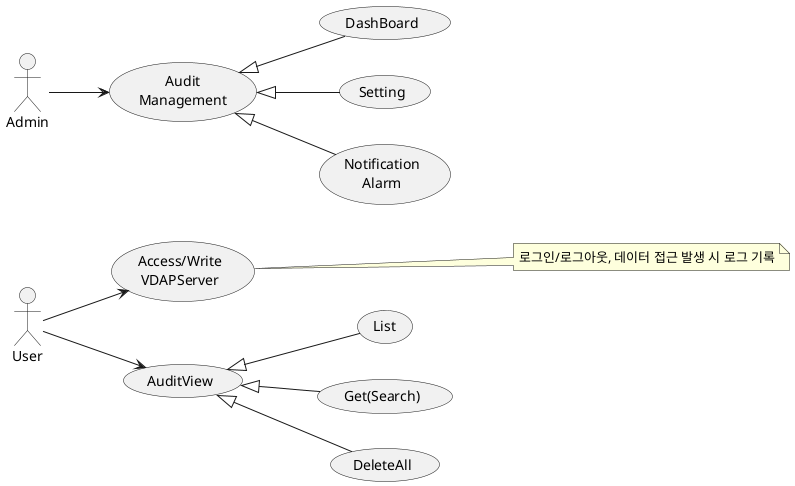
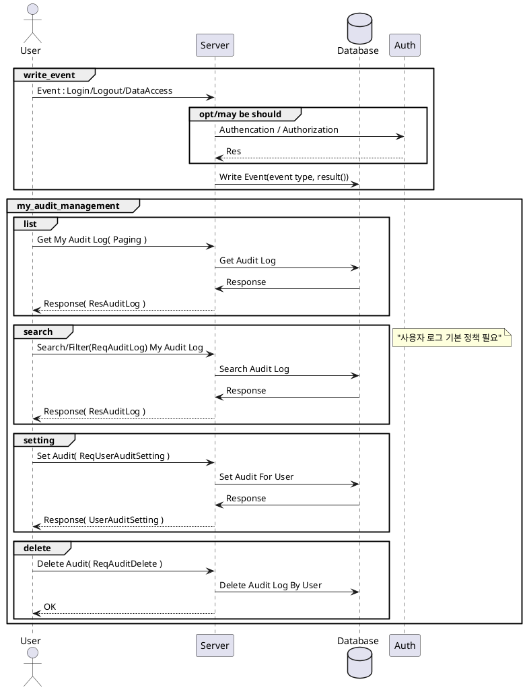
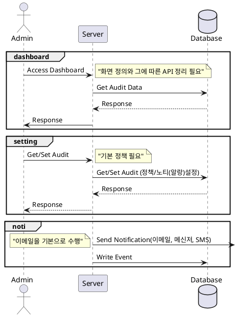
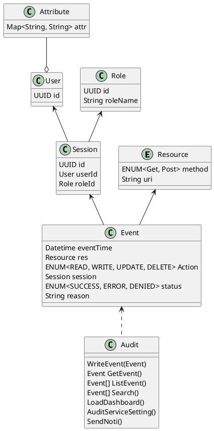

# 사용자 활동

## 1. 개요

본 문서는 사용자의 활동을 기록하고 관리하기 위한 기능(Audit)설계 문서로 유스케이스, 인터페이스, 시퀀스, 클래스, 데이터베이스 설계서를 포함한다.

## 2. 요구사항

**기능적 요구사항(Functional Requirements)**  

- 로그 수집(Audit Log Collection)
  - API 호출 및 데이터베이스 쿼리 내역 기록.
- 로그 보존(Retention)
  - 조직의 정책 및 법적 요구사항에 따라 특정 기간 동안 로그를 보관(예: 1년, 5년 등).
  - 일정 기간 이후 로그 자동 삭제 또는 압축.
- 검색 및 조회(Search & Query)
  - 특정 사용자, IP, 시간 범위 등의 조건으로 로그 검색 가능.
  - 로그 내 특정 이벤트(예: 실패한 로그인 시도) 필터링 기능 제공.
- 실시간 모니터링(Real-time Monitoring)
- 이벤트 알림(Notification)
  - 관리자에게 중요한 이벤트 발생 시 알림(Notification) 제공.
  - 예: 연속된 로그인 실패, 권한 없는 데이터 접근 시 관리자에게 이메일/SMS 알림.

> 다음은 구현에 넣기 어려워서...

- 로그 무결성 검증(Integrity Verification)
- 로그가 변조되지 않도록 해시(Hash) 및 디지털 서명 적용.
- 원본 로그와 비교하여 무결성 검증 수행.
- 보고서 생성(Reporting)
  - 사용자 활동에 대한 주기적인 리포트 생성(일별, 주별, 월별).
  - CSV, PDF 등의 포맷으로 로그 내보내기(export).

---

**비기능적 요구사항(Non-functional Requirements)**  

- 고가용성(High Availability)
  - 로그 수집 및 저장 시스템이 장애 없이 지속적으로 운영될 수 있도록 설계.
- 성능(Performance)
  - 실시간 로그 수집 시 성능 저하 없이 동작해야 함.
  - 대량의 로그 데이터 검색 시 빠른 응답 속도를 보장.
- 확장성(Scalability)
  - 사용자 수 증가 및 데이터 양 증가 시에도 확장 가능하도록 설계.
- 사용자 친화적 UI(User-Friendly UI)
  - 관리자 및 보안 담당자가 쉽게 로그를 분석할 수 있는 대시보드 제공.

---

**보안 고려사항(Security Considerations)**  

1. 로그 무결성 보호(Integrity)
    - 로그 변조 방지를 위해 암호화(HMAC, SHA-256, SHA-512) 및 디지털 서명 적용.
    - 데이터 무결성을 위해 WORM(Write Once, Read Many) 스토리지 사용.

2. 접근 제어(Access Control)
    - 민감한 로그 접근 권한을 제한(예: 관리자만 접근 가능).  
    - RBAC(Role-Based Access Control) 적용하여 역할별 접근 제어.
    - MFA(다중 인증) 적용하여 중요한 로그에 대한 접근 보안 강화.

3. 로그 보안 저장(Storage Security)
    - 로그 데이터 암호화(예: AES-256) 적용.
    - 저장소에 대한 강력한 액세스 제어 및 모니터링.

4. 데이터 전송 보안(Transport Security)
    - 로그 전송 시 TLS(Transport Layer Security) 1.2 이상 사용.
    - API 기반 로그 전송 시 OAuth 또는 JWT 인증 적용.

5. 로그 삭제 및 보존 정책(Log Retention & Deletion Policy)
    - 법적 요건에 따라 최소 및 최대 보존 기간 설정.
    - 특정 조건(예: 5년 경과, 특정 규정 준수) 충족 시 자동 삭제.

6. 침해 탐지(Incident Detection)
    - 이상 활동 탐지 시스템(IDS/IPS) 연계하여 비정상적인 로그 이벤트 감지.
    - 예: 일반적인 사용 패턴과 다른 IP에서의 다중 로그인 시도 감지.

---

1. **Index 적용**
   - `Audit_Log`의 `timestamp`에 인덱스 추가하여 로그 조회 성능 향상

2. **데이터 보존 정책**
   - `Audit_Log` 테이블은 일정 기간(예: 6개월) 후 `archive_audit_log` 테이블로 이전

3. **Partitioning (파티셔닝)**
   - `Audit_Log`을 월별 파티셔닝하여 대용량 데이터 최적화 (`audit_log_2024_02` 등)  

## 3. Usecase

## 4. 시퀀스 & 인터페이스

### 사용자
  
- 이벤트
  - 로그인/로그아웃
  - OpenVDAP API Access(method, uri, response(code), reason)
- 내 활동 확인
  - List
  - Search
  - Notification(?)
  - Delete
  - Setting(?)

> API Access 와 특정 이벤트(로그인, 로그아웃, 데이터 검색, 데이터 접근)을 분리할 것인가는 고민
> 분리할 경우 데이터를 가져가서 사용하는 입장에서는 전처리 과정이 축소될 수 있음.
> ...

### 관리자

- Dashboard
- Setting
- Notification

---

## 5. 클래스

| 유형                    | 기호    | 목적                                                                   |
| ----------------------- | ------- | ---------------------------------------------------------------------- |
| 의존성(Association)     | `-->`   | 객체가 다른 객체를 사용함. ( A `-->` B)                                |
| 확장(Inheritance)       | `<\|--` | 계층 구조에서 클래스의 특수화. (부모 `<\|--` 자식)                     |
| 구현(Implementation)    | `<\|..` | 클래스에 의한 인터페이스의 실현. (Interface `<\|..` Class)             |
| 약한 의존성(Dependency) | `..>`   | 더 약한 형태의 의존성. A 클래스 메소스 파라미터로 B를 사용( A `..>` B) |
| 집합(Aggregation)       | `o--`   | 부분이 전체와 독립적으로 존재할 수 있음( 클래스 `o--` 부분 클래스)     |
| 컴포지션(Composition)   | `*--`   | 부분이 전체 없이 존재할 수 없음( 클래스 `*--` 부분 클래스)             |

## 6. 데이터베이스

**Audit_Log(감사 로그)/Audit_Log_Archive**  

| Column       | Data Type                                           | Constraints                            | Index | Desc |
| ------------ | --------------------------------------------------- | -------------------------------------- | ----- | ---- |
| `id`         | UUID                                                | PRIMARY KEY                            | v     |      |
| `resource`   | VARCHAR(255)                                        | NOT NULL                               | v     |      |
| `user_id`    | UUID                                                | FOREIGN KEY → `User(id)`, NULL 가능    | v     |      |
| `session_id` | UUID                                                | FOREIGN KEY → `Session(id)`, NULL 가능 | v     |      |
| `action`     | ENUM('READ', 'WRITE', 'UPDATE', 'DELETE')           | NOT NULL                               |       |      |
| `status`     | ENUM('SUCCESS', 'ACCESS_DENIED', 'INVALID_SESSION') | NOT NULL                               |       |      |
| `reason`     | TEXT                                                | NULL 가능                              |       |      |
| `timestamp`  | TIMESTAMP                                           | DEFAULT CURRENT_TIMESTAMP              | v     |      |

**Audit_Setting**  

| Column       | Data Type                                           | Constraints                            | Index | Desc                            |
| ------------ | --------------------------------------------------- | -------------------------------------- | :---: | ------------------------------- |
| `id`         | UUID                                                | PRIMARY KEY                            |   v   |                                 |
| `event`      | VARCHAR(255)                                        | NOT NULL                               |   v   | 이벤트 타입을 적용할 지 고민임. |
| `user_id`    | UUID                                                | FOREIGN KEY → `User(id)`, NULL 가능    |   v   |                                 |
| `session_id` | UUID                                                | FOREIGN KEY → `Session(id)`, NULL 가능 |   v   |                                 |
| `role_id`    | UUID                                                | FOREIGN KEY → `Role(id)`, NULL 가능    |       |                                 |
| `action`     | ENUM('READ', 'WRITE', 'UPDATE', 'DELETE')           | NOT NULL                               |       |                                 |
| `status`     | ENUM('SUCCESS', 'ACCESS_DENIED', 'INVALID_SESSION') | NOT NULL                               |       |                                 |
| `reason`     | TEXT                                                | NULL 가능                              |       |                                 |
| `timestamp`  | TIMESTAMP                                           | DEFAULT CURRENT_TIMESTAMP              |   v   |                                 |

{
  "timestamp": "2025-02-05T12:34:56Z",
  "user_id": "john_doe",
  "event": "LOGIN_SUCCESS",
  "ip_address": "192.168.1.100",
  "user_agent": "Mozilla/5.0 (Windows NT 10.0; Win64; x64)",
  "location": "USA",
  "details": {
    "method": "OAuth",
    "device": "Desktop"
  }
}

{
  "timestamp": "2025-02-05T13:00:10Z",
  "user_id": "admin_01",
  "event": "FILE_DOWNLOAD",
  "file_name": "confidential_report.pdf",
  "file_path": "/secure/docs/",
  "ip_address": "203.0.113.45",
  "user_agent": "Chrome/110.0",
  "action_status": "SUCCESS"
}

---

시스템 활동에 대한 로그 관리도 필요하다고 보여짐.

- 사용자
  - 로그 정책 변경  
  - 로그 삭제  
- 관리자
  - 로그 정책 변경
    - 보관 기간
    - 알람 기준
      - Threashold
    - 노티 설정
      - 전달 방법과 대상 정보
- 서비스
  - 모니터링  
  - ...
