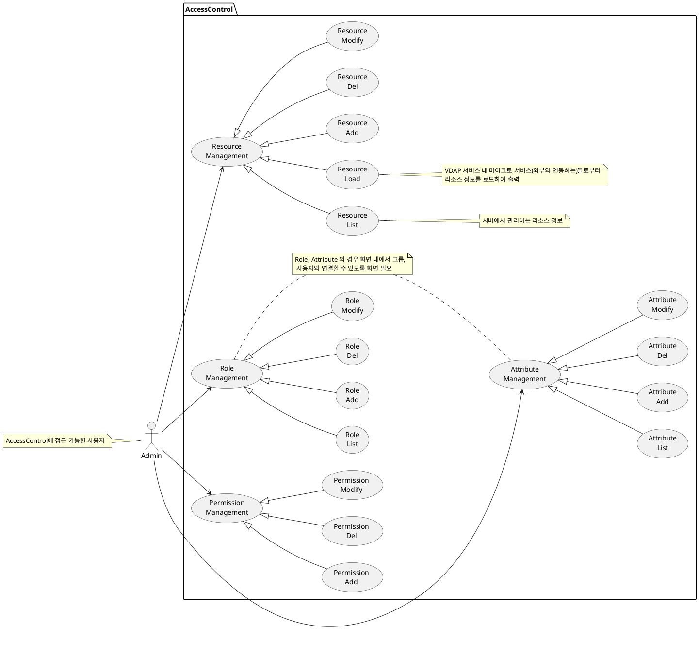
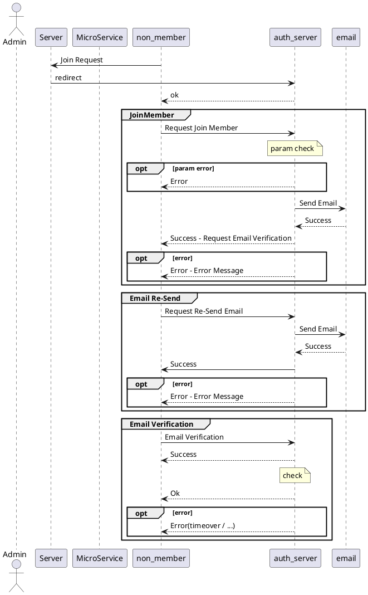
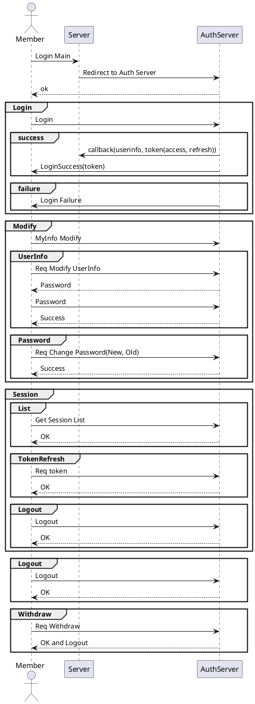
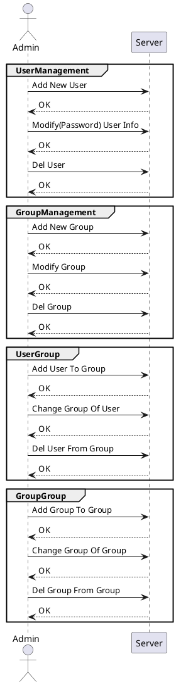

# 권한 관리 및 접근제어  

## 1. 개요

본 문서는 사용자의 접근 권한 관리와 접근제어에 대한 설계 문서로 유스케이스, 인터페이스, 시퀀스, 클래스, 데이터베이스 설계서를 포함한다.

## 2. 요구사항

- 권한 관리 보안 요구사항  
  - 역할 기반 접근 제어(RBAC)
    - 사용자 그룹(예: 관리자, 일반 사용자, 게스트 등)에 따라 접근 권한을 설정해야 한다.
    - 최소 권한 원칙(Principle of Least Privilege, POLP)을 적용해야 한다.
    - 관리자는 시스템 내에서 특정 역할을 가진 사용자만 생성할 수 있어야 한다.
  - 권한 상승 방지
    - 사용자가 임의로 자신의 권한을 변경할 수 없도록 해야 한다.
    - 관리자 계정의 생성 및 수정은 로그로 기록하고, 감사가 가능해야 한다.
  - API 접근 권한 설정
    - API 호출 시 사용자 인증 및 권한 검사를 수행해야 한다.
    - 관리 기능을 수행하는 API는 추가적인 인증(예: API 키, OAuth 2.0 등)을 요구해야 한다.

## 3. Usecase



## 4. 시퀀스 & 인터페이스

- Resource
  - Load
  - List
  - Add
  - Del
  - Modify



- 회원(관리자)
  - 로그인  
  - 아이디 찾기
  - 비밀번호 찾기  
  - 사용자 정보 변경  
  - 세션
    - 세션 조희  
    - 세션(토큰) 갱신
    - 세션 로그아웃
  - 로그아웃  
  - 회원탈퇴  
  


- 관리자
  - 사용자  
    - 추가  
    - 수정  
    - 삭제  
  - 그룹
    - 추가  
    - 수정  
    - 삭제  
  - 사용자_그룹  
    - 추가  
    - 수정  
    - 삭제  
  - 그룹_그룹
    - 추가  
    - 수정  
    - 삭제  



---

회원가입 / 로그인 / 로그아웃의 경우 인증서버와의 연동에 따라 개발 필요성이 없을 수 있다.
따라서 이 문서에서 인터페이스를 정의하지 않는다.  

> 인증 시스템에서 보안과 관련된 내용 확인 필요  

1. Non Member  
   1. SignUp  
        Reqquest  
        Response  
   2. Email  
        Reqquest  
        Response  
   3. EmailLink...

2. Member
   1. Login
   2. Find ID
   3. Find PW
   4. Modify User Info
   5. Session
      1. List
      2. Refresh
      3. Session Logout
   6. Logout
   7. Withdraw

3. Admin
   1. User Management
   2. Group Management

## 5. 클래스

| 유형                    | 기호    | 목적                                                                   |
| ----------------------- | ------- | ---------------------------------------------------------------------- |
| 의존성(Association)     | `-->`   | 객체가 다른 객체를 사용함. ( A `-->` B)                                |
| 확장(Inheritance)       | `<\|--` | 계층 구조에서 클래스의 특수화. (부모 `<\|--` 자식)                     |
| 구현(Implementation)    | `<\|..` | 클래스에 의한 인터페이스의 실현. (Interface `<\|..` Class)             |
| 약한 의존성(Dependency) | `..>`   | 더 약한 형태의 의존성. A 클래스 메소스 파라미터로 B를 사용( A `..>` B) |
| 집합(Aggregation)       | `o--`   | 부분이 전체와 독립적으로 존재할 수 있음( 클래스 `o--` 부분 클래스)     |
| 컴포지션(Composition)   | `*--`   | 부분이 전체 없이 존재할 수 없음( 클래스 `*--` 부분 클래스)             |

```plantuml
@startuml
' abstract        abstract
' abstract class  "abstract class"
' annotation      annotation
' circle          circle
' ()              circle_short_form
' class           class
' class           class_stereo  <<stereotype>>
' diamond         diamond
' <>              diamond_short_form
' entity          entity
' enum            enum
' exception       exception
' interface       interface
' metaclass       metaclass
' protocol        protocol
' stereotype      stereotype
' struct          struct

@enduml
```

## 6. 데이터베이스

**User**  

| Column       | Data Type                             | Constraints               | Index | Desc                  |
| ------------ | ------------------------------------- | ------------------------- | :---: | --------------------- |
| `id`         | UUID                                  | PRIMARY KEY               |   v   | 사용자 테이블 PK Key  |
| `email`      | VARCHAR(255)                          | UNIQUE, NOT NULL          |   v   | 사용자 아이디(이메일) |
| `password`   | VARCHAR(255)                          | NOT NULL                  |       | 사용자 암호           |
| `name`       | VARCHAR(255)                          | NOT NULL                  |       | 사용자 이름           |
| `nickname`   | VARCHAR(255)                          | NOT NULL                  |       | 사용자 별칭           |
| `phone`      | VARCHAR(255)                          |                           |       | 사용자 연락처         |
| `status`     | ENUM('Active', 'Inactive', 'Dormant') | DEFAULT 'Inactive'        |       | 사용자 계정 상태      |
| `created_at` | TIMESTAMP                             | NOT NULL                  |       | 사용자 계정 생성일    |
| `updated_at` | TIMESTAMP                             | DEFAULT CURRENT_TIMESTAMP |       | 사용자 계정 수정일    |

---

**Group (그룹)**  

| Column        | Data Type    | Constraints               | Index | Desc        |
| ------------- | ------------ | ------------------------- | :---: | ----------- |
| `id`          | UUID         | PRIMARY KEY               |   v   | 그룹 아이디 |
| `name`        | VARCHAR(255) | UNIQUE, NOT NULL          |   v   | 그룹 이름   |
| `nickname`    | VARCHAR(255) |                           |       |             |
| `description` | TEXT         |                           |       |             |
| `created_at`  | TIMESTAMP    | NOT NULL                  |       |             |
| `updated_at`  | TIMESTAMP    | DEFAULT CURRENT_TIMESTAMP |       |             |

---

**GroupUserRelation( 그룹 - 그룹 or 그룹 - 사용자 관계 정보 테이블)**  

| Column       | Data Type             | Constraints                                     | Index |
| ------------ | --------------------- | ----------------------------------------------- | :---: |
| `parents_id` | UUID                  | FOREIGN KEY → `Group(id)`, NOT NULL             |   v   |
| `child_type` | ENUM('Group', 'User') | NOT NULL                                        |   v   |
| `child_id`   | UUID                  | FOREIGN KEY → `Group(id) or User(id)`, NOT NULL |   v   |
| `joined_at`  | TIMESTAMP             | DEFAULT CURRENT_TIMESTAMP                       |       |

---

**Session**  

| Column            | Data Type   | Constraints                                   | Index | Desc                                 |
| ----------------- | ----------- | --------------------------------------------- | :---: | ------------------------------------ |
| `session_id`      | CHAR(64)    | PRIMARY KEY                                   |   v   | 세션 고유 식별자(sha256 해시)        |
| `user_id`         | UUID        | FOREIGN KEY → `User(id)`, NOT NULL            |   v   | 사용자 테이블의 아이디               |
| `access_token`    | TEXT        | NOT NULL                                      |       | 세션 액세스 토큰(JWT 또는 랜덤 토큰) |
| `refresh_token`   | TEXT        | NOT NULL                                      |       | 리프레시 토큰                        |
| `ip_address`      | VARCHAR(45) | NOT NULL                                      |       | 사용자 로그인 IP                     |
| `user_agent`      | TEXT        | NOT NULL                                      |       | 사용자의 브라우저/기기 정보          |
| `created_at`      | DATETIME    | NOT NULL, DEFAULT CURRENT_TIMESTAMP           |       | 세션 생성 시간                       |
| `expires_at`      | DAATTIME    | NOT NULL                                      |       | 세션 만료 시간                       |
| `last_activity`   | DATETIME    | NOT NULL, DEFAULT CURRENT_TIMESTAMP ON UPDATE |       | 마지막 요청 시간                     |
| `is_active`       | BOOLEAN     | NOT NULL, DEFAULT TRUE                        |       | 세션 활성 여부(로그아웃 FALSE)       |
| `failed_attempts` | INT         | NOT NULL, DEFAULT 0                           |       | 로그인 실패 횟수                     |

---

## 4. Role (역할)

| Column        | Data Type    | Constraints      | Index |
| ------------- | ------------ | ---------------- | :---: |
| `id`          | UUID         | PRIMARY KEY      |   v   |
| `name`        | VARCHAR(255) | UNIQUE, NOT NULL |   v   |
| `description` | TEXT         |                  |       |

---

## 5. User_Role (사용자 - 역할 관계)

| Column    | Data Type | Constraints                        | Index |
| --------- | --------- | ---------------------------------- | :---: |
| `user_id` | UUID      | FOREIGN KEY → `User(id)`, NOT NULL |   v   |
| `role_id` | UUID      | FOREIGN KEY → `Role(id)`, NOT NULL |   v   |

---

## 6. Group_Role (그룹 - 역할 관계)

| Column     | Data Type | Constraints                         | Index |
| ---------- | --------- | ----------------------------------- | :---: |
| `group_id` | UUID      | FOREIGN KEY → `Group(id)`, NOT NULL |   v   |
| `role_id`  | UUID      | FOREIGN KEY → `Role(id)`, NOT NULL  |   v   |

---

## 7. Permissions (권한)

| Column     | Data Type              | Constraints      | Index |
| ---------- | ---------------------- | ---------------- | :---: |
| `id`       | UUID                   | PRIMARY KEY      |   v   |
| `name`     | VARCHAR(255)           | UNIQUE, NOT NULL |   v   |
| `resource` | VARCHAR(255)           | NOT NULL         |   v   |
| `action`   | ENUM('READ', 'WRITE'') | NOT NULL         |       |

---

## 8. Role_Permission (역할 - 권한 관계)

| Column          | Data Type | Constraints                               | Index |
| --------------- | --------- | ----------------------------------------- | :---: |
| `role_id`       | UUID      | FOREIGN KEY → `Role(id)`, NOT NULL        |   v   |
| `permission_id` | UUID      | FOREIGN KEY → `Permissions(id)`, NOT NULL |   v   |

---

## 9. Attributes (속성)

| Column        | Data Type                                 | Constraints | Index |
| ------------- | ----------------------------------------- | ----------- | :---: |
| `id`          | UUID                                      | PRIMARY KEY |   v   |
| `name`        | VARCHAR(255)                              | NOT NULL    |   v   |
| `value`       | TEXT                                      | NOT NULL    |       |
| `entity_type` | ENUM('User', 'Group', 'Role', 'Resource') | NOT NULL    |       |
| `entity_id`   | UUID                                      | NOT NULL    |   v   |

---

## 10. Permission_Attributes (권한 - 속성 관계)

| Column          | Data Type | Constraints                               | Index |
| --------------- | --------- | ----------------------------------------- | :---: |
| `permission_id` | UUID      | FOREIGN KEY → `Permissions(id)`, NOT NULL |   v   |
| `attribute_id`  | UUID      | FOREIGN KEY → `Attributes(id)`, NOT NULL  |   v   |

---

## 11. Session (사용자 세션)

| Column        | Data Type    | Constraints                        | Index |
| ------------- | ------------ | ---------------------------------- | :---: |
| `id`          | UUID         | PRIMARY KEY                        |   v   |
| `user_id`     | UUID         | FOREIGN KEY → `User(id)`, NOT NULL |   v   |
| `device_info` | TEXT         | NOT NULL                           |       |
| `ip_address`  | VARCHAR(255) | NOT NULL                           |   v   |
| `created_at`  | TIMESTAMP    | DEFAULT CURRENT_TIMESTAMP          |       |
| `expires_at`  | TIMESTAMP    | NOT NULL                           |   v   |
|               |              |                                    |       |

---

> 추가적인 데이터베이스 최적화

1. **Index 적용**
   - 자주 검색되는 `user_id`, `session_id`, `role_id`, `resource` 등에 인덱스 적용
   - `Audit_Log`의 `timestamp`에 인덱스 추가하여 로그 조회 성능 향상

2. **데이터 보존 정책**
   - `Audit_Log` 테이블은 일정 기간(예: 6개월) 후 `archive_audit_log` 테이블로 이전

3. **Partitioning (파티셔닝)**
   - `Audit_Log`을 월별 파티셔닝하여 대용량 데이터 최적화 (`audit_log_2024_02` 등)

4. **Foreign Key 제약 적용**
   - 데이터 무결성을 유지하기 위해 외래 키 설정 (`ON DELETE CASCADE` 옵션 고려 가능)
