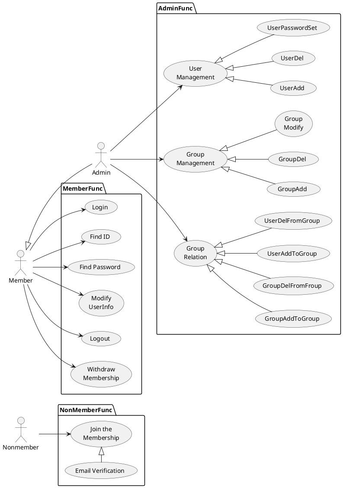
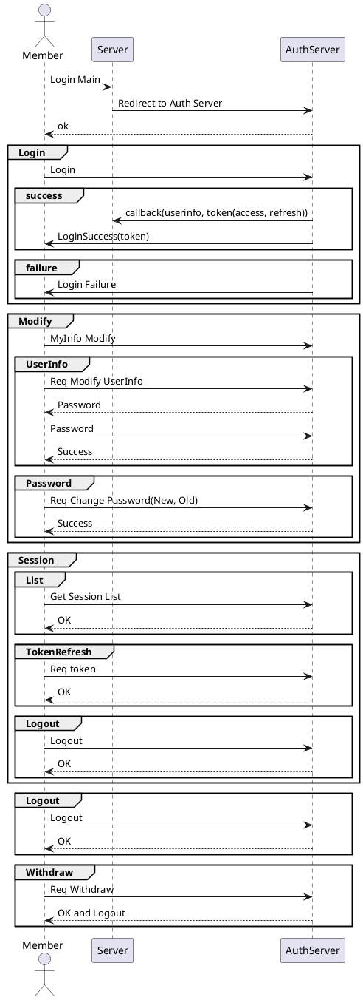

# 데이터 뷰

## 1. 개요

본 문서는 통합 데이터 융합/정제/변환을 위한 설계 문서로 유스케이스, 인터페이스, 시퀀스, 클래스, 데이터베이스 설계서를 포함한다.

## 2. 요구사항

일반 요구사항

단일화된 데이터 조회 및 탐색 명령어 (SQL/DSL) 개발

데이터의 성격, 형태, 저장위치 등 다양한 정보를 관리 할 수 있는 통합 메타데이터 디스크립션 제공
정형 텍스트, 비정형 텍스트, 이미지, 동영상, 시계열 데이터의 메타 데이터를 추출할 수 있는 기능 개발 / 이종 데이터의 연계를 위한 메타 정보 추출
자동으로 메타 데이터를 생성하는 기능 개발
수집된 데이터 스키마 및 메타데이터를 기반으로 사용자정의 모델링 기술 개발
"데이터 융합/정제에 필요한 데이터 처리 기능 개발 
 - 결측치, 중복, 필터 등의 데이터 정제 기능 제공
 - 데이터 형식, 필드간 머지 등의 데이터 형 변환 기능 제공 "
- 이미지, 동영상, RestAPI에 대한 통합/연계를 지원하는 가상화 모듈 확장 개발
데이터 모델을 융합 및 정제를 진행할 수 있는 기능 개발
사용자가 SQL/DSL로 정의한 모델 정보를 다시 모델로 등록할 수 있는 기능 개발

## 3. Usecase

## 4. 시퀀스 & 인터페이스

- 회원(관리자)
  - 로그인  
  - 아이디 찾기
  - 비밀번호 찾기  
  - 사용자 정보 변경  
  - 세션
    - 세션 조희  
    - 세션(토큰) 갱신
    - 세션 로그아웃
  - 로그아웃  
  - 회원탈퇴  
  

## 5. 클래스

| 유형                    | 기호    | 목적                                                                   |
| ----------------------- | ------- | ---------------------------------------------------------------------- |
| 의존성(Association)     | `-->`   | 객체가 다른 객체를 사용함. ( A `-->` B)                                |
| 확장(Inheritance)       | `<\|--` | 계층 구조에서 클래스의 특수화. (부모 `<\|--` 자식)                     |
| 구현(Implementation)    | `<\|..` | 클래스에 의한 인터페이스의 실현. (Interface `<\|..` Class)             |
| 약한 의존성(Dependency) | `..>`   | 더 약한 형태의 의존성. A 클래스 메소스 파라미터로 B를 사용( A `..>` B) |
| 집합(Aggregation)       | `o--`   | 부분이 전체와 독립적으로 존재할 수 있음( 클래스 `o--` 부분 클래스)     |
| 컴포지션(Composition)   | `*--`   | 부분이 전체 없이 존재할 수 없음( 클래스 `*--` 부분 클래스)             |

```plantuml
@startuml
' abstract        abstract
' abstract class  "abstract class"
' annotation      annotation
' circle          circle
' ()              circle_short_form
' class           class
' class           class_stereo  <<stereotype>>
' diamond         diamond
' <>              diamond_short_form
' entity          entity
' enum            enum
' exception       exception
' interface       interface
' metaclass       metaclass
' protocol        protocol
' stereotype      stereotype
' struct          struct

class           User
class           Group
class           Relation
@enduml
```

## 6. 데이터베이스

Database, Storage 가 분리되어 있었으나 통합.
UserDefine Driver를 사용할 수 있는 구조로 변경.

**Storage**  
