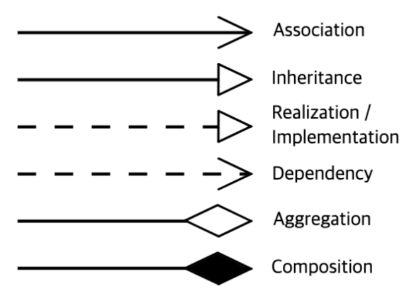

# 검색

## 1. 개요

본 문서는 데이터 검색(탐색)을 위한 설계 문서로 유스케이스, 인터페이스, 시퀀스, 클래스, 데이터베이스 설계서를 포함한다.

## 2. 요구사항

자연어 검색  
검색 기록  
검색 추천  
검색 클러스터 구성  

- 저장소 탐색
  - 저장소 리스트  
  - 저장소 정보 열람  
  - 즐겨찾기
  - 카테고리  
  - 사전  
  - 태그  

추상화 된 데이터 스키마의 메타 정보를 이용하여 검색 기능 개발
추상화된 데이터의 원본 데이터를 샘플링하여 제공
데이터 검색 수행 시 클러스터링된 검색엔진에서 검색에 필요한 다중 저장소에 동시에 접근하여 검색 결과에 대한 비동기 조합으로 성능 최적화

- 보안
  - 접근 제어(RBAC, Attribute(User, Group))
    - 초기 컨셉은 최초 모두 검색 가능하고, 특이 행동에 대해서 접근제어를 수행하고자 하였었음.

### 2.1. Rate Limiting

사용자 관련 API에서 Rate Limit(속도 제한) 을 적용해야 하는 주요 부분

(1) 게시글 작성/댓글 API (스팸 방지)  
예: POST /api/posts 또는 POST /api/comments  
이유:  
자동화된 스팸 댓글, 도배 방지  
추천 제한:  
동일 IP 또는 계정에서 10~20회/분 이상 요청 시 제한  

(2) 검색 API (DDoS 방지)  
예: GET /api/search?q=...  
이유:  
과도한 검색 요청으로 인한 서버 부하 방지  
추천 제한:  
동일 IP에서 10~20회/분 이상 요청 시 제한  

## 3. Usecase

## 3. 시퀀스 & 인터페이스

- 비회원  
  - 회원가입  
  - 이메일인증요청  

- 회원(관리자)
  - 로그인  
  - 아이디 찾기
  - 비밀번호 찾기  
  - 사용자 정보 변경  
  - 세션
    - 세션 조희  
    - 세션(토큰) 갱신
    - 세션 로그아웃
  - 로그아웃  
  - 회원탈퇴  
  

- 관리자
  - 사용자  
    - 추가  
    - 수정  
    - 삭제  
  - 그룹
    - 추가  
    - 수정  
    - 삭제  
  - 사용자_그룹  
    - 추가  
    - 수정  
    - 삭제  
  - 그룹_그룹
    - 추가  
    - 수정  
    - 삭제  

## 5. 클래스

| 유형                    | 기호    | 목적                                                                   |
| ----------------------- | ------- | ---------------------------------------------------------------------- |
| 의존성(Association)     | `-->`   | 객체가 다른 객체를 사용함. ( A `-->` B)                                |
| 확장(Inheritance)       | `<\|--` | 계층 구조에서 클래스의 특수화. (부모 `<\|--` 자식)                     |
| 구현(Implementation)    | `<\|..` | 클래스에 의한 인터페이스의 실현. (Interface `<\|..` Class)             |
| 약한 의존성(Dependency) | `..>`   | 더 약한 형태의 의존성. A 클래스 메소스 파라미터로 B를 사용( A `..>` B) |
| 집합(Aggregation)       | `o--`   | 부분이 전체와 독립적으로 존재할 수 있음( 클래스 `o--` 부분 클래스)     |
| 컴포지션(Composition)   | `*--`   | 부분이 전체 없이 존재할 수 없음( 클래스 `*--` 부분 클래스)             |

## 6. 데이터베이스

- UserTable

| Field | DataType | Constraint | Default | Desc |
| ----- | -------- | ------- | ------- | ---- |
| id    | UUID     |         |         |      |

json User {
  "id": "uuid",
  "email": "email address",
  "pw": "password",
  "name": "name",
  "nickname": "nickname",
  "phone": "phone",
  "status": ["active", "inactive", "etc"],
  "createdAt": "create time",
  "updatedAt": "update time"
}

- GroupTable

- UserGroupRelation

json Group {
  "id": "uuid",
  "name": "name",
  "nickname": "nickname",
  "desc": "description",
  "createdAt": "create time",
  "updatedAt": "update time"
}

json UserGroupRelation {
  "parentID": "group id",
  "childType": ["group", "user"],
  "childID": ["group id", "user id"],
  "joined_at": "join time"
}

json SignUpReq {
  "id": "email address",
  "pw": "password",
  "name": "name",
  "nickname": "nickname",
  "phone": "phone",
  "etc": "etc"
}

json SignUpRes {
  "code": ["success", "error"],
  "errMsg": "error message",
  "body": {
    "message": "User registered successfully"
  }
}

SignUpReq --> SignUpRes

note "SignUp 완료 후 이메일 전송과 이메일 내 링크 연결을 통해 이메일 인증을 완료" as signup_note

SignUpReq .. signup_note

json LoginReq {
  "id": "user@example.com",
  "password": "securepassword",
  "device_info": "Chrome - Windows"
	' Device Info: 사용자가 로그인한 기기 정보를 DB에 저장
}

note "다중 세션을 위해 추가적인 정보 `device_info`를 사용(예시)" as login_note
LoginReq .. login_note

json LoginRes {
  "access_token": "eyJhbGciOiJIUzI1...",
  "refresh_token": "d1f13c1c-bc87...",
  "expires_in": 3600
  ' Access Token: 짧은 수명의 JWT (예: 1시간)
	' Refresh Token: 기기별 고유한 UUID 기반 토큰 (DB 또는 Redis에 저장)
}
LoginReq -> LoginRes

' 이메일 인증이 완료되지 않은 사용자의 경우 이메일 인증 요청 화면으로 이동
json EmailVerificationReq {
  "request": "..."
}

' 이메일 인증은 5분 내로 완료되지 못하는 경우 인증 링크로 접속하더라도 인증 실패 

json TokenRefreshReq {
  "refresh_token": "d1f13c1c-bc87..."
}

json TokenRefreshRes {
  "access_token": "new-access-token",
  "expires_in": 3600
}

note "Refresh Token이 유효하지 않으면 로그아웃 처리" as token_refresh_note
TokenRefreshReq .. token_refresh_note

TokenRefreshReq --> TokenRefreshRes

' 세션 테이블은 Audit Log와 연결된다.
json sessionTable {
  "id": "session id", 
  "userId": "userId",
  "refresh_token": "token...",
  "device_info": "device info",
  "status": ["active", "inactive"],
  "createdAt": "create time",
  "ipAddress": "IP Address", 
  "expiresAt": "token 만료 시간"
}

note "현재 접속된 기기 정보 조회" as session_list_note

json SessionList {
  "SessionList": [
    {
      "device_info": "Chrome - Windows",
      "last_active": "2024-02-03T12:00:00Z"
    },
    {
      "device_info": "Safari - iPhone",
      "last_active": "2024-02-02T23:45:00Z"
    }
  ]
}

SessionList .. session_list_note

' 1.	Access Token은 짧은 만료 시간 (1시간 이하)
' 2.	Refresh Token은 DB 또는 Redis에 저장 (기기별 관리)
' 3.	로그아웃 시 Refresh Token을 삭제하여 세션 종료
' 4.	Blacklist를 활용하여 강제 로그아웃 가능
' 5.	JWT 서명키는 안전하게 관리 (환경 변수 사용)
' 6.	Rate Limiting 적용 (특히 로그인, 토큰 갱신 API에 적용)" as security_note

# 2. 저장소 가상화 