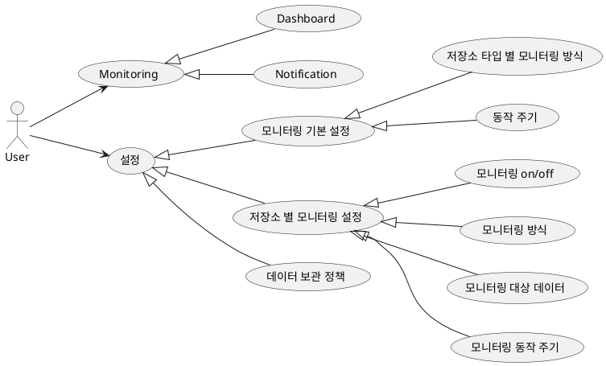
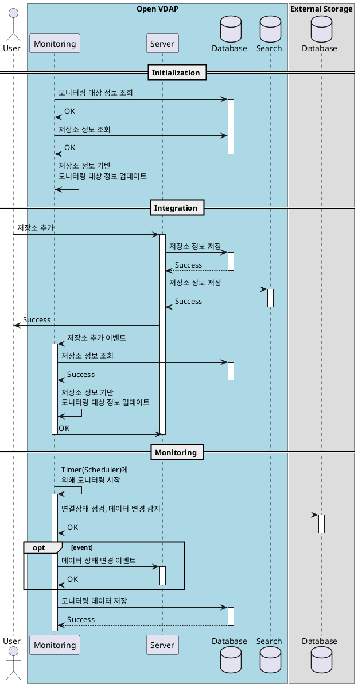
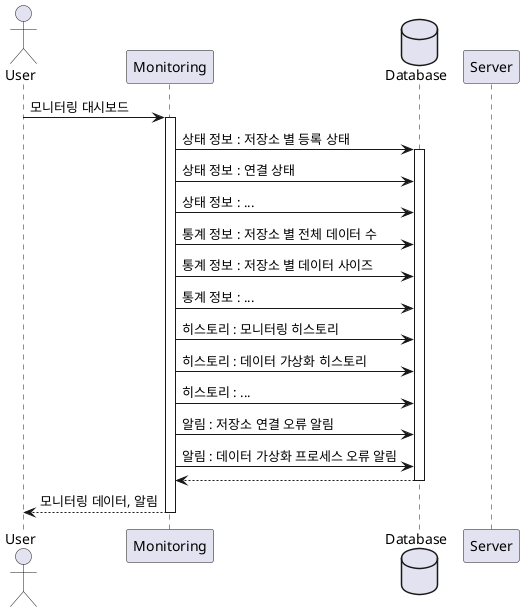
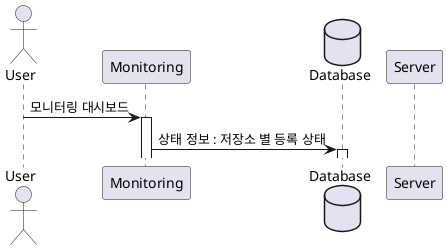

# 작업 관리

## 1. 개요

본 문서는 작업 관리 설계 문서로 유스케이스, 인터페이스, 시퀀스, 클래스, 데이터베이스 설계서를 포함한다.

## 2. 요구사항

## 3. Usecase

## 4. 시퀀스

- 시작 및 프로세스 연동(모니터링 시작)  
- 모니터링  
  - 연결 상태
  - 데이터 수
  - 데이터 변경
  - 기타  

- Monitoring
  - Dashboard
    - 상태
      - 저장소 타입 별 등록 상태(수)  
      - 연결 상태  
      - 가상화 상태(메타데이터 수집 프로세스 상태)  
    - 통계  
      - 데이터 정보
        - 저장소 별 전체 데이터 수  
        - 저장소 별 등록 데이터 수  
        - 저장소 별 데이터 변경 감지 수 (Hour, Day, Month)
        - 저장소 별 등록 데이터 사이즈 Total  
        - 저장소 별 등록 데이터 사이트 Avg
        - 데이터 종류 별 등록 수  
        - 그 외 사용자 요구 혹은 필요에 따른 정보 추가  
      - 데이터 가상화  
        - 데이터 가상화 프로세스 실행 히스토리  
  - Notification
    - 데이터 저장소 연결 상태 변경 알림
    - 데이터 가상화 프로세스 실패 알림  

- 설정  
  - 모니터링 기본 설정  
    - 저장소 타입 별 모니터링 방식  
    - 동작 주기  
    - 서버 정보  
      - 패브릭 코어
  - 저장소 별 모니터링 설정  
    - 모니터링 On/Off  
    - 동작 주기  
    - 동작 설정  
      - 연결 상태 확인 방법 설정  
      - 데이터 모니터링
        - 필터
          - include / exclude
  - 데이터 정책(보관)

## 5. 인터페이스

현 시점(25.02.07)에서는 인터페이스를 모두 정의할 수 없어 개발 과정에서 추가한다.  

## 6. 클래스

| 유형                    | 기호    | 목적                                                                   |
| ----------------------- | ------- | ---------------------------------------------------------------------- |
| 의존성(Association)     | `-->`   | 객체가 다른 객체를 사용함. ( A `-->` B)                                |
| 확장(Inheritance)       | `<\|--` | 계층 구조에서 클래스의 특수화. (부모 `<\|--` 자식)                     |
| 구현(Implementation)    | `<\|..` | 클래스에 의한 인터페이스의 실현. (Interface `<\|..` Class)             |
| 약한 의존성(Dependency) | `..>`   | 더 약한 형태의 의존성. A 클래스 메소스 파라미터로 B를 사용( A `..>` B) |
| 집합(Aggregation)       | `o--`   | 부분이 전체와 독립적으로 존재할 수 있음( 클래스 `o--` 부분 클래스)     |
| 컴포지션(Composition)   | `*--`   | 부분이 전체 없이 존재할 수 없음( 클래스 `*--` 부분 클래스)             |

```plantuml
@startuml
' abstract        abstract
' abstract class  "abstract class"
' annotation      annotation
' circle          circle
' ()              circle_short_form
' class           class
' class           class_stereo  <<stereotype>>
' diamond         diamond
' <>              diamond_short_form
' entity          entity
' enum            enum
' exception       exception
' interface       interface
' metaclass       metaclass
' protocol        protocol
' stereotype      stereotype
' struct          struct

class           User
class           Group
class           Relation
@enduml
```

## 6. 데이터베이스

**MonitoringSetting**  

**MonitoringTarget**  
**Status**  
**Stat**  
**History**  

**저장소에 대한 모니터링**  
    
저장소 모니터링 기본 설정
2. 저장소 모니터링 설정  
    설정에는 다음과 같은 부분들이 필요
    Protocol : SQL, HTTP(TCP), ICMP
    Detail Set : Query/URI
    Schedule : 1분, 1시간, .... ( crontab 양식으로 처리할 수 있도록 )
    Timeout : 30sec
    Threshold : Success, Error

임시 데이터 넣고
    저장소 모니터링 기능 개발
    스레드 풀

1. 저장소 가상화 시 모니터링 기본 설정 필요
    trigger : Server -> Monitoring : Noti(저장소 추가/삭제)
    1. 저장소 정보 로드
    2. 저장소 모니터링 기본 설정
    3. 저장소 모니터링 시작
2. 저장소 모니터링 설정  
    설정에는 다음과 같은 부분들이 필요
    Protocol : SQL, HTTP(TCP), ICMP
    Detail Set : Query/URI
    Schedule : 1분, 1시간, .... ( crontab 양식으로 처리할 수 있도록 )
    Timeout : 30sec
    Threshold : Success, Error
3. 모니터링 결과 저장

**데이터 모니터링**  
모니터링 주기는 위에서 설정한 저장소 모니터링 주기로 동작한다.(Default)
필요한 경우 데이터 모니터링을 위한 설정에서 주기를 설정할 수 있도록 한다.

- Filter 필요(regex 로 동작, multi 허용)
  - Database
    - include  
      - ["iris", "stg-iris", "^product"]
    - exclude
      - ["test"]
  - Database Schema
  - Table
  - Path
  - File(*.md, *.docx)

1. 데이터베이스 데이터베이스/데이터베이스 스키마/테이블 모니터링
    - 마지막 상태 정보 : from fabric server에서 상태 정보 득.
        - Metadata 관리되고 있는 것과 추가해야 할 부분이 있음.
            - Database  
            - Database Schema  
            - Table  
    - 상태 정보 조회 후 변경된 경우 Fabric 서버로 Noti 전송

2. 파일(MinIO/Hadoop) 대상 모니터링
    - 마지막 상태 정보 : from fabric server에서 상태 정보 득.
      - 파일 마지막 변경 시간, 소유자, 등
    - 상태 정보 조회 후 변경된 경우 Fabric 서버로 Noti 전송

---

- 작업히스토리
  - 내 작업 상태  
    - 모니터링은 작업 정보를 수신하여 관리해주면 됨.
    - Job Create : service A : Monitoring
    - Job Success : service A : Monitoring
    - Job Error : service A : Monitoring
  - 상태 조회
    - UI <- Monitoring
  - 명령 수행  
    - start, restart, stop, remove  