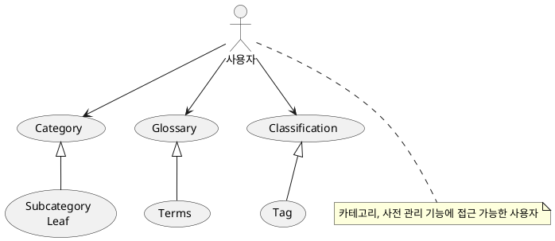
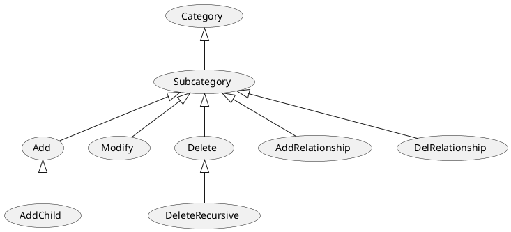
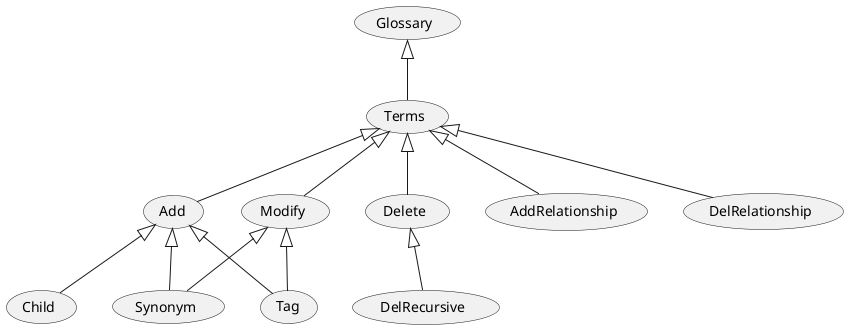
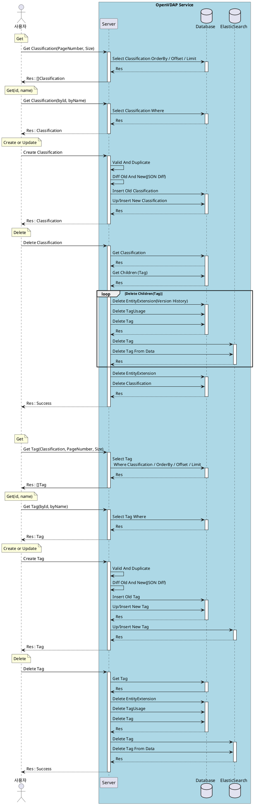
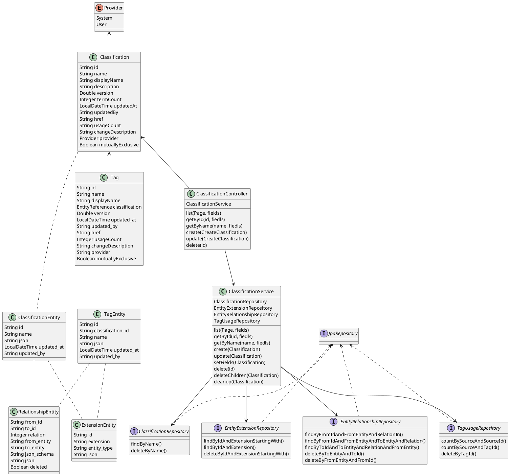

# 메타데이터 - Classification, Tag

## 1. 개요

메타데이터에 대해 사용자 메타데이터(사전, 설명, 태그)를 설정할 수 있도록 한다.
이를 통해 데이터에 대한 탐색과 검색을 돕는다.

## 2. 요구사항

데이터에 대해 태그를 설정(연결)하여 검색이 용이하도록 한다.  
카테고리를 통해 데이터를 분류하고 관리할 수 있도록 한다.

Classification - Tag 관계로 Classification 은 여러개가 있을 수 있다.  
Classification 의 이름은 중복 될 수 없다.  
Tag 는 Classification 내 에서 중복될 수 없다.  
> 설정(중복금지)에 따라 하나의 Classification 에 소속된 Tag 중 하나의 Tag만을 데이터에 설정할 수 있다.
> 예 : 레벨 ( Critical, Major, Minor, None ) 처럼 명확한 구분이 필요한 태그
> 1개의 데이터에 대해 Critical, Minor가 설정되어 있다면 혼선을 야기할 수 있다.

```text
- Classification
  - Classification_01
    - Tag01
    - Tag02
    - Tag03
  - Classification_02
    - Tag01
```

Category

카테고리는 트리 형태로 존재하며, 하나의 카테고리 안에는 동일한 이름의 데이터가 있을 수 없다.  
미분류 카테고리가 있으며, 데이터에 카테고리가 설정되지 않은 경우 미분류로 분류한다.
데이터는 카테고리의 리프(subcategory X, leaf O) 노드에 설정할 수 있다.

```text
- Category
  - Category01
    - English
      - A
        - Apple
          - ...
          - ...
      - B
        - Banana
          - ...
          - ...
    - Korean
      - 가
        - 가방
      - 나
        - 나방
  - Category02
    - 포유류
      - ...
    - 조류
      - ...
```

사전
사전은 트리 형태이며, 동의어 개념으로 연결될 수 있다.

```text
- Glossary
  - Korean
    - 가
      - 가
      - 가방
    - 나
      - 나
      - 나방
    - 다
```

## 3. Usecase



---



---



## 4. 시퀀스

- Classification
  - PageRequest
  - GetById/Name
  - Create/Update
  - Delete
  - Version
- Tag
  - PageRequest
  - GetById/Name
  - Create/Update
  - Delete
  - Version



- Glossary
  - PageRequest
  - GetById/Name
  - Create/Update
  - Delete
  - Version
- Term
  - PageRequest
  - GetById/Name
  - Create/Update
  - Delete
  - Version

## 5. 클래스 다이어그램

**참고용**  

| 유형                    | 기호    | 목적                                                                   |
| ----------------------- | ------- | ---------------------------------------------------------------------- |
| 의존성(Association)     | `-->`   | 객체가 다른 객체를 사용함. ( A `-->` B)                                |
| 확장(Inheritance)       | `<\|--` | 계층 구조에서 클래스의 특수화. (부모 `<\|--` 자식)                     |
| 구현(Implementation)    | `<\|..` | 클래스에 의한 인터페이스의 실현. (Interface `<\|..` Class)             |
| 약한 의존성(Dependency) | `..>`   | 더 약한 형태의 의존성. A 클래스 메소스 파라미터로 B를 사용( A `..>` B) |
| 집합(Aggregation)       | `o--`   | 부분이 전체와 독립적으로 존재할 수 있음( 클래스 `o--` 부분 클래스)     |
| 컴포지션(Composition)   | `*--`   | 부분이 전체 없이 존재할 수 없음( 클래스 `*--` 부분 클래스)             |

- Classification, Tag



## 6. 인터페이스 설계

> 본 문서에서는 현 시점(25.03.24)에서는 인터페이스 리스트만을 작성한다.  
> 상세한 내용에 대해서는 Swagger를 활용하거나 본 문서에 내용을 업데이트하여 제공한다.

### 6.1. Classification

### 6.2. Tag

### 6.3. 데이터 연결

## 7. 데이터베이스

- Classification

| Column       | Data Type   | Constraints | Index | Desc               |
| ------------ | ----------- | ----------- | :---: | ------------------ |
| `id`         | UUID        | PRIMARY KEY |       | 고유아이디(UUID)   |
| `name`       | CHAR(256)   | UNIQUE      |   V   | 이름               |
| `json`       | JSON        | NOT NULL    |       | Classification     |
| `updated_at` | DATETIME(3) | NOT NULL    |       | 마지막 변경 시간   |
| `udpated_by` | CHAR(256)   |             |       | 마지막 변경 사용자 |

- Tag

| Column              | Data Type   | Constraints | Index | Desc               |
| ------------------- | ----------- | ----------- | :---: | ------------------ |
| `id`                | UUID        | PRIMARY KEY |       | 고유아이디(UUID)   |
| `classification_id` | UUID        | UNIQUE      |   v   | 고유아이디(UUID)   |
| `name`              | CHAR(256)   | UNIQUE      |   v   | 이름               |
| `json`              | JSON        | NOT NULL    |       | Tag                |
| `updated_at`        | DATETIME(3) | NOT NULL    |       | 마지막 변경 시간   |
| `udpated_by`        | CHAR(256)   |             |       | 마지막 변경 사용자 |

`constraint unique_tag unique (tag.classification_id, tag.name)`

- EntityRelationship  

| Column        | Data Type | Constraints | Index | Desc                            |
| ------------- | --------- | ----------- | :---: | ------------------------------- |
| `from_id`     | UUID      | PRIMARY KEY |   V   | 고유아이디(UUID)                |
| `to_id`       | UUID      | PRIMARY KEY |   V   | 고유아이디(UUID)                |
| `from_entity` | CHAR(256) | NOT NULL    |   V   | 엔티티 타입                     |
| `to_entity`   | CHAR(256) | NOT NULL    |   V   | 엔티티 타입                     |
| `relation`    | INT       | PRIMARY KEY |   V   | 관계 ENUM 값                    |
| `json_schema` | CHAR(256) | NOT NULL    |       | 특수 관계 표현을 위한 추가 정보 |
| `json`        | JSON      | NOT NULL    |       | 특수 관계 표현을 위한 추가 정보 |
| `deleted`     | BOOLEAN   |             |       | 삭제 여부                       |

- EntityExtension  

| Column        | Data Type | Constraints | Index | Desc                              |
| ------------- | --------- | ----------- | :---: | --------------------------------- |
| `id`          | UUID      | PRIMARY KEY |       | 고유아이디(UUID)                  |
| `extension`   | CHAR(256) | PRIMARY KEY |   V   | 추가 정보 저장 타입(version, ...) |
| `entity_type` | CHAR(256) | NOT NULL    |       | 엔티티 타입                       |
| `json`        | JSON      | NOT NULL    |       | 확장 저장 정보                    |

- TagUsage

| Column        | Data Type | Constraints      | Index | Desc                                           |
| ------------- | --------- | ---------------- | :---: | ---------------------------------------------- |
| `source`      | INT       | UNIQUE, NOT NULL |       | 0 classification, 1 glossary                   |
| `source_id`   | CHAR(256) | UNIQUE, NOT NULL |       | classification or glossary id                  |
| `tag_id`      | CHAR(256) | UNIQUE, NOT NULL |       | 태그(사전) 아이디                              |
| `label_type`  | INT       | NOT NULL         |       | 0 Manual, 1 Propagated, 2 Automated, 3 Derived |
| `state`       | INT       | NOT NULL         |       | 0 Suggested, 1 Confirmed                       |
| `target_type` | CHAR(32)  | UNIQUE, NOT NULL |       | 데이터 타입                                    |
| `target_id`   | CHAR(36)  | UNIQUE, NOT NULL |       | 데이터 아이디                                  |