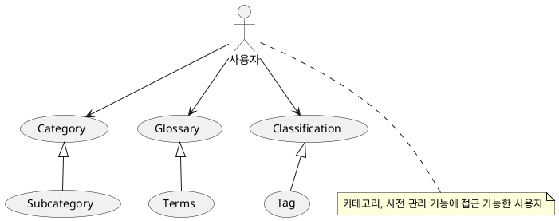
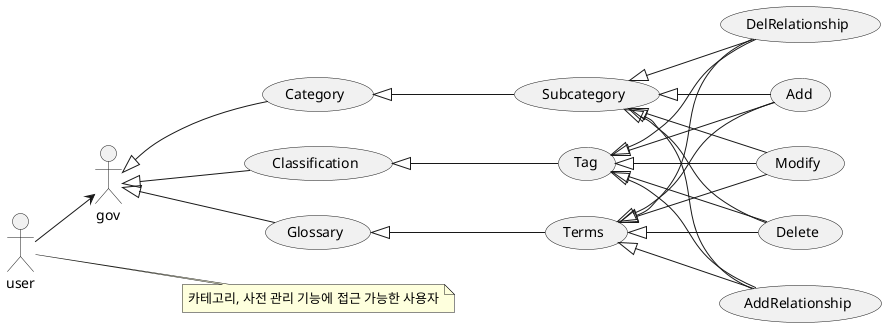
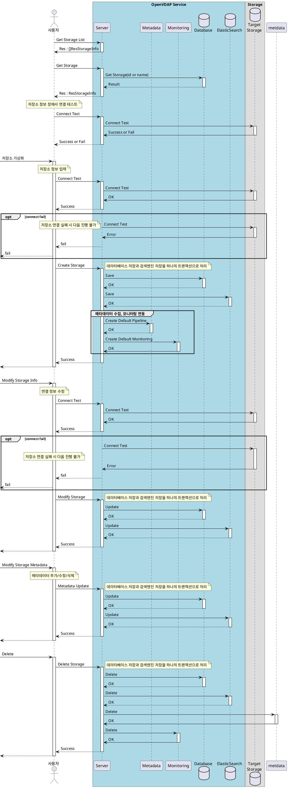
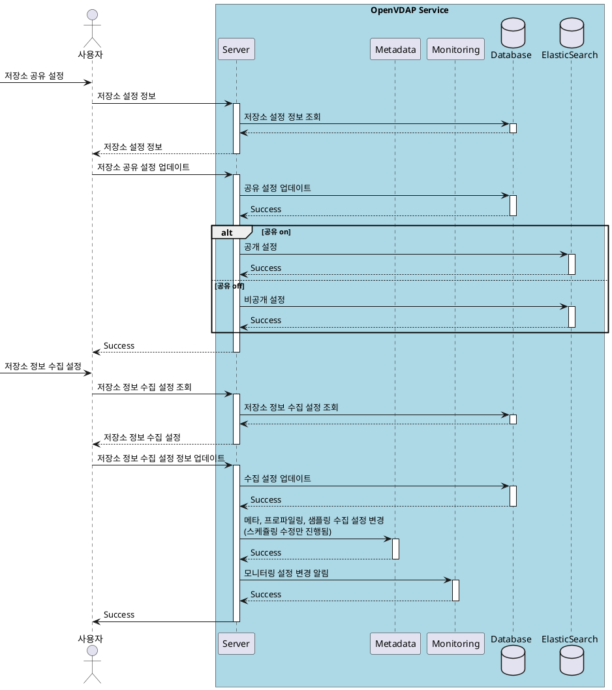
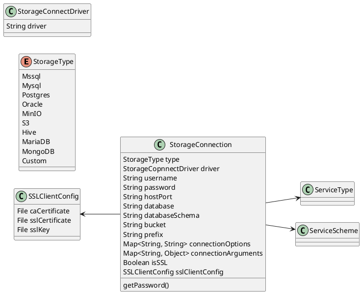
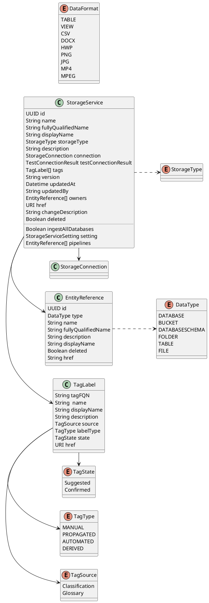

# 메타데이터 - Classification, Tag

## 1. 개요

메타데이터에 대해 사용자 메타데이터(사전, 설명, 태그)를 설정할 수 있도록 한다.
이를 통해 데이터에 대한 탐색과 검색을 돕는다.

## 2. 요구사항

Classification(Category) 를 메타데이터 설정할 수 있도록 한다.

Classification 데이터 예제  
Classification 은 Tag를 자식으로 가진다.
Classification 이름은 중복될 수 없다.
Tag는 자식을 가질 수 없으며, 하나의 Classification에는 중복된 Tag 이름을 가질 수 없다.

```text
- Classification
  - Classification_01
    - Tag01
    - Tag02
    - Tag03
  - Classification_02
    - Tag01
```

Category

카테고리는 트리 형태로 존재하며, 하나의 카테고리 안에는 동일한 이름의 데이터가 있을 수 없다.  
데이터는 리프노드에만 설정된다?

```text
- Category
  - Category01
    - English
      - A
        - Apple
          - ...
          - ...
      - B
        - Banana
          - ...
          - ...
    - Korean
      - 가
        - 가방
      - 나
        - 나방
  - Category02
    - 포유류
      - ...
    - 조류
      - ...
```

## 3. Usecase



---


---


---



## 4. 시퀀스

-   저장소 관리
    -   리스트 조회
    -   저장소 정보
        -   연결테스트
    -   추가
        -   연결테스트
    -   수정
        -   연결테스트
    -   저장소 메타데이터 수정
    -   삭제



-   저장소 설정
    -   검색/공유 설정
    -   메타데이터(프로파일링) 수집 설정
        -   자세한 내용은 virtualzation-pipeline.md 을 참고
    -   샘플 수집 설정
        -   자세한 내용은 virtualzation-pipeline.md 파일을 참고
    -   모니터링 설정
        -   자세한 내용은 monitoring.md 파일을 참고



## 5. 클래스 다이어그램

**참고용 OpenMetadata Service 객체**


| 유형                    | 기호    | 목적                                                                   |
| ----------------------- | ------- | ---------------------------------------------------------------------- |
| 의존성(Association)     | `-->`   | 객체가 다른 객체를 사용함. ( A `-->` B)                                |
| 확장(Inheritance)       | `<\|--` | 계층 구조에서 클래스의 특수화. (부모 `<\|--` 자식)                     |
| 구현(Implementation)    | `<\|..` | 클래스에 의한 인터페이스의 실현. (Interface `<\|..` Class)             |
| 약한 의존성(Dependency) | `..>`   | 더 약한 형태의 의존성. A 클래스 메소스 파라미터로 B를 사용( A `..>` B) |
| 집합(Aggregation)       | `o--`   | 부분이 전체와 독립적으로 존재할 수 있음( 클래스 `o--` 부분 클래스)     |
| 컴포지션(Composition)   | `*--`   | 부분이 전체 없이 존재할 수 없음( 클래스 `*--` 부분 클래스)             |

-   저장소 연결 정보



-   저장소 정보  
    저장소 정보는 저장소 연결 정보를 포함한다.



## 6. 인터페이스 설계

> 본 문서에서는 현 시점(25.02.06)에서는 인터페이스 리스트만을 작성한다.  
> 상세한 내용에 대해서는 Swagger를 활용하거나 본 문서에 내용을 업데이트하여 제공한다.

### 6.1. 저장소 관리

OpenMetadata 의 DatabaseService, StorageService 를 StorageService 통합

-   저장소 리스트
    -   ResultList<StorageService>
-   저장소 정보
    -   StorageService
-   추가
    -   CreateStorageService
-   연결테스트
    -   CreateWorkflow -> ConnectionTest 로 변경
-   연결정보 수정
    -   StorageService
-   메타데이터 설정(업데이트)
    -   StorageService
-   삭제
    -   ID or Name

### 6.2. 저장소 설정

-   설정
    -   검색/공유 설정
        -   전체 공개
        -   비공개
    -   파이프라인(메타데이터, 프로파일링, 로그, 샘플)
        -   [파이프라인] - docs/arch/virtualization-pipeline.md
    -   모니터링
        -   [모니터링] - docs/arch/monitoring.md

## 7. 데이터베이스

-   StorageConnection

| Column            | Data Type | Constraints | Index | Desc                      |
| ----------------- | --------- | ----------- | :---: | ------------------------- |
| `id`              | UUID      | PRIMARY KEY |   v   | 저장소 연결 정보 식별자   |
| `storage_type`    | ENUM      | NOT NULL    |       | 저장소 타입               |
| `username`        | CHAR(128) |             |       | 사용자 이름               |
| `password`        | CHAR(256) |             |       | 비밀번호(암호화된 데이터) |
| `host_port`       | CHAR(512) | NOT NULL    |   v   | 저장소 Host, Port         |
| `database`        | CHAR(512) |             |       | 데이터베이스              |
| `bucket`          | CHAR(512) |             |       | 버켓                      |
| `database_schema` | CHAR(512) |             |       |                           |
| `prefix`          | CHAR(512) |             |       |                           |
| `is_ssl`          | BOOLEAN   |             |       |                           |
| `ssl_ca_cert`     | BINARY    |             |       |                           |
| `ssl_ssl_cert`    | BINARY    |             |       |                           |
| `ssl_key`         | BINARY    |             |       |                           |

-   StorageService

| Column         | Data Type | Constraints | Index | Desc                            |
| -------------- | --------- | ----------- | :---: | ------------------------------- |
| `id`           | UUID      | PRIMARY KEY |   v   | 저장소 고유 식별자              |
| `storage_type` | ENUM      | NOT NULL    |       | 저장소 타입                     |
| `name`         | CHAR(256) | NOT NULL    |   v   | 저장소 이름                     |
| `display_name` | CHAR(512) |             |       | 저장소 별칭(화면에 출력할 이름) |
| `description`  | TEXT      |             |       | 저장소 설명                     |
| `conn_id`      | UUID      | FK          |       | 저장소 설명                     |
| `conn_id`      | UUID      | FK          |       | 저장소 설명                     |

-   entity_relation
-   tags

    StorageConnection connection
    TestConnectionResult testConnectionResult
    TagLabel[] tags
    String version
    Datetime updatedAt
    String updatedBy
    EntityReference[] owners
    URI href
    String changeDescription
    Boolean deleted
    ..
    ' 데이터베이스 전체에 접근 권한이 있는 경우 설정하여 전체 데이터베이스의 데이터를 수집할 수 있음.
    Boolean ingestAllDatabases
    StorageServiceSetting setting
    EntityReference[] pipelines
