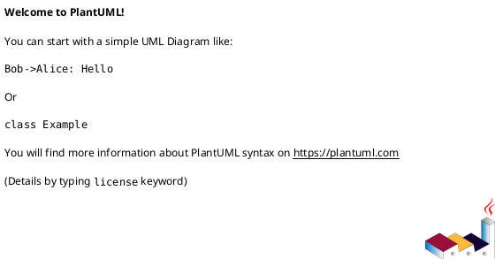

# 이벤트

## 1. 개요

본 문서는 이벤트 발생 알림 기능을 위한 설계 문서로 유스케이스, 
인터페이스, 시퀀스, 클래스, 데이터베이스 설계서를 포함한다.

## 2. 요구사항

다음 이벤트 발생 시 사용자에게 알림을 전달할 수 있어야 한다. 
...
이벤트 발생 시 알림 방법으로 다음을 제공해야 한다.
...

## 3. Usecase

```plantuml
@startuml
allowmixing
left to right direction
@enduml
```

## 4. 클래스



## 5. 시퀀스

```plantuml
@startuml

@enduml
```

## 6. 인터페이스

## 7. 데이터베이스

| Column              | Data Type | Constraints                           | Index | Desc                                   |
| ------------------- | --------- | ------------------------------------- | :---: | -------------------------------------- |
| `id`                | ENUM      | NOT NULL                              |   v   | 저장소 타입                            |


json - schema - analytics 참고