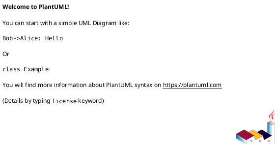

# 검색

## 1. 개요

본 문서는 데이터 검색(탐색)을 위한 설계 문서로 유스케이스, 인터페이스, 시퀀스, 클래스, 데이터베이스 설계서를 포함한다.

## 2. 요구사항

자연어 검색  
검색 기록  
검색 추천  
검색 클러스터 구성  

- 저장소 탐색
  - 저장소 리스트  
  - 저장소 정보 열람  
  - 즐겨찾기
  - 카테고리  
  - 사전  
  - 태그  

추상화 된 데이터 스키마의 메타 정보를 이용하여 검색 기능 개발
추상화된 데이터의 원본 데이터를 샘플링하여 제공
데이터 검색 수행 시 클러스터링된 검색엔진에서 검색에 필요한 다중 저장소에 동시에 접근하여 검색 결과에 대한 비동기 조합으로 성능 최적화

사용자 메타데이터
시각화 연동
추천 관련

- 보안
  - 접근 제어(RBAC, Attribute(User, Group))
    - 초기 컨셉은 최초 모두 검색 가능하고, 특이 행동에 대해서 접근제어를 수행하고자 하였었음.

### 2.1. Rate Limiting

사용자 관련 API에서 Rate Limit(속도 제한) 을 적용해야 하는 주요 부분

(1) 게시글 작성/댓글 API (스팸 방지)  
예: POST /api/posts 또는 POST /api/comments  
이유:  
자동화된 스팸 댓글, 도배 방지  
추천 제한:  
동일 IP 또는 계정에서 10~20회/분 이상 요청 시 제한  

(2) 검색 API (DDoS 방지)  
예: GET /api/search?q=...  
이유:  
과도한 검색 요청으로 인한 서버 부하 방지  
추천 제한:  
동일 IP에서 10~20회/분 이상 요청 시 제한  

## 3. Usecase

- 공개 데이터
- 비공개 데이터

```plantuml
@startuml
allowmixing
left to right direction

@enduml
```

## 4. 클래스

| 유형                    | 기호    | 목적                                                                   |
| ----------------------- | ------- | ---------------------------------------------------------------------- |
| 의존성(Association)     | `-->`   | 객체가 다른 객체를 사용함. ( A `-->` B)                                |
| 확장(Inheritance)       | `<\|--` | 계층 구조에서 클래스의 특수화. (부모 `<\|--` 자식)                     |
| 구현(Implementation)    | `<\|..` | 클래스에 의한 인터페이스의 실현. (Interface `<\|..` Class)             |
| 약한 의존성(Dependency) | `..>`   | 더 약한 형태의 의존성. A 클래스 메소스 파라미터로 B를 사용( A `..>` B) |
| 집합(Aggregation)       | `o--`   | 부분이 전체와 독립적으로 존재할 수 있음( 클래스 `o--` 부분 클래스)     |
| 컴포지션(Composition)   | `*--`   | 부분이 전체 없이 존재할 수 없음( 클래스 `*--` 부분 클래스)             |

## 5. 시퀀스

탐색



검색

```plantuml
@startuml

@enduml
```

시각화

추천

## 6. 인터페이스

## 7. 데이터베이스