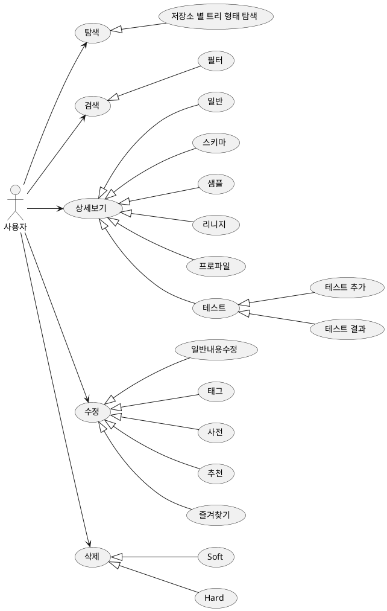
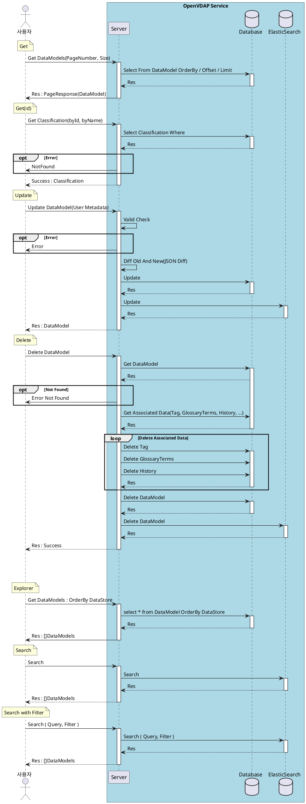
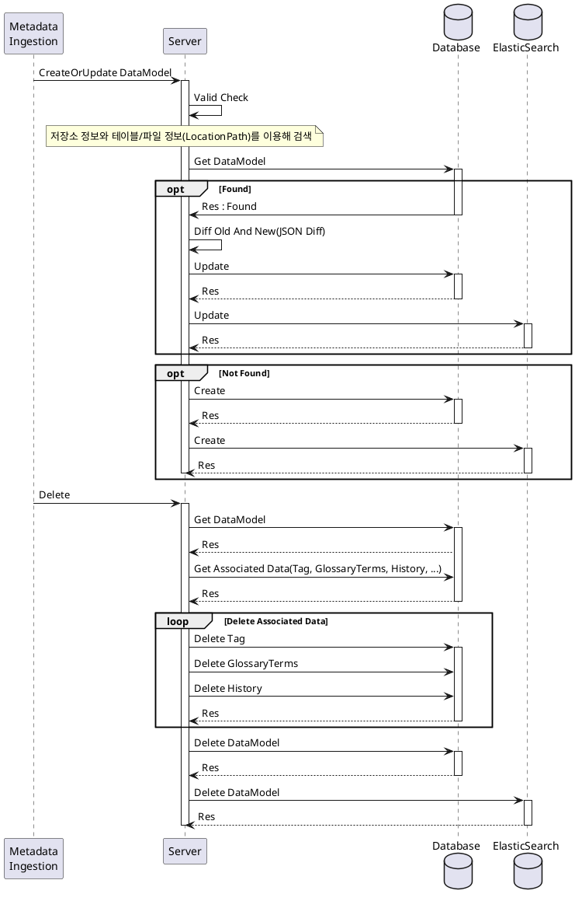
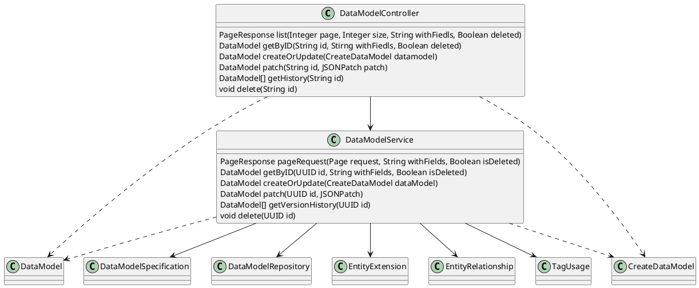
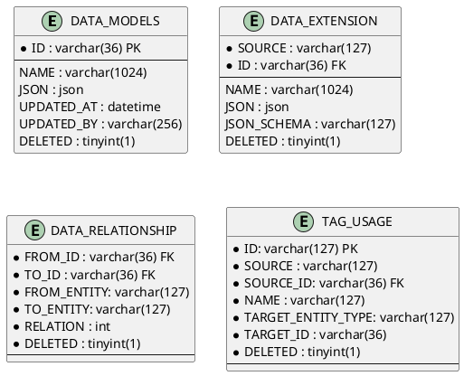

# 데이터 가상화

## 1. 개요

본 문서는 데이터 가상화 설계 문서로 유스케이스, 인터페이스, 시퀀스, 클래스, 데이터베이스 설계서를 포함한다.

## 2. 요구사항

1. 다양한 형태의 데이터를 위한 메타데이터
2. 다양한 형태의 데이터로부터 메타데이터 수집
3. 표준 메타데이터  
   1. 표준 용어 사전  
   2. 불용어 -> 검색과도 연관있음  
4. 데이터 변경을 감지 자동으로 업데이트하는 기능 개발  

### 2.1. 메타데이터 정의

[메타데이터 정의 링크](./standard_metadata.md)

### 2.2. 확인사항

**데이터 셋일 경우 다음 정보에 처리에 어려움이 있어 처리하지 않음.**  

> 자동으로 수집이 어려운 데이터(불가능한 데이터)에 대해 사용자가 쉽게 적용할 수 있는 방안이 필요하다.
> 방안으로 메타데이터 정보의 일괄적용 혹은 CSV 파일을 이용한 입력을 고려한다.
> 일괄적용의 경우 설정 할 메타데이터를 JSONPatch 와 유사하게 입력할 수 있도록 하고, 적용할 데이터들을 검색하고 선택하여 적용하는 방식
> CSV를 이용한 방법의 경우 데이터 모델 리스트를 CSV 파일 형태로 제공하고, CSV 편집 후 업로드 시 적용한다. 

| Name(한글)     | 데이터타입 | 설명                                                      |
| -------------- | ---------- | --------------------------------------------------------- |
| DataStoreType  | String     | 자원 저장소 타입( Mysql, Mariadb, Mssql, Postgresql, ...) |
| DataStore      | Struct     | 자원 저장소 정보                                          |
| Database       | Struct     | 데이터베이스 정보                                         |
| DatabaseSchema | Struct     | 데이터베이스 스키마 정보                                  |
| Bucket         | Struct     | S3, MinIO 의 저장소 버켓 정보                             |
| Folder         | Struct     | 폴더 정보                                                 |
| LocationPath   | String     | 데이터 위치 정보                                          |

## 3. Usecase

사용자 유즈케이스

## 4. 시퀀스

### 4.1. 기능 리스트

- DataModel
  - PageRequest : 리스트 조회
  - GetById : 단일 조회
  - Create/Update : 데이터 모델 추가 / 수정
    - Database
    - DatabaseSchema
    - Table
    - Bucket
    - Folder
    - File
      - Table Type Data(CSV, XLSX)
      - Document Type Data(DOCX, HWPX)
      - Image Type Data(PNG, JPG)
      - Audio Type Data(MP3)
      - Semi Structure Type Data(JSON)
  - CreateDataModel
  - VersionHistory : 데이터 모델 버전 히스토리
  - Delete : 데이터 모델 삭제
    - Soft
    - Hard
- Search
  - General : 일반 검색
  - Filtering : 필터링 방식 검색
- Explorer

### 4.2. 다이어그램

사용자 중심 시퀀스

서비스 중심 시퀀스  

## 5. 클래스

```plantuml
@startuml
left to right direction

' | 유형                    | 기호    | 목적                                                                   |
' | ----------------------- | ------- | ---------------------------------------------------------------------- |
' | 의존성(Association)     | `-->`   | 객체가 다른 객체를 사용함. ( A `-->` B)                                |
' | 확장(Inheritance)       | `<\|--` | 계층 구조에서 클래스의 특수화. (부모 `<\|--` 자식)                     |
' | 구현(Implementation)    | `<\|..` | 클래스에 의한 인터페이스의 실현. (Interface `<\|..` Class)             |
' | 약한 의존성(Dependency) | `..>`   | 더 약한 형태의 의존성. A 클래스 메소스 파라미터로 B를 사용( A `..>` B) |
' | 집합(Aggregation)       | `o--`   | 부분이 전체와 독립적으로 존재할 수 있음( 클래스 `o--` 부분 클래스)     |
' | 컴포지션(Composition)   | `*--`   | 부분이 전체 없이 존재할 수 없음( 클래스 `*--` 부분 클래스)             |


class DataModel {
  String id
  String identifierType
  String identifier
  String name
  String displayName
  String description
  String subject
  Double version
  DateTime updatedAt
  String updatedBy
  Boolean deleted

  LifeCycle date
  String createdBy
  String publisher
  Availability availability
  Audience audience 
  AccessControl accessControl
  Mandate mandate
  String right 

  ReferenceModel[] owners
  TagLabel[] tagLabels
  String dataType 
  String tableType 
  String fileFormat
  Long dataSize 
  String dataStoreType 
  ReferenceModel dataStore
  ReferenceModel database
  ReferenceModel databaseSchema
  ReferenceModel bucket
  ReferenceModel folder
  String locationPath 
  ReferenceModel[] parent 
  ReferenceModel[] children 
  String language 
  Vote vote
  ReferenceModel[] followers

  TableProfile tableProfile
  TableSample tableSample
  DocumentProfile documentProfile
  String documentSample
  PictureProfile pictureProfile
  Byte[] pictureSample
  AudioProfile audioProfile
  String audioSample
}

class Availability {
   String name
   String email 
   String phone 
}

DataModel --> Availability

class Audience {
   String audienceType
   String accessibility
}

DataModel --> Audience

class AccessControl {
   String level 
   String reason 
   LocalDatetime releaseDate
}

DataModel --> AccessControl

class Mandate {
   String name 
   String reference
}

DataModel --> Mandate

class LifeCycle {
   LocalDatetime created
   LocalDatetime modified
   LocalDatetime valid
   LocalDatetime available
}

DataModel --> LifeCycle 

class TagLabel {
   String id 
   String name 
   String displayName 
   String description 
   String source 
   String sourceId 
}

DataModel --> TagLabel

class ReferenceModel {
   String source
   String id 
   String name 
   String displayName 
   String description 
}

DataModel --> ReferenceModel

class TableProfile {
  String schemaDefinition 
  TableConstraints tableConstraints
  TableProfileConfig tableProfileConfig
  TableStatistics tableStatistics 
  Column[] columns
}

DataModel --> TableProfile

class TableConstraints {
   String constraintType 
   String[] columns 
   String[] referredColumns
}

TableProfile --> TableConstraints

class TableProfileConfig {
   String profileSampleType 
   Long profileSample 
   String[] excludeColumns 
   String[] includeColumns
   Boolean computeTableMetrics
   Boolean computeTableMetrics 
   String samplingMethodType 
   Long sampleDataCount
   String profileQuery
}

TableProfile --> TableProfileConfig

class TableStatistics {
   LocalDateTime timestamp
   String profileSAmpleType
   Long profileSample
   String samplingMethodType 
   Long colummnCount
   Long rowCount
   Long size
   LocalDateTime createDateTime
}

TableProfile --> TableStatistics

class Column{
   String name 
   String displayName 
   String dataType 
   Integer dataLength 
   Integer precision 
   Integer scale 
   String description 
   Boolean isPrivate 
   TagLabel[] taglabels
   String constraint
   Integer ordinalPosition 
   ColunmProfile profile
}

TableProfile --> Column

class ColumnProfile {
   String name 
   LocalDateTime timestamp
   Long ValueCount
   Float valuePercentage
   Long duplicateCount 
   Long nullCount
   Float missingPercentage
   Long uniqueCount
   Long distinctCount
   Object min 
   Object max 
   Long minLength
   Long maxLength
   Float mean 
   Float sum 
   Float stddev 
   Float variance
   Float median 
   Float firstQuartile
   Float thirdQuartile
   Float interQuartileRange 
   Float nonParametricSkew
   Object histogram
}

Column --> ColumnProfile

class TableSample {
   String[] columns
   Object[][] rows
}

DataModel --> TableSample

class DocumentProfile {
   String mlModelInfo
   String title
   String author
   String company
   String abstractive
   String[] keywords
   String[] Domain
   String LastModifiedBy
   LocalDateTime Created
   LocalDateTime Modified
   Long PageCount
   Long WordCount
}

DataModel --> DocumentProfile

class PictureProfile {
   String mlModelInfo
   String camera
   LocalDateTime pictureDateTime
   String shutterSpeed
   String aperture
   Integer iso
   Integer focalLength
   String WhiteBalance
   Boolean Flash
   String Latitude
   String Longitude
   String Accuracy
   String EditorApp
   String AverageColor
   String[] DominantColors
   Float Contrast
   Float Brightness
   Float Saturation
   String Resolution
   Float PixelDensity
   String[] ObjectInfo
   String[] LandscapeInfo
   String TextDetection
}

DataModel --> PictureProfile

class AudioProfile {
   String mlModelInfo
   Integer duration
   Speaker[] Speakers
   SpeakerDiarization speakerDiarization
   String emotionAnalysis
   String backgroundNoise
   String stt
   String language
   String dialect
   String[] keywords
   String[] namedEntities
   String intent
   String summary
}

DataModel --> AudioProfile

class Speaker {
   String speakerId
}

AudioProfile --> Speaker

class SpeakerDiarization{
   String SpeakerID
   Long StartTime
   Long EndTime
   String transcript
}

AudioProfile --> SpeakerDiarization

@enduml
```

---

## 6. 인터페이스  

Swagger 로 대체

## 7. 데이터베이스

