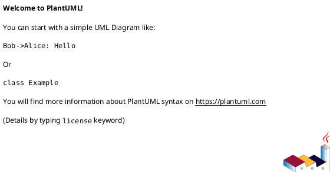

# 데이터 가상화

## 1. 개요

본 문서는 데이터 가상화 설계 문서로 유스케이스, 인터페이스, 시퀀스, 클래스, 데이터베이스 설계서를 포함한다.

## 2. 요구사항

일반 요구사항

1. 다양한 형태의 데이터를 위한 메타데이터
2. 다양한 형태의 데이터로부터 메타데이터 수집
3. 표준 메타데이터  
   1. 표준 용어 사전  
   2. 불용어 -> 검색과도 연관있음  
4. 데이터 변경을 감지 자동으로 업데이트하는 기능 개발  

## 3. Usecase

```plantuml
@startuml
left to right direction

@enduml
```

## 4. 클래스

| 유형                    | 기호    | 목적                                                                   |
| ----------------------- | ------- | ---------------------------------------------------------------------- |
| 의존성(Association)     | `-->`   | 객체가 다른 객체를 사용함. ( A `-->` B)                                |
| 확장(Inheritance)       | `<\|--` | 계층 구조에서 클래스의 특수화. (부모 `<\|--` 자식)                     |
| 구현(Implementation)    | `<\|..` | 클래스에 의한 인터페이스의 실현. (Interface `<\|..` Class)             |
| 약한 의존성(Dependency) | `..>`   | 더 약한 형태의 의존성. A 클래스 메소스 파라미터로 B를 사용( A `..>` B) |
| 집합(Aggregation)       | `o--`   | 부분이 전체와 독립적으로 존재할 수 있음( 클래스 `o--` 부분 클래스)     |
| 컴포지션(Composition)   | `*--`   | 부분이 전체 없이 존재할 수 없음( 클래스 `*--` 부분 클래스)             |

```plantuml
@startuml

@enduml
```

## 5. 시퀀스



## 6. 인터페이스  

## 7. 데이터베이스
