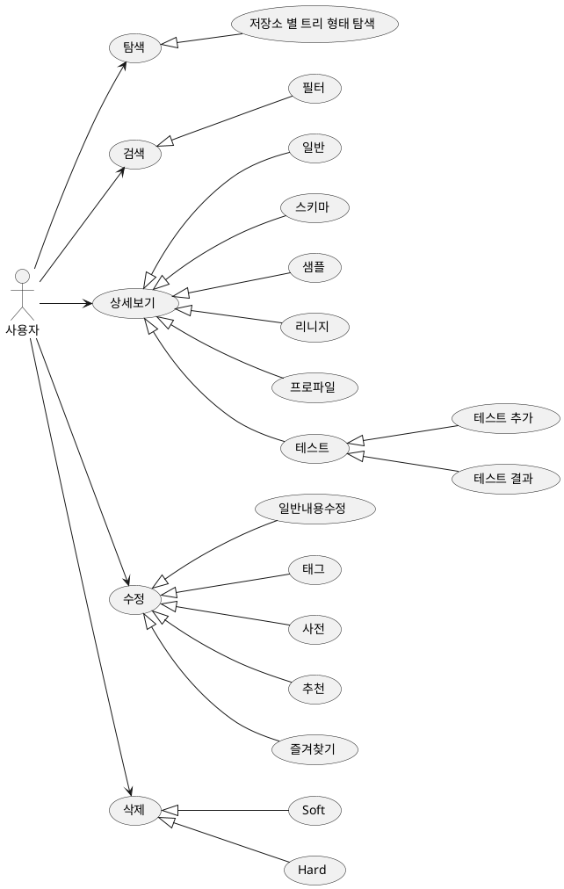
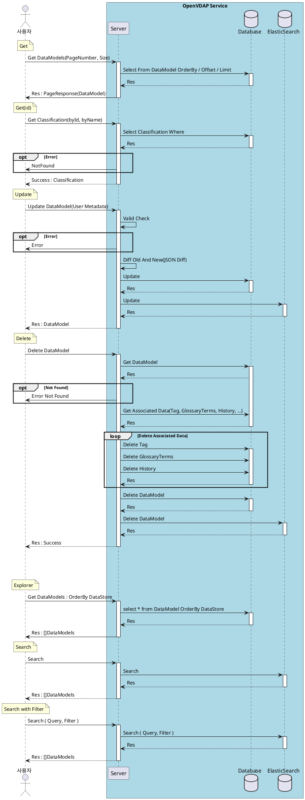
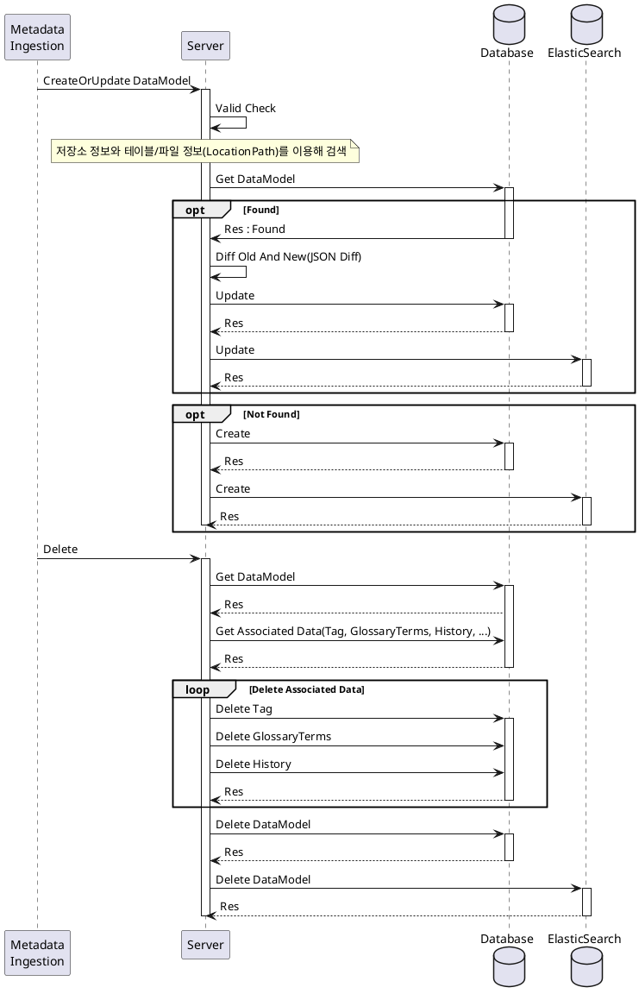
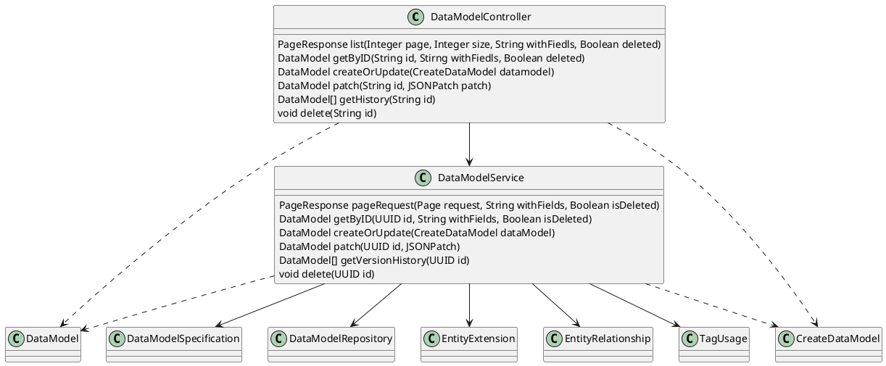
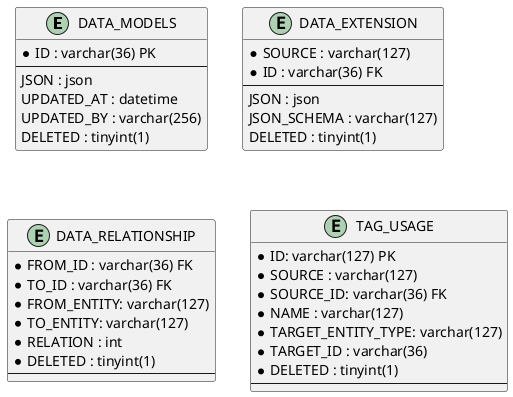

# 데이터 가상화

## 1. 개요

본 문서는 데이터 가상화 설계 문서로 유스케이스, 인터페이스, 시퀀스, 클래스, 데이터베이스 설계서를 포함한다.

## 2. 요구사항

1. 다양한 형태의 데이터를 위한 메타데이터
2. 다양한 형태의 데이터로부터 메타데이터 수집
3. 표준 메타데이터  
   1. 표준 용어 사전  
   2. 불용어 -> 검색과도 연관있음  
4. 데이터 변경을 감지 자동으로 업데이트하는 기능 개발  

### 2.1. 메타데이터 정의

다음은 OpenVDAP을 위한 표준 메타데이터로 공공데이터 표준과 KISTI 메타데이터 표준을 기반으로 작성되었습니다.

> 공공데이터 용어사전을 기반으로 데이터의 이름(테이블 이름, 컬럼 이름 등)을
> 용어 사전과 대조하여 한글이름 or 영문이름을 추가하고 설명을 추가 작성할 수 있을 것 입니다.

| DataName:Depth - 1 | Depth - 2     | Depth - 3 | 데이터타입       | 설명                                                                              | 자동 수집 가능 여부 |
| ------------------ | ------------- | --------- | ---------------- | --------------------------------------------------------------------------------- | :-----------------: |
| ID                 | -             | -         | UUID             | 자원 식별 고유 아이디(OpenVDAP 부여 아이디)                                       |          o          |
| IdentifierType     | -             | -         | String(ENUM)     | 식별자 유형(DOI, ARK, URI, URL, UCI 등)                                           |          x          |
| Identifier         | -             | -         | String           | 프로젝트 내부의 참조 번호나 DOI 와 같은 국제표준식별자 ex : 표준(TTAS.OT-10.0058) |          x          |
| Name               | -             | -         | String           | 자원에 부여된 이름 ex : TableName, FileName, DatasetName                          |          o          |
| DisplayName        | -             | -         | String           | 부제목 : OpenVDAP 에서 사용자가 설정한 이름                                       |          x          |
| Description        | -             | -         | String           | 자원에 설정된 설명 혹은 OpenVDAP 에서 사용자가 입력한 설명                        |          △          |
| Subject(주제)      | -             | -         | String           | 데이터의 주제 혹은 데이터의 내용을 설명하는 키워드 혹은 구 (phrases)              |          △          |
| Version            | -             | -         | Double           | 자원(실데이터)의 변경 or 사용자에 의한 데이터 변경에 따라 증가하는 버전 정보      |          o          |
| Creator(생산자)    | -             | -         | String           | 데이터를 생성한 개체 정보(기관 혹은 개인 식별 정보)                               |          x          |
| Publisher(출판자)  | -             | -         | String           | 자원을 현재의 형태로 이용가능하게 만든 개체                                       |          x          |
| Availability       | -             | -         | Availability     | 자원 관련 담당자/기관 정보                                                        |          -          |
| -                  | Name          | -         | String           | 자원 담당자(기관)의 이름                                                          |          x          |
| -                  | Email         | -         | String           | 연락처(email, phone)                                                              |          x          |
| -                  | phone         | -         | String           | 연락처(email, phone)                                                              |          x          |
| Audience           | -             | -         | Audience         | 자원 이용하기에 적합한 이용자 계층, 계층에 유용성 정보                            |          -          |
| -                  | AudienceType  | -         | String           | 자원을 이용하기에 적합한 이용자 계층                                              |          x          |
| -                  | Accessibility | -         | String           | 특정 계층에게 있어 자원의 이용 가능성과 유용성                                    |          x          |
| AccessControl      | -             | -         | AccessControl    | 보안 정보                                                                         |          -          |
| -                  | Level         | -         | String           | 보안 등급                                                                         |          x          |
| -                  | Reason        | -         | String           | 보안 등급 근거                                                                    |          x          |
| -                  | ReleaseDate   | -         | DateTime         | 공개 예정일                                                                       |          x          |
| Mandate            | -             | -         | Mandate          | 법규 - 자원을 생산 또는 이용가능하게 만든 볍률 정보                               |          x          |
| -                  | Name          | -         | String           | 자원 생산 또는 이용 가능하게 만든 법률 또는 법규의 이름                           |          x          |
| -                  | Refence       | -         | String           | 자원 생산 또는 이용 가능하게 만든 법률 또는 법규의 해당 조항 및 설명              |          x          |
| Right              | -             | -         | String           | 지적재산권 내용                                                                   |          x          |
| Date               | -             | -         | -                | 날짜                                                                              |          -          |
| -                  | Created       | -         | DateTime         | 생성일                                                                            |          o          |
| -                  | Modified      | -         | DateTime         | 마지막 변경 시간                                                                  |          o          |
| -                  | Valid         | -         | DateTime         | 유효 기간                                                                         |          x          |
| -                  | Available     | -         | DateTime         | 이용 가능 기간                                                                    |          x          |
| TagLabels          | -             | -         | Taglabel[]       | 데이터 관련 키워드/사전 정보                                                      |          -          |
| -                  | id            | -         | UUID             | 데이터 관련 키워드/사전 정보                                                      |          -          |
| -                  | name          | -         | String           | 태그/사전 이름                                                                    |          -          |
| -                  | displayName   | -         | String           | 태그/사전 부제                                                                    |          -          |
| -                  | description   | -         | String           | 태그/사전 설명                                                                    |          -          |
| -                  | source        | -         | String           | 태그/사전의 부모 개체 타입 ex : Classification/Glossary/GlossaryTerms             |          -          |
| -                  | sourceId      | -         | String           | 태그/사전의 부모 개체 아이디                                                      |          -          |
| DataType           | -             | -         | String           | 데이터의 유형 ex: Dataset/Structured/Unstructured/Semi-Structured                 |          o          |
| DataSize           | -             | -         | Long             | 테이블, 파일 데이터의 크기(Byte)                                                  |          o          |
| TableType          | -             | -         | String           | 테이블 데이터의 유형(Regular, View, ...) Regular, View                            |          o          |
| FileFormat         | -             | -         | String           | 파일 데이터의 유형 ex : CSV, DOC, JPG, ...                                        |          o          |
| DataStoreType      | -             | -         | String           | 자원 저장소 타입( Mysql, Mariadb, Mssql, Postgresql, ...)                         |          o          |
| DataStore          | -             | -         | ReferenceModel   | 자원 저장소 정보                                                                  |          -          |
| -                  | source        | -         | String           | 타입 (DataStore, Database, DatabaseSchema, Bucket, Folder)                        |          o          |
| -                  | id            | -         | UUID             | DataStore 의 아이디                                                               |          o          |
| -                  | name          | -         | String           | DataStore 의 이름                                                                 |          o          |
| -                  | displayName   | -         | String           | DataStore 의 부제                                                                 |          o          |
| -                  | description   | -         | String           | DataStore 의 설명                                                                 |          o          |
| -                  | href          | -         | String           | DataStore 링크 URI                                                                |          o          |
| Database           | -             | -         | ReferenceModel   | 데이터베이스 정보                                                                 |          -          |
| -                  | source        | -         | String           | 타입 (DataStore, Database, DatabaseSchema, Bucket, Folder)                        |          o          |
| -                  | id            | -         | UUID             | Database 의 아이디                                                                |          o          |
| -                  | name          | -         | String           | Database 의 이름                                                                  |          o          |
| -                  | displayName   | -         | String           | Database 의 부제                                                                  |          o          |
| -                  | description   | -         | String           | Database 의 설명                                                                  |          o          |
| -                  | href          | -         | String           | Database  링크 URI                                                                |          o          |
| DatabaseSchema     | -             | -         | ReferenceModel   | 데이터베이스 스키마 정보                                                          |          -          |
| -                  | source        | -         | String           | 타입 (DataStore, Database, DatabaseSchema, Bucket, Folder)                        |          o          |
| -                  | id            | -         | UUID             | DatabaseSchema 의 아이디                                                          |          o          |
| -                  | name          | -         | String           | DatabaseSchema 의 이름                                                            |          o          |
| -                  | displayName   | -         | String           | DatabaseSchema 의 부제                                                            |          o          |
| -                  | description   | -         | String           | DatabaseSchema 의 설명                                                            |          o          |
| -                  | href          | -         | String           | DatabaseSchema  링크 URI                                                          |          o          |
| Bucket             | -             | -         | ReferenceModel   | S3, MinIO 의 저장소 버켓 정보                                                     |          -          |
| -                  | source        | -         | String           | 타입 (DataStore, Database, DatabaseSchema, Bucket, Folder)                        |          o          |
| -                  | id            | -         | UUID             | Bucket 의 아이디                                                                  |          o          |
| -                  | name          | -         | String           | Bucket 의 이름                                                                    |          o          |
| -                  | displayName   | -         | String           | Bucket 의 부제                                                                    |          o          |
| -                  | description   | -         | String           | Bucket 의 설명                                                                    |          o          |
| -                  | href          | -         | String           | Bucket  링크 URI                                                                  |          o          |
| Folder             | -             | -         | ReferenceModel   | 폴더 정보                                                                         |          -          |
| -                  | source        | -         | String           | 타입 (DataStore, Database, DatabaseSchema, Bucket, Folder)                        |          o          |
| -                  | id            | -         | UUID             | Folder 의 아이디                                                                  |          o          |
| -                  | name          | -         | String           | Folder 의 이름                                                                    |          o          |
| -                  | displayName   | -         | String           | Folder 의 부제                                                                    |          o          |
| -                  | description   | -         | String           | Folder 의 설명                                                                    |          o          |
| -                  | href          | -         | String           | Folder  링크 URI                                                                  |          o          |
| LocationPath       | -             | -         | String           | 데이터 위치 정보 (Path, Link)                                                     |          o          |
| Parent             | -             | -         | ReferenceModel[] | 상위 데이터모델(데이터 셋에 포함된 모델일 경우 데이터 셋) 정보                    |          o          |
| Children           | -             | -         | ReferenceModel[] | 하위 데이터모델(데이터셋에 포함된 데이터 모델) 정보                               |          o          |
| Language           | -             | -         | String           | 데이터에 사용된 언어                                                              |          o          |
| Votes              | -             | -         | Vote             | 데이터 관련 키워드/사전 정보                                                      |          -          |
| -                  | upVotes       | -         | Long             | 추천 수                                                                           |          -          |
| -                  | downVotes     | -         | Long             | 비추천 수                                                                         |          -          |
| -                  | upVoters      | -         | ReferenceModel[] | 추천 사용자 리스트                                                                |          -          |
| -                  | downVoters    | -         | ReferenceModel[] | 비추천 사용자 리스트                                                              |          -          |
| Followers          | -             | -         | ReferenceModel[] | 즐겨찾기 사용자 리스트                                                            |          -          |

**테이블 데이터 상세**  

| DataName:Depth - 1 | Depth - 2             | Depth - 3                       | 데이터타입         | 설명                                                                   | 자동 수집 가능 여부 |
| ------------------ | --------------------- | ------------------------------- | ------------------ | ---------------------------------------------------------------------- | :-----------------: |
| TableProfile       | -                     | -                               | TableProfile       | 테이블 데이터 프로파일                                                 |          o          |
| -                  | SchemaDefinition      | -                               | String             | 테이블 DDL 쿼리                                                        |          o          |
| -                  | TableConstraints      | -                               | TableConstraints   | 테이블 제약사항                                                        |          -          |
| -                  | -                     | ConstraintType                  | String             | 제약사항 (UNIQUE, PK, FK, SORT)                                        |          o          |
| -                  | -                     | Columns                         | String[]           | 컬럼                                                                   |          o          |
| -                  | -                     | ReferredColumns                 | String[]           | 레퍼런스 컬럼 정보(DataID.ColumnName)                                  |          o          |
| -                  | TableProfileConfig    | -                               | TableProfileConfig | 테이블 프로파일을 위한 설정                                            |          -          |
| -                  | -                     | profileSampleType               | String             | 프로파일 작성을 위한 샘플 데이터 수집 방식                             |          -          |
| -                  | -                     | profileSample                   | Long               | 프로파일 작성을 위한 샘플 데이터의 크기                                |          -          |
| -                  | -                     | excludeColumns                  | String[]           | 프로파일 작성에서 제외할 컬럼들                                        |          -          |
| -                  | -                     | includeColumns                  | String[]           | 프로파일 작성에서 포함할 컬럼들                                        |          -          |
| -                  | -                     | computeTableMetrics             | Boolean            | 프로파일 작성을 위한 샘플 데이터의 크기                                |          o          |
| -                  | -                     | computeColumnMetrics            | Boolean            | 프로파일 작성을 위한 샘플 데이터의 크기                                |          o          |
| -                  | -                     | samplingMethodType              | String             | 샘플 데이터 수집 방식                                                  |          -          |
| -                  | -                     | sampleDataCount                 | Long               | 샘플 데이터의 크기                                                     |          -          |
| -                  | -                     | profileQuery                    | String             | 프로파일 작성과 샘플 수집에 사용할 사용자 정의 SQL                     |          o          |
| -                  | TableStatistics(통계) | -                               | TableStatistics    | 테이블 데이터의 통계 정보                                              |          -          |
| -                  | -                     | Timestamp                       | DateTime           | 테이블 통게 수집 시간                                                  |          o          |
| -                  | -                     | ProfileSampleType               | String             | 테이블 통계 작성에 사용된 샘플 데이터 수집 크기 종류 Percentage, Line  |          o          |
| -                  | -                     | ProfileSample                   | Integer            | 테이블 통계 작성에 사용된 샘플 데이터의 크기                           |          o          |
| -                  | -                     | SamplingMethodType              | String             | 테이블 통계 작성에 사용된 샘플 데이터의 수집 방식  System, Random, ... |          o          |
| -                  | -                     | ColumnCount                     | Integer            | 테이블의 컬럼 수                                                       |          o          |
| -                  | -                     | RowCount                        | Integer            | 테이블 라인 수                                                         |          o          |
| -                  | -                     | Size                            | Integer            | 테이블 데이터의 크기(byte)                                             |          o          |
| -                  | -                     | CreateDateTime                  | DateTime           | 테이블 생성 시간                                                       |          o          |
| -                  | Columns (컬럼 정보)   | -                               | Columns            | 테이블의 컬럼 구조를 나타내는 메타 정보                                |          -          |
| -                  | -                     | Name (컬럼 이름)                | String             | 컬럼의 식별자 이름                                                     |          o          |
| -                  | -                     | DisplayName (표시 이름)         | String             | 화면 또는 UI 상에 노출되는 컬럼 이름                                   |          o          |
| -                  | -                     | DataType (데이터 타입)          | String             | INT, FLOAT, DATETIME, TEXT 등 컬럼의 데이터 타입                       |          o          |
| -                  | -                     | DataLength (데이터 길이)        | Integer            | 문자열, 숫자 등의 길이 또는 크기                                       |          o          |
| -                  | -                     | Precision (정밀도)              | Integer            | 숫자 타입 전체 유효 자릿수 (예: 소수점 포함 총 자리 수)                |          o          |
| -                  | -                     | Scale (소수 자릿수)             | Integer            | 소수점 이하 자릿수 (예: 2 → 0.01 단위까지)                             |          o          |
| -                  | -                     | Description (컬럼 설명)         | String             | 컬럼에 대한 부가 설명                                                  |          o          |
| -                  | -                     | IsPrivate (개인정보 여부)       | Boolean            | 해당 컬럼이 개인정보인지 여부 (true/false)                             |          o          |
| -                  | -                     | Tags (태그)                     | TagLabels          | 컬럼에 부여된 태그 혹은 도메인 사전 정보                               |          o          |
| -                  | -                     | Constraint (제약 조건)          | String             | NULL, NOT_NULL, UNIQUE, PK 등 제약조건 정의                            |          o          |
| -                  | -                     | OrdinalPosition (순서)          | Integer            | 컬럼이 테이블에서 나타나는 순서                                        |          o          |
| -                  | -                     | Profile (통계 정보)             | ColumnProfile      | 컬럼에 대한 통계 기반 프로파일 정보                                    |          -          |
| -                  | -                     | - Name (컬럼 이름)              | String             | 프로파일 대상 컬럼 이름                                                |          o          |
| -                  | -                     | - Timestamp (분석 시각)         | DateTime           | 프로파일링 실행 시각                                                   |          o          |
| -                  | -                     | - ValueCount (데이터 수)        | Long               | 해당 컬럼에 존재하는 값의 개수                                         |          o          |
| -                  | -                     | - ValuePercentage (데이터 비율) | Float(%)           | 전체 대비 데이터 존재 비율 (0~100%)                                    |          o          |
| -                  | -                     | - ValidCount (유효 데이터 수)   | Long               | 유효한 값의 수 (예: 포맷 오류 없는 값들)                               |          o          |
| -                  | -                     | - DuplicateCount (중복 수)      | Long               | 중복된 값들의 개수                                                     |          o          |
| -                  | -                     | - NullCount (NULL 수)           | Long               | NULL 값의 개수                                                         |          o          |
| -                  | -                     | - MissingPercentage (결측률)    | Float(%)           | NULL/미싱값 비율 (0~100%)                                              |          o          |
| -                  | -                     | - UniqueCount (고유 수)         | Long               | 고유한 값의 수                                                         |          o          |
| -                  | -                     | - DistinctCount (중복제거 수)   | Long               | 중복 제거 후의 유일한 값 개수                                          |          o          |
| -                  | -                     | - Min (최소값)                  | String             | 최소 값                                                                |          o          |
| -                  | -                     | - Max (최대값)                  | String             | 최대 값                                                                |          o          |
| -                  | -                     | - MinLength (최소 길이)         | Long               | 문자열 혹은 리스트 값의 최소 길이                                      |          o          |
| -                  | -                     | - MaxLength (최대 길이)         | Long               | 문자열 혹은 리스트 값의 최대 길이                                      |          o          |
| -                  | -                     | - Mean (평균)                   | Float              | 수치 데이터의 평균값                                                   |          o          |
| -                  | -                     | - Sum (합계)                    | Float              | 수치 데이터 총합                                                       |          o          |
| -                  | -                     | - Stddev (표준편차)             | Float              | 수치 데이터의 표준편차                                                 |          o          |
| -                  | -                     | - Variance (분산)               | Float              | 데이터의 분산                                                          |          o          |
| -                  | -                     | - Median (중앙값)               | Float              | 중앙값                                                                 |          o          |
| -                  | -                     | - FirstQuartile (1사분위수)     | Float              | 하위 25%에 해당하는 값                                                 |          o          |
| -                  | -                     | - ThirdQuartile (3사분위수)     | Float              | 상위 25% 경계값 (75% 지점)                                             |          o          |
| -                  | -                     | - InterQuartileRange (IQR)      | Float              | 사분위수 범위 = Q3 - Q1                                                |          o          |
| -                  | -                     | - NonParametricSkew (비대칭도)  | Float              | 비모수적 왜도 지표                                                     |          o          |
| -                  | -                     | - Histogram (히스토그램)        | Object/Chart       | 값의 분포 정보를 담은 히스토그램                                       |          o          |
| TableSample        | -                     | -                               | TableSample        | 테이블 샘플 데이터                                                     |          o          |
| -                  | Columns               | -                               | String[]           | 컬럼 이름 리스트                                                       |          o          |
| -                  | Rows                  | -                               | Object[][]         | 테이블 데이터 로우 리스트                                              |          o          |

**문서 타입 데이터 상세**  

| DataName:Depth - 1 | Depth - 2      | Depth - 3 | 데이터타입      | 설명                                                | 자동 수집 가능 여부 |
| ------------------ | -------------- | --------- | --------------- | --------------------------------------------------- | :-----------------: |
| DocumentProfile    | -              | -         | DocumentProfile | 문서 타입 데이터의 메타데이터 정보                  |          -          |
| -                  | MLModelInfo    | -         | String          | 문서 데이터의 메타데이터 수집에 사용된 ML 모델 정보 |          o          |
| -                  | Title          | -         | String          | 제목                                                |          o          |
| -                  | Author         | -         | String          | 작성자                                              |          o          |
| -                  | Company        | -         | String          | 회사                                                |          o          |
| -                  | Abstractive    | -         | String          | 문서 요약                                           |          o          |
| -                  | Keywords       | -         | String          | 주요 키워드                                         |          o          |
| -                  | Domain         | -         | String          | 문서 카테고리(금융, 법률, 의료, 기술 등)            |          o          |
| -                  | LastModifiedBy | -         | String          | 마지막 저장 사용자 정보                             |          o          |
| -                  | Created        | -         | DateTime        | 작성일                                              |          o          |
| -                  | Modified       | -         | DateTime        | 수정일                                              |          o          |
| -                  | PageCount      | -         | Integer         | 페이지 수                                           |          o          |
| -                  | WordCount      | -         | Integer         | 단어 수                                             |          o          |
| DocumentSample     | -              | -         | String          | 문서 데이터의 샘플                                  |          o          |

**사진 타입 데이터 상세**  

| DataName:Depth - 1             | Depth - 2                   | Depth - 3 | 데이터타입         | 설명                                                 | 자동 수집 가능 여부 |
| ------------------------------ | --------------------------- | --------- | ------------------ | ---------------------------------------------------- | :-----------------: |
| PictureProfile (사진 프로파일) | -                           | -         | PictureProfile     | 사진 데이터의 프로파일                               |          -          |
| -                              | MLModelInfo (ML 모델 정보)  | -         | String             | 사진 메타데이터 수집에 사용된 머신러닝 모델 정보     |          o          |
| -                              | Camera (카메라 정보)        | -         | String             | 촬영에 사용된 카메라 기종                            |          o          |
| -                              | PictureDateTime (촬영일시)  | -         | DateTime           | 사진이 촬영된 날짜 및 시간                           |          o          |
| -                              | ShutterSpeed (셔터속도)     | -         | String             | 사진 촬영 시 사용된 셔터 속도                        |          o          |
| -                              | Aperture (조리개값)         | -         | String             | 조리개 수치 (F 값)                                   |          o          |
| -                              | ISO (ISO 감도)              | -         | Integer            | 촬영 시 설정된 ISO 감도 값                           |          o          |
| -                              | FocalLength (초점거리)      | -         | Integer            | 렌즈 초점 거리 (mm)                                  |          o          |
| -                              | WhiteBalance (화이트밸런스) | -         | String (또는 Enum) | 자동 / 수동 등 화이트 밸런스 설정                    |          o          |
| -                              | Flash (플래시 사용 여부)    | -         | Boolean/String     | 플래시 사용 여부 (사용 / 미사용 등)                  |          o          |
| -                              | Latitude (위도)             | -         | String             | GPS 위도 좌표                                        |          o          |
| -                              | Longitude (경도)            | -         | String             | GPS 경도 좌표                                        |          o          |
| -                              | Accuracy (정확도)           | -         | String             | GPS 정확도 값                                        |          o          |
| -                              | EditorApp (편집 소프트웨어) | -         | String             | 사진을 편집한 애플리케이션 또는 소프트웨어 이름      |          o          |
| -                              | AverageColor (평균색상)     | -         | String             | 사진의 전체 평균 색상                                |          o          |
| -                              | DominantColors (주요색상)   | -         | String[]           | 주요 색상 목록                                       |          o          |
| -                              | Contrast (대비)             | -         | Float              | 이미지의 대비 정도                                   |          o          |
| -                              | Brightness (밝기)           | -         | Float              | 이미지의 밝기 값                                     |          o          |
| -                              | Saturation (채도)           | -         | Float              | 색상의 선명도 또는 채도 값                           |          o          |
| -                              | Resolution (해상도)         | -         | String             | 이미지 해상도 (예: 1920x1080)                        |          o          |
| -                              | PixelDensity (픽셀밀도)     | -         | Float              | 인치당 픽셀 수 (PPI)                                 |          o          |
| -                              | ObjectInfo (객체 정보)      | -         | String[]           | 인물, 차량, 동물, 사물 등 이미지 내 인식된 객체 정보 |          o          |
| -                              | LandscapeInfo (풍경 정보)   | -         | String[]           | 산, 바다, 도시, 실내 등 이미지 내 풍경 정보          |          o          |
| -                              | TextDetection (텍스트 검출) | -         | String             | 사진에 포함된 텍스트를 인식하고 변환한 내용          |          o          |
| PictureSample (사진 샘플)      | -                           | -         | Byte               | 사진 원본의 샘플 데이터 (Raw 또는 Thumbnail 등)      |          o          |

**음성(오디오) 타입 데이터 상세**  

| DataName:Depth - 1             | Depth - 2                        | Depth - 3  | 데이터타입         | 설명                                                     | 자동 수집 가능 여부 |
| ------------------------------ | -------------------------------- | ---------- | ------------------ | -------------------------------------------------------- | :-----------------: |
| AudioProfile (오디오 프로파일) | -                                | -          | AudioProfile       | 오디오 데이터의 프로파일                                 |          -          |
| -                              | MLModelInfo (ML 모델 정보)       | -          | String             | 메타데이터 추출에 사용된 머신러닝 모델명                 |          o          |
| -                              | Duration (재생시간)              | -          | Integer (ms)       | 오디오 전체 재생 시간 (밀리초 단위)                      |          o          |
| -                              | Speakers (발화자)                | -          | Speakers[]         | 화자 정보                                                |          -          |
| -                              | -                                | SpeakerID  | String             | 화자 구분 아이디                                         |          o          |
| -                              | SpeakerDiarization (발화자 구분) | -          | SpeakerDiarization | 서로 다른 화자들의 음성 영역 구분                        |          -          |
| -                              | -                                | SpeakerID  | String             | 화자 구분 아이디                                         |          o          |
| -                              | -                                | StartTime  | Long               | 시작 시간(밀리초) ex: 1초100 -> 1100                     |          o          |
| -                              | -                                | EndTime    | Long               | 끝 시간(밀리초)                                          |          o          |
| -                              | -                                | Transcript | String             | 음성 -> 텍스트                                           |          o          |
| -                              | EmotionAnalysis (감정 분석)      | -          | String             | 주요 감정 상태 (예: 기쁨, 슬픔, 분노 등)                 |          o          |
| -                              | BackgroundNoise (배경 소음)      | -          | String             | 배경 환경의 소리 정보 (예: 자연, 거리 소음 등)           |          o          |
| -                              | STT (음성 → 텍스트)              | -          | String             | 음성을 텍스트로 변환한 전체 내용                         |          o          |
| -                              | Language (언어)                  | -          | String             | 사용된 언어 코드 (예: "ko", "en")                        |          o          |
| -                              | Dialect (방언)                   | -          | String             | 지역 방언 정보 (예: "경상도", "전라도")                  |          o          |
| -                              | Keywords (키워드)                | -          | String[]           | 오디오에서 추출된 주요 키워드 목록                       |          o          |
| -                              | NamedEntities (개체명)           | -          | String[]           | 사람, 장소, 기관, 날짜 등의 정보                         |          o          |
| -                              | Intent (의도)                    | -          | String             | 화자의 발화 의도 (예: 질문, 요청, 명령 등)               |          o          |
| -                              | Summary (요약)                   | -          | String             | 전체 오디오 내용의 요약 문장                             |          o          |
| AudioSample(오디오 샘플)       | -                                | -          | String             | 오디오 샘플(STT를 이용해 텍스트로 변환된 데이터 중 일부) |          -          |

**데이터 셋일 경우 다음 정보에 처리에 어려움이 있어 처리하지 않음.**  

> 자동으로 수집이 어려운 데이터(불가능한 데이터)에 대해 사용자가 쉽게 적용할 수 있는 방안이 필요하다.
> 방안으로 메타데이터 정보의 일괄적용 혹은 CSV 파일을 이용한 입력을 고려한다.
> 일괄적용의 경우 설정 할 메타데이터를 JSONPatch 와 유사하게 입력할 수 있도록 하고, 적용할 데이터들을 검색하고 선택하여 적용하는 방식
> CSV를 이용한 방법의 경우 데이터 모델 리스트를 CSV 파일 형태로 제공하고, CSV 편집 후 업로드 시 적용한다. 

| Name(한글)     | 데이터타입 | 설명                                                      |
| -------------- | ---------- | --------------------------------------------------------- |
| DataStoreType  | String     | 자원 저장소 타입( Mysql, Mariadb, Mssql, Postgresql, ...) |
| DataStore      | Struct     | 자원 저장소 정보                                          |
| Database       | Struct     | 데이터베이스 정보                                         |
| DatabaseSchema | Struct     | 데이터베이스 스키마 정보                                  |
| Bucket         | Struct     | S3, MinIO 의 저장소 버켓 정보                             |
| Folder         | Struct     | 폴더 정보                                                 |
| LocationPath   | String     | 데이터 위치 정보                                          |

## 3. Usecase

사용자 유즈케이스

## 4. 시퀀스

### 4.1. 기능 리스트

- DataModel
  - PageRequest : 리스트 조회
  - GetById : 단일 조회
  - Create/Update : 데이터 모델 추가 / 수정
    - Database
    - DatabaseSchema
    - Table
    - Bucket
    - Folder
    - File
      - Table Type Data(CSV, XLSX)
      - Document Type Data(DOCX, HWPX)
      - Image Type Data(PNG, JPG)
      - Audio Type Data(MP3)
      - Semi Structure Type Data(JSON)
  - CreateDataset
  - VersionHistory : 데이터 모델 버전 히스토리
  - Delete : 데이터 모델 삭제
    - Soft
    - Hard
- Search
  - General : 일반 검색
  - Filtering : 필터링 방식 검색
- Explorer

### 4.2. 다이어그램

사용자 중심 시퀀스

서비스 중심 시퀀스  

## 5. 클래스

| 유형                    | 기호    | 목적                                                                   |
| ----------------------- | ------- | ---------------------------------------------------------------------- |
| 의존성(Association)     | `-->`   | 객체가 다른 객체를 사용함. ( A `-->` B)                                |
| 확장(Inheritance)       | `<\|--` | 계층 구조에서 클래스의 특수화. (부모 `<\|--` 자식)                     |
| 구현(Implementation)    | `<\|..` | 클래스에 의한 인터페이스의 실현. (Interface `<\|..` Class)             |
| 약한 의존성(Dependency) | `..>`   | 더 약한 형태의 의존성. A 클래스 메소스 파라미터로 B를 사용( A `..>` B) |
| 집합(Aggregation)       | `o--`   | 부분이 전체와 독립적으로 존재할 수 있음( 클래스 `o--` 부분 클래스)     |
| 컴포지션(Composition)   | `*--`   | 부분이 전체 없이 존재할 수 없음( 클래스 `*--` 부분 클래스)             |

---

## 6. 인터페이스  

Swagger 로 대체

## 7. 데이터베이스

