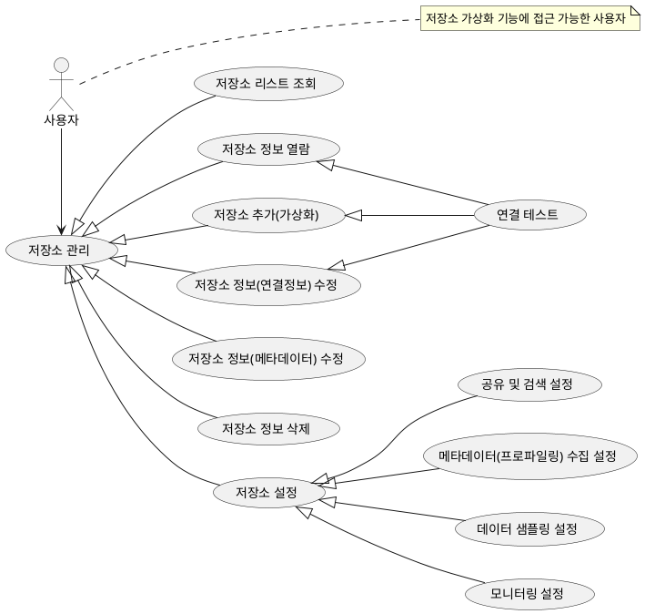
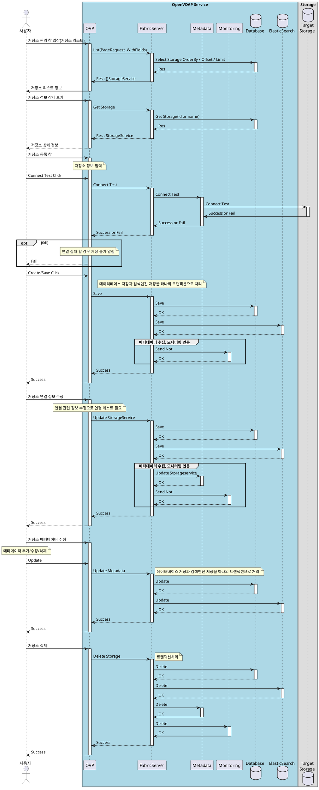
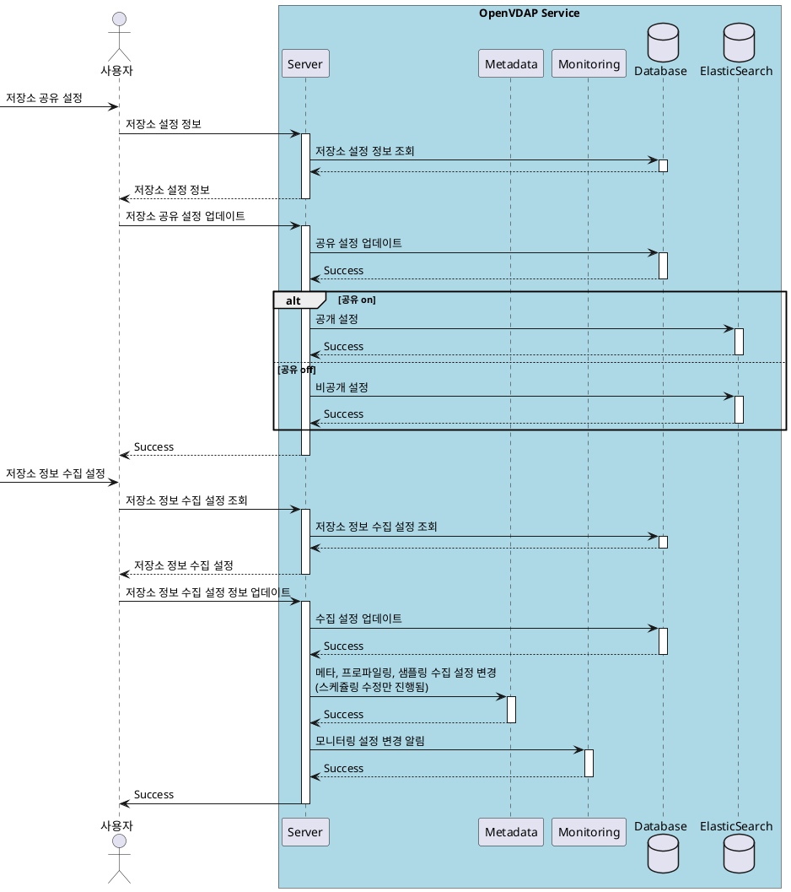
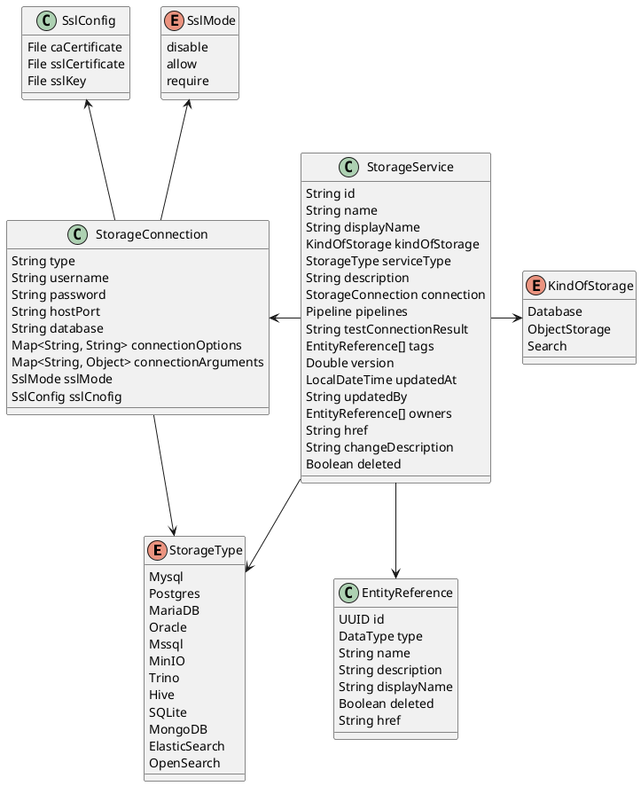
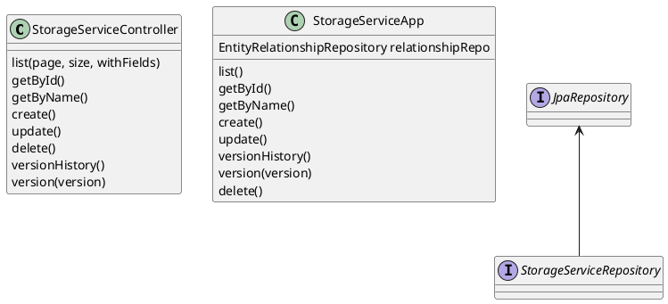

# 저장소 가상화

## 1. 개요

저장소 가상화(Storage Virtualization)는 물리적 데이터 저장소의 분산된 리소스를 하나의
논리적 저장소로 통합하여 관리하는 기술입니다.
본 문서는 저장소 가상화 설계 문서로 유스케이스, 인터페이스, 시퀀스, 클래스, 데이터베이스 설계서를 포함한다.

## 2. 요구사항

일반 요구사항

1. 다양한 데이터 저장소 정보를 등록(가상화)하여 관리할 수 있는 기능
   3차년도 목표 7~8종
   - MySQL
   - MariaDB
   - PostgreSQL
   - MinIO
   - Oracle
   - MongoDB
   - MS-SQL
   - Hive
   - ...
2. 사용자 설정 가능한 메타데이터  
   1. 카테고리/태그  
   2. 사전  

보안 요구사항

1. 거버넌스 : 접근 제어
   1. 저장소 관리 기능에 대한 접근 제어  
   2. 저장소 정보(하위 데이터)에 대한 접근 제어 - 공개 / 비공개  

## 3. Usecase

## 4. 시퀀스

- 저장소 관리  
  - 리스트 조회
  - 저장소 정보
    - 연결테스트  
  - 추가
    - 연결테스트  
  - 수정
    - 연결테스트  
  - 저장소 메타데이터 수정
  - 삭제  
  

  
- 저장소 설정
  - 검색/공유 설정  
  - 메타데이터(프로파일링) 수집 설정  
    - 자세한 내용은 virtualzation-pipeline.md 을 참고
  - 샘플 수집 설정  
    - 자세한 내용은 virtualzation-pipeline.md 파일을 참고
  - 모니터링 설정  
    - 자세한 내용은 monitoring.md 파일을 참고

## 5. 클래스 다이어그램

**참고용**  

| 유형                    | 기호    | 목적                                                                   |
| ----------------------- | ------- | ---------------------------------------------------------------------- |
| 의존성(Association)     | `-->`   | 객체가 다른 객체를 사용함. ( A `-->` B)                                |
| 확장(Inheritance)       | `<\|--` | 계층 구조에서 클래스의 특수화. (부모 `<\|--` 자식)                     |
| 구현(Implementation)    | `<\|..` | 클래스에 의한 인터페이스의 실현. (Interface `<\|..` Class)             |
| 약한 의존성(Dependency) | `..>`   | 더 약한 형태의 의존성. A 클래스 메소스 파라미터로 B를 사용( A `..>` B) |
| 집합(Aggregation)       | `o--`   | 부분이 전체와 독립적으로 존재할 수 있음( 클래스 `o--` 부분 클래스)     |
| 컴포지션(Composition)   | `*--`   | 부분이 전체 없이 존재할 수 없음( 클래스 `*--` 부분 클래스)             |

- 저장소 연결 정보  

---

## 6. 인터페이스 설계

> 본 문서에서는 현 시점(25.03.24)에서는 인터페이스 리스트만을 작성한다.  
> 상세한 내용에 대해서는 Swagger를 활용하거나 본 문서에 내용을 업데이트하여 제공한다.  

### 6.1. 저장소 관리

1. List
2. GetById, getByName
3. Create
4. Update
5. ConnectionTest
6. DeleteById/Name
7. VersionHistory

### 6.2. 저장소 설정

1. Search
   1. Enable/Disable
2. Monitoring
  [모니터링 설계 문서](../monitoring/monitoring.md)
3. Pipeline
  [파이프라인 설계 문서](./virtualization-pipeline.md)

## 7. 데이터베이스

- StorageService

| Column         | Data Type   | Constraints      | Index | Desc                                 |
| -------------- | ----------- | ---------------- | :---: | ------------------------------------ |
| `id`           | UUID        | PRIMARY KEY      |   v   | 저장소 고유 식별자                   |
| `name`         | CHAR(256)   | UNIQUE, NOT NULL |   v   | 저장소 이름                          |
| `kind`         | CHAR(128)   | NOT NULL         |       | 저장소 종류(database, objectstorage) |
| `storage_type` | CHAR(256)   | NOT NULL         |       | 저장소 타입                          |
| `json`         | JSON        | NOT NULL         |       | StorageService JSON String           |
| `updated_at`   | DATETIME(3) | NOT NULL         |       | 저장소 데이터 변경 시간              |
| `udpated_by`   | CHAR(256)   | NOT NULL         |       | 저장소 정보 변경 사용자              |
| `deleted`      | BOOLEAN     |                  |   v   | 저장소 삭제 여부                     |
