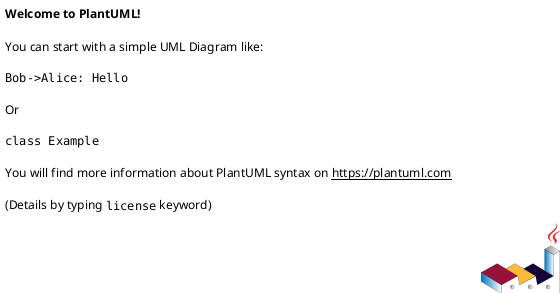

# 메트릭

## 1. 개요

본 문서는 시스템, 저장소, 데이터 메트릭 기능을 위한 설계 문서로 유스케이스, 
인터페이스, 시퀀스, 클래스, 데이터베이스 설계서를 포함한다.

## 2. 요구사항

시스템 기준 메트릭 정보 제공
저장소 기준 메트릭 정보 제공
데이터(테이블, 파일, ...) 기준 메트릭 정보 제공

## 2.1. 기능

아래 데이터를 시스템 기준(필터링 없음), 저장소 기준(저장소 필터링)으로 제공
  데이터 별 설명 작성률
  데이터 별 소유자(담당자) 할당률
  데이터 별 카테고리 포함률

  시각화로 제공되는 정보
  Datatype, Dataformat 별 
  시간 순 등록 데이터의 변화
  시간 순 설명 및 태그 설정 변화

  카테고리 별 데이터 분포
  태그 별 데이터 분포

테이블 데이터 메트릭

시스템 사용 관련 메트릭
  일 별 활성 사용자 수
  최다 활동 사용자

  most view data
    | 이름 | 데이터 타입 | 소유자 | View Count |
  data type 별 view count : line graph
  category 별
  service 별
  ...

## 2.2. 분석

## 2.3. 데이터 퀄리티

## 3. Usecase

```plantuml
@startuml
allowmixing
left to right direction
@enduml
```

## 4. 클래스



## 5. 시퀀스

```plantuml
@startuml

@enduml
```

## 6. 인터페이스

## 7. 데이터베이스

| Column              | Data Type | Constraints                           | Index | Desc                                   |
| ------------------- | --------- | ------------------------------------- | :---: | -------------------------------------- |
| `id`                | ENUM      | NOT NULL                              |   v   | 저장소 타입                            |


json - schema - analytics 참고