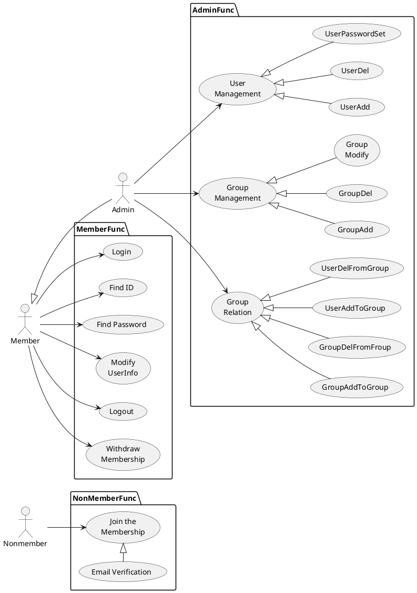
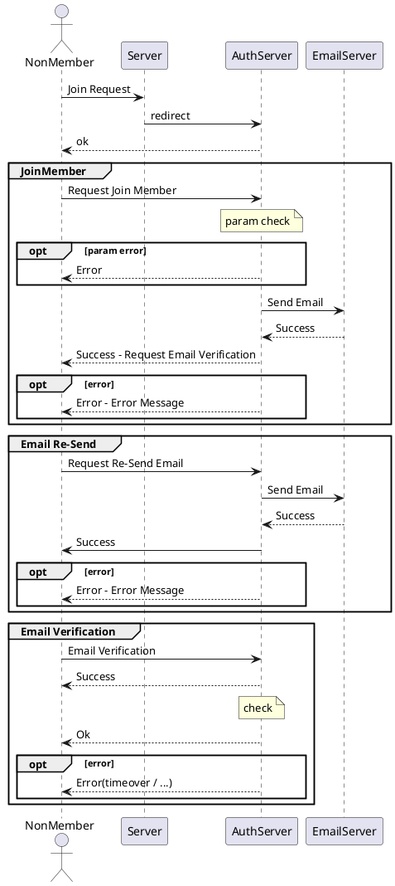
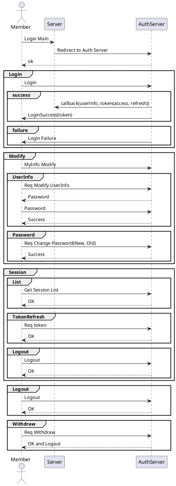
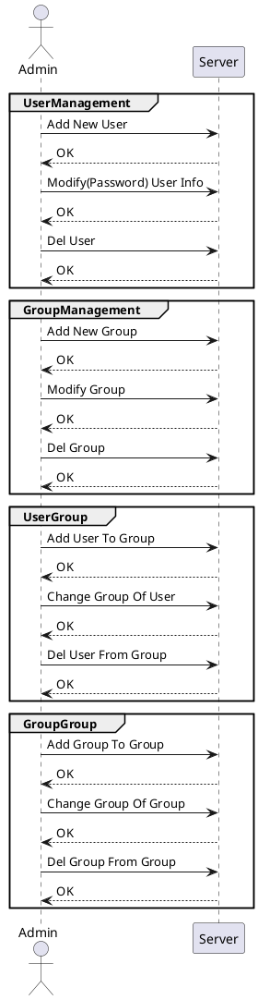
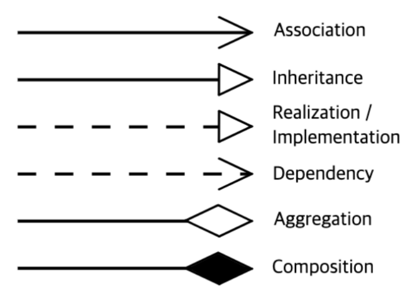

---
사용자 관리 설계 문서
---

# 사용자 관리

## 1. 개요

본 문서는 사용자 관리 설계 문서로 유스케이스, 인터페이스, 시퀀스, 클래스, 데이터베이스 설계서를 포함한다.

## 2. 요구사항

- 일반 요구사항  
  - 아이디는 이메일 형태  
  - 다중 세션을 허용  
    - 다중 세션의 범위는 보안 요구사항(접속 알림, 다중국가 불가)을 만족하면서  
  - 사용자는 여러개의 그룹에 소속될 수 있음  
  - 그룹은 트리 형태로 구성
- 사용자 보안 요구사항  
  - ID/패스워드 기반 로그인  
    - 사용자 ID는 고유해야 하며, 중복 등록을 방지해야 한다.  
    - 패스워드는 안전한 해시 알고리즘(Bcrypt, Argon2 등)으로 저장해야 한다.  
    - 패스워드의 최소 길이는 8자 이상으로 하고, 대문자, 소문자, 숫자, 특수문자를 포함하도록 한다.  
    - 로그인 실패 시 일정 횟수(예: 5회) 초과하면 계정을 잠그고, 일정 시간 후 다시 시도할 수 있도록 한다.  
  - 비밀번호 정책  
    - 사용자는 일정 기간(예: 90일)마다 비밀번호를 변경해야 한다.  
    - 최근 사용한 비밀번호(예: 5개)는 재사용할 수 없도록 한다.  
    - 패스워드는 최소한 다음 기준을 충족해야 한다.  
    - 대소문자, 숫자, 특수문자 포함  
    - 공백 포함 불가  
    - 일반적으로 사용되는 쉬운 비밀번호(예: 12345678, password1 등) 차단  
  - 자동 로그아웃  
    - 사용자가 일정 시간(예: 10분) 동안 활동이 없을 경우 자동으로 로그아웃 처리한다.  
    - 민감한 작업(예: 비밀번호 변경, 결제 정보 변경 등) 수행 시 재인증(패스워드)을 요구한다.  
  - 세션 및 토큰 관리  
    - JWT 사용 시, 토큰은 암호화 및 서명하여 저장해야 한다.  
    - 세션 쿠키는 HttpOnly, Secure, SameSite=Strict 옵션을 적용해야 한다. ?? 
    - 사용자가 로그아웃하면 해당 세션과 인증 토큰을 즉시 무효화해야 한다.
- 계정 보안 요구사항
  - 계정 잠금 및 복구
    - 여러 번 로그인 실패(예: 5회) 시 계정을 잠그고, 이메일 또는 관리자 승인 후 해제해야 한다.  
    - 계정 복구 시 이메일 인증, 보안 질문 또는 2FA를 요구해야 한다.  
  - 로그 및 감사(Audit Logging)
    - 사용자 로그인, 로그아웃, 비밀번호 변경, 계정 생성/삭제 등의 이벤트를 기록해야 한다.
    - 로그는 최소 6개월 이상 저장하고, 변경할 수 없도록 보호해야 한다.
  - 의심스러운 활동 탐지
    - 동일한 계정으로 여러 위치에서 로그인 시 알림을 제공해야 한다.
    - 비정상적인 로그인 시도(예: 여러 국가에서 로그인 시도)를 감지하고 차단할 수 있어야 한다.
- 권한 관리 보안 요구사항  
  - 역할 기반 접근 제어(RBAC)
    - 사용자 그룹(예: 관리자, 일반 사용자, 게스트 등)에 따라 접근 권한을 설정해야 한다.
    - 최소 권한 원칙(Principle of Least Privilege, POLP)을 적용해야 한다.
    - 관리자는 시스템 내에서 특정 역할을 가진 사용자만 생성할 수 있어야 한다.
  - 권한 상승 방지
    - 사용자가 임의로 자신의 권한을 변경할 수 없도록 해야 한다.
    - 관리자 계정의 생성 및 수정은 로그로 기록하고, 감사가 가능해야 한다.
  - API 접근 권한 설정
    - API 호출 시 사용자 인증 및 권한 검사를 수행해야 한다.
    - 관리 기능을 수행하는 API는 추가적인 인증(예: API 키, OAuth 2.0 등)을 요구해야 한다.
- 기타 보안 요구사항
  - 데이터 보호 및 암호화
    - 비밀번호는 평문 저장을 금지하고, 안전한 해시 함수(Bcrypt, PBKDF2, Argon2 등)를 사용해야 한다.
    - 사용자의 중요한 정보(예: 이메일, 전화번호 등)는 저장 시 암호화해야 한다.
  - 외부 공격 방어
    - 브루트포스 공격을 방지하기 위해 CAPTCHA 또는 지연 응답(예: 1초 딜레이)을 적용한다.
    - CSRF(Cross-Site Request Forgery) 보호를 위해 CSRF 토큰을 사용한다.
    - XSS(Cross-Site Scripting) 방지를 위해 입력 값을 필터링 및 인코딩한다.
  - 탈퇴 및 데이터 삭제 정책
    - 사용자가 계정을 탈퇴하면 모든 관련 데이터를 안전하게 삭제해야 한다.
    - 일부 데이터(법적 요구사항에 따라 보존해야 하는 기록)는 별도로 관리해야 한다.

### 2.1. Rate Limiting

사용자 관련 API에서 Rate Limit(속도 제한) 을 적용해야 하는 주요 부분

(1) 로그인 API (Authentication)  
예: POST /api/auth/login  
이유:  
브루트포스 공격(무차별 대입 공격) 방지  
자동화된 로그인 시도(봇 공격) 방지  
추천 제한:  
동일 IP에서 510회 실패 시 515분 동안 로그인 차단  
CAPTCHA 적용 후 일정 횟수(예: 10회) 초과 시 추가 차단  

(2) 회원가입 API (Sign-Up)  
예: POST /api/auth/register  
이유:  
자동화된 계정 생성(스팸 가입) 방지  
추천 제한:  
동일 IP에서 10~20회/시간 이상 요청 시 차단  
CAPTCHA 또는 이메일 인증을 필수로 요구  

(3) 비밀번호 찾기/재설정 API  
예: POST /api/auth/reset-password 또는 POST /api/auth/forgot-password  
이유:  
무차별 대입 공격을 통한 계정 탈취 방지  
과도한 요청으로 이메일/SMS API 비용 증가 방지  
추천 제한:  
동일 IP에서 5~10회/시간 이상 요청 시 차단  
동일 사용자(이메일, 전화번호) 기준 3~5회/시간 요청 제한  

(4) API 토큰 생성 API  
예: POST /api/auth/generate-token  
이유:  
API 키 및 토큰 생성 남용 방지  
추천 제한:  
동일 사용자당 3~5회/시간 이상 요청 시 제한  

(5) 사용자 프로필 업데이트 API  
예: PUT /api/user/profile  
이유:  
과도한 요청으로 인해 서버 부하 증가 방지  
추천 제한:  
동일 계정에서 5~10회/시간 이상 요청 시 제한  

(6) 게시글 작성/댓글 API (스팸 방지)  
예: POST /api/posts 또는 POST /api/comments  
이유:  
자동화된 스팸 댓글, 도배 방지  
추천 제한:  
동일 IP 또는 계정에서 10~20회/분 이상 요청 시 제한  

(8) 검색 API (DDoS 방지)  
예: GET /api/search?q=...  
이유:  
과도한 검색 요청으로 인한 서버 부하 방지  
추천 제한:  
동일 IP에서 10~20회/분 이상 요청 시 제한  

#### Rate Limit 적용 방법

1. IP 기반 제한
    - 동일 IP에서 일정 횟수 이상 요청 시 차단 (예: X회/분, Y회/시간)
    - 공용 네트워크(회사, 카페 등)에서는 예외 처리 필요
2. 사용자 계정 기반 제한
    - 로그인한 사용자 기준으로 일정 횟수 이상 요청 시 제한
    - 계정 탈취 시도 방지를 위해 적용
3. 지수적 백오프(Exponential Backoff)
    - 실패 횟수 증가 시 대기 시간 늘리기 (예: 5회 실패 → 5분 대기, 10회 실패 → 30분 대기)
4. Rate Limit 헤더 제공
    - 클라이언트가 남은 요청 횟수를 알 수 있도록 X-RateLimit-Limit, X-RateLimit-Remaining, X-RateLimit-Reset 헤더 추가
5. 서버 측 로그 기록 및 알림
    - 이상 탐지 시 관리자에게 알림 (예: 특정 계정에서 짧은 시간 동안 로그인 시도 100회)

## 2. Usecase

## 3. 시퀀스 & 인터페이스

- 비회원  
  - 회원가입  
  - 이메일인증요청  

- 회원(관리자)
  - 로그인  
  - 아이디 찾기
  - 비밀번호 찾기  
  - 사용자 정보 변경  
  - 세션
    - 세션 조희  
    - 세션(토큰) 갱신
    - 세션 로그아웃
  - 로그아웃  
  - 회원탈퇴  
  

- 관리자
  - 사용자  
    - 추가  
    - 수정  
    - 삭제  
  - 그룹
    - 추가  
    - 수정  
    - 삭제  
  - 사용자_그룹  
    - 추가  
    - 수정  
    - 삭제  
  - 그룹_그룹
    - 추가  
    - 수정  
    - 삭제  

## 5. 클래스

| 유형                    | 기호    | 목적                                                                   |
| ----------------------- | ------- | ---------------------------------------------------------------------- |
| 의존성(Association)     | `-->`   | 객체가 다른 객체를 사용함. ( A `-->` B)                                |
| 확장(Inheritance)       | `<\|--` | 계층 구조에서 클래스의 특수화. (부모 `<\|--` 자식)                     |
| 구현(Implementation)    | `<\|..` | 클래스에 의한 인터페이스의 실현. (Interface `<\|..` Class)             |
| 약한 의존성(Dependency) | `..>`   | 더 약한 형태의 의존성. A 클래스 메소스 파라미터로 B를 사용( A `..>` B) |
| 집합(Aggregation)       | `o--`   | 부분이 전체와 독립적으로 존재할 수 있음( 클래스 `o--` 부분 클래스)     |
| 컴포지션(Composition)   | `*--`   | 부분이 전체 없이 존재할 수 없음( 클래스 `*--` 부분 클래스)             |

```plantuml
@startuml
' abstract        abstract
' abstract class  "abstract class"
' annotation      annotation
' circle          circle
' ()              circle_short_form
' class           class
' class           class_stereo  <<stereotype>>
' diamond         diamond
' <>              diamond_short_form
' entity          entity
' enum            enum
' exception       exception
' interface       interface
' metaclass       metaclass
' protocol        protocol
' stereotype      stereotype
' struct          struct

class           User
class           Group
class           Relation
@enduml
```

## 6. 데이터베이스

- UserTable

| Field | DataType | Constraint | Default | Desc |
| ----- | -------- | ------- | ------- | ---- |
| id    | UUID     |         |         |      |

json User {
  "id": "uuid",
  "email": "email address",
  "pw": "password",
  "name": "name",
  "nickname": "nickname",
  "phone": "phone",
  "status": ["active", "inactive", "etc"],
  "createdAt": "create time",
  "updatedAt": "update time"
}

- GroupTable

- UserGroupRelation

json Group {
  "id": "uuid",
  "name": "name",
  "nickname": "nickname",
  "desc": "description",
  "createdAt": "create time",
  "updatedAt": "update time"
}

json UserGroupRelation {
  "parentID": "group id",
  "childType": ["group", "user"],
  "childID": ["group id", "user id"],
  "joined_at": "join time"
}

json SignUpReq {
  "id": "email address",
  "pw": "password",
  "name": "name",
  "nickname": "nickname",
  "phone": "phone",
  "etc": "etc"
}

json SignUpRes {
  "code": ["success", "error"],
  "errMsg": "error message",
  "body": {
    "message": "User registered successfully"
  }
}

SignUpReq --> SignUpRes

note "SignUp 완료 후 이메일 전송과 이메일 내 링크 연결을 통해 이메일 인증을 완료" as signup_note

SignUpReq .. signup_note

json LoginReq {
  "id": "user@example.com",
  "password": "securepassword",
  "device_info": "Chrome - Windows"
	' Device Info: 사용자가 로그인한 기기 정보를 DB에 저장
}

note "다중 세션을 위해 추가적인 정보 `device_info`를 사용(예시)" as login_note
LoginReq .. login_note

json LoginRes {
  "access_token": "eyJhbGciOiJIUzI1...",
  "refresh_token": "d1f13c1c-bc87...",
  "expires_in": 3600
  ' Access Token: 짧은 수명의 JWT (예: 1시간)
	' Refresh Token: 기기별 고유한 UUID 기반 토큰 (DB 또는 Redis에 저장)
}
LoginReq -> LoginRes

' 이메일 인증이 완료되지 않은 사용자의 경우 이메일 인증 요청 화면으로 이동
json EmailVerificationReq {
  "request": "..."
}

' 이메일 인증은 5분 내로 완료되지 못하는 경우 인증 링크로 접속하더라도 인증 실패 

json TokenRefreshReq {
  "refresh_token": "d1f13c1c-bc87..."
}

json TokenRefreshRes {
  "access_token": "new-access-token",
  "expires_in": 3600
}

note "Refresh Token이 유효하지 않으면 로그아웃 처리" as token_refresh_note
TokenRefreshReq .. token_refresh_note

TokenRefreshReq --> TokenRefreshRes

' 세션 테이블은 Audit Log와 연결된다.
json sessionTable {
  "id": "session id", 
  "userId": "userId",
  "refresh_token": "token...",
  "device_info": "device info",
  "status": ["active", "inactive"],
  "createdAt": "create time",
  "ipAddress": "IP Address", 
  "expiresAt": "token 만료 시간"
}

note "현재 접속된 기기 정보 조회" as session_list_note

json SessionList {
  "SessionList": [
    {
      "device_info": "Chrome - Windows",
      "last_active": "2024-02-03T12:00:00Z"
    },
    {
      "device_info": "Safari - iPhone",
      "last_active": "2024-02-02T23:45:00Z"
    }
  ]
}

SessionList .. session_list_note

' 1.	Access Token은 짧은 만료 시간 (1시간 이하)
' 2.	Refresh Token은 DB 또는 Redis에 저장 (기기별 관리)
' 3.	로그아웃 시 Refresh Token을 삭제하여 세션 종료
' 4.	Blacklist를 활용하여 강제 로그아웃 가능
' 5.	JWT 서명키는 안전하게 관리 (환경 변수 사용)
' 6.	Rate Limiting 적용 (특히 로그인, 토큰 갱신 API에 적용)" as security_note

# 2. 저장소 가상화 