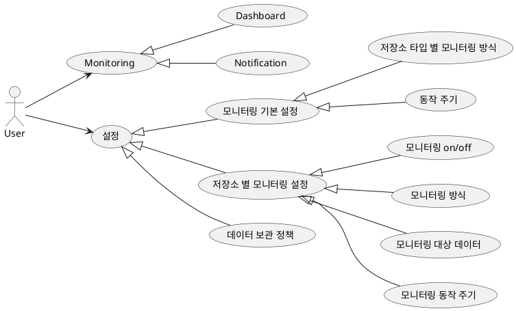
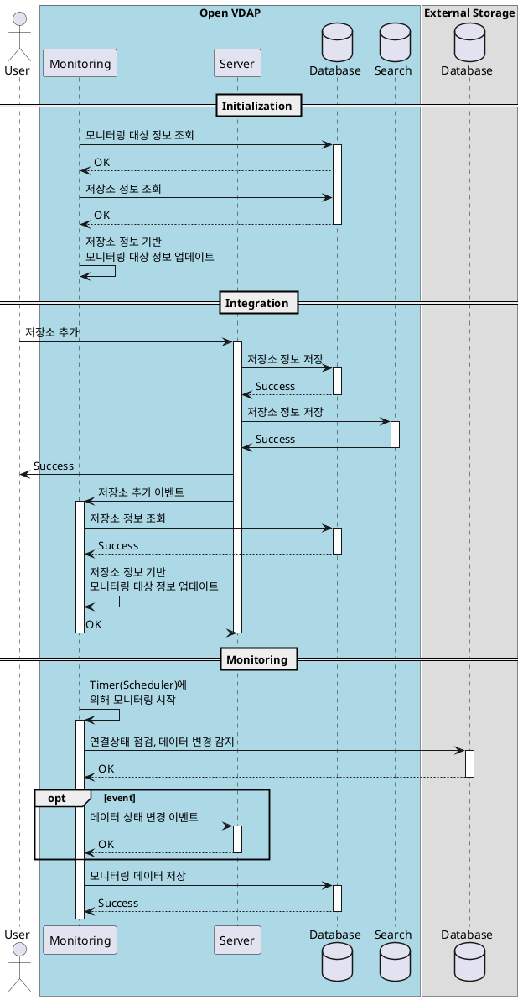
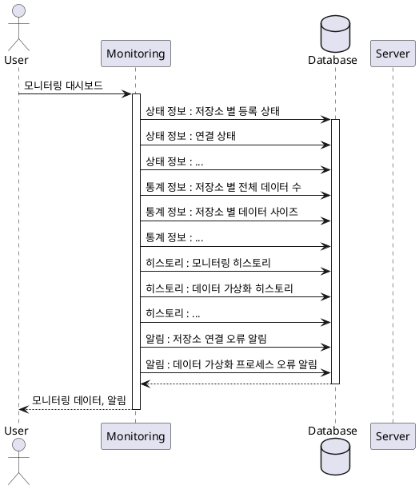
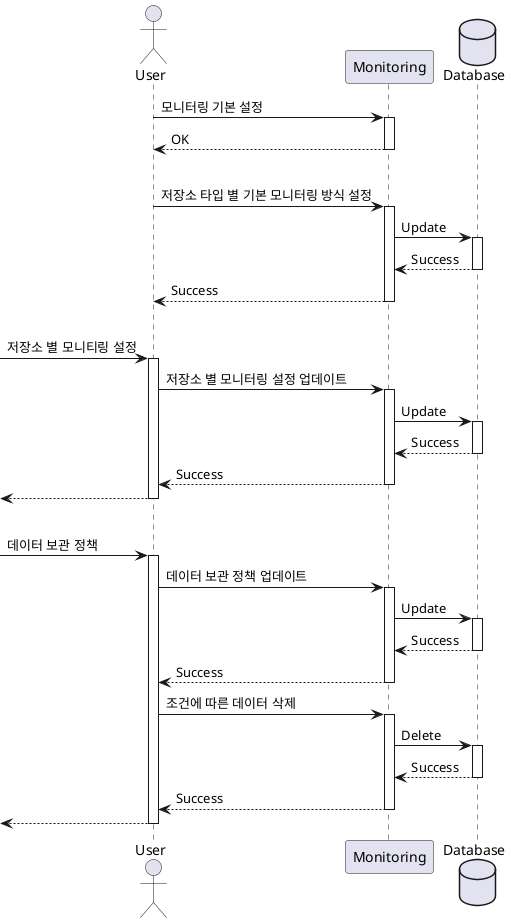
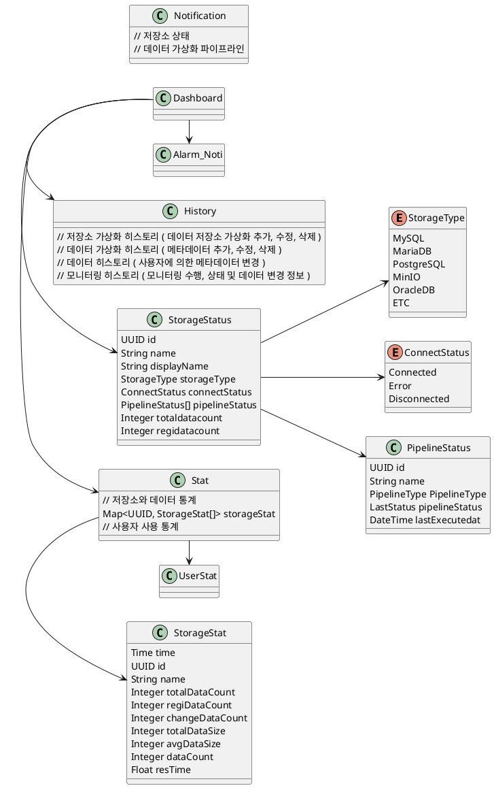

# 모니터링

## 1. 개요

본 문서는 모니터링 설계 문서로 유스케이스, 인터페이스, 시퀀스, 클래스, 데이터베이스 설계서를 포함한다.

## 2. 요구사항

각종 필터 조건을 이용하여 모니터링 대상을 지정하고 상태를 조회할 수 있는 기능 개발
저장소에 존재하는 데이터를 자동으로 인식하여 추상화하고 등록하는 기술 개발
원본 데이터 변화를 주기적으로 모니터링 하여 데이터 모델을 최신 상태로 유지하는 기술 개발

## 3. Usecase

## 4. 시퀀스

- 시작 및 프로세스 연동(모니터링 시작)  
- 모니터링  
  - 연결 상태
    - select 1;
    - http connect
    - icmp : X
  - 데이터 수
    - show database
    - show databaseSchema
    - show tables
  - 데이터 변경 감지
    - 기존 데이터 정보 로드
    - 현재 데이터 상태 확인  
      - schema 변경 확인  
      - 데이터 변경 확인  
        - table updatetime 확인 방법
        - table size 변경 확인  
        - file updatetime
  - 평균 응답 시간  
  - 기타  

- Monitoring
  - Dashboard
    - 상태
      - 저장소 타입 별 등록 상태(수) - fabric  
      - 연결 상태 - 수집  
      - 가상화 상태(메타데이터 수집 프로세스 상태) - fabric  
    - 통계  
      - 데이터 정보
        - 저장소 별 전체 데이터 수 - 수집
        - 저장소 별 등록 데이터 수 - fabric  
        - 저장소 별 데이터 변경 감지 수 (Hour, Day, Month)  
          - 데이터 변경 감지 - 개발  
        - 저장소 별 등록 데이터 사이즈 Total - table rows/mb, file size  
        - 저장소 별 등록 데이터 사이트 Avg - ...  
        - 데이터 종류 별 등록 수 - fabric  
        - 그 외 사용자 요구 혹은 필요에 따른 정보 추가  
      - 데이터 가상화  
        - 데이터 가상화 프로세스 실행 히스토리  
  - Notification
    - 데이터 저장소 연결 상태 변경 알림
    - 데이터 가상화 프로세스 실패 알림  

- 설정  
  - 모니터링 기본 설정  
    - 저장소 타입 별 모니터링 방식  
    - 동작 주기  
  - 저장소 별 모니터링 설정  
    - 모니터링 On/Off  
    - 동작 주기  
    - 동작 설정  
      - 연결 상태 확인 방법 설정  
      - 데이터 모니터링
        - 필터
          - include / exclude
  - 데이터 정책(보관)  
    - 정책 업데이트  
    - 오래된 데이터 삭제  

## 5. 인터페이스

현 시점(25.02.07)에서는 인터페이스를 모두 정의할 수 없어 개발 과정에서 추가한다.  

## 6. 클래스

| 유형                    | 기호    | 목적                                                                   |
| ----------------------- | ------- | ---------------------------------------------------------------------- |
| 의존성(Association)     | `-->`   | 객체가 다른 객체를 사용함. ( A `-->` B)                                |
| 확장(Inheritance)       | `<\|--` | 계층 구조에서 클래스의 특수화. (부모 `<\|--` 자식)                     |
| 구현(Implementation)    | `<\|..` | 클래스에 의한 인터페이스의 실현. (Interface `<\|..` Class)             |
| 약한 의존성(Dependency) | `..>`   | 더 약한 형태의 의존성. A 클래스 메소스 파라미터로 B를 사용( A `..>` B) |
| 집합(Aggregation)       | `o--`   | 부분이 전체와 독립적으로 존재할 수 있음( 클래스 `o--` 부분 클래스)     |
| 컴포지션(Composition)   | `*--`   | 부분이 전체 없이 존재할 수 없음( 클래스 `*--` 부분 클래스)             |

- Filter 필요(regex 로 동작, multi 허용)
  - Database
    - include  
      - ["iris", "stg-iris", "^product"]
    - exclude
      - ["test"]
  - Database Schema
  - Table
  - Path
  - File(*.md, *.docx)

## 6. 데이터베이스

### 6.1. 모니터링 설정

**모니터링 기본 설정**  

| Column              | Data Type | Constraints                           | Index | Desc                                   |
| ------------------- | --------- | ------------------------------------- | :---: | -------------------------------------- |
| `storage_type`      | ENUM      | NOT NULL                              |   v   | 저장소 타입                            |
| `monitoring_method` | TEXT      | NOT NULL                              |       | 저장소 모니터링 방법                   |
| `is_enable`         | BOOL      | NOT NULL, DEFAULT TRUE                |       | 모니터링 기능 On/Off                   |
| `period`            | INT       | NOT NULL, DEFAULT 300                 |       | 저장소 모니터링 주기                   |
| `timeout`           | INT       | NOT NULL, DEFAULT 5                   |       | 네트워크 타임아웃                      |
| `success_threshold` | INT       | NOT NULL, DEFAULT 1                   |       | 저장소 상태 변경을 위한 성공처리 방침  |
| `fail_threshold`    | INT       | NOT NULL, DEFAULT 3                   |       | 저장소 상태 변경을 위한 실패 처리 방침 |
| `period`            | INT       | NOT NULL, DEFAULT 300                 |       | 저장소 모니터링 주기                   |
| `updated_at`        | DATETIME  | NOT NULL, CURRENT_TIMESTAMP ON UPDATE |       | 설정 변경 시간                         |

**저장소 별 모니터링 설정**  

| Column              | Data Type | Constraints                           | Index | Desc                                   |
| ------------------- | --------- | ------------------------------------- | :---: | -------------------------------------- |
| `id`                | UUID      | PRIMARY KEY                           |   v   | 저장소 아이디                          |
| `storage_type`      | ENUM      | NOT NULL                              |       | 저장소 타입                            |
| `name`              | TEXT      | NOT NULL                              |       | 저장소 이름                            |
| `displayName`       | TEXT      | NOT NULL                              |       | 저장소 별칭                            |
| `is_enable`         | BOOL      | NOT NULL, DEFAULT TRUE                |       | 모니터링 기능 On/Off                   |
| `monitoring_method` | TEXT      | NOT NULL                              |       | 저장소 모니터링 방법                   |
| `timeout`           | INT       | NOT NULL, DEFAULT 5                   |       | 네트워크 타임아웃                      |
| `success_threshold` | INT       | NOT NULL, DEFAULT 1                   |       | 저장소 상태 변경을 위한 성공처리 방침  |
| `fail_threshold`    | INT       | NOT NULL, DEFAULT 3                   |       | 저장소 상태 변경을 위한 실패 처리 방침 |
| `period`            | INT       | NOT NULL, DEFAULT 300                 |       | 저장소 모니터링 주기                   |
| `filter`            | TEXT      | NOT NULL                              |       | 데이터 필터링 정보                     |
| `updated_at`        | DATETIME  | NOT NULL, CURRENT_TIMESTAMP ON UPDATE |       | 설정 변경 시간                         |

### 6.2. 상태

- StorageStatus

| Column              | Data Type | Constraints                         | Index | Desc                                       |
| ------------------- | --------- | ----------------------------------- | :---: | ------------------------------------------ |
| `time`              | DATETIME  | NOT NULL, DEFAULT CURRENT_TIMESTAMP |   v   | 시간                                       |
| `id`                | CHAR(64)  | PRIMARY KEY                         |   v   | 저장소 아이디                              |
| `name`              | TEXT      | NOT NULL                            |       | 저장소 이름                                |
| `display_name`      | TEXT      | NOT NULL                            |       | 저장소 별칭                                |
| `try_attempt`       | INT       | NOT NULL, DEFAULT 0                 |       | 저장소 연결 상태                           |
| `connect_status`    | ENUM      | NOT NULL                            |       | 저장소 연결 상태                           |
| `last_meta_status`  | ENUM      | NOT NULL                            |       | 마지막 저장소 메타데이터 수집(동기화) 상태 |
| `monitoring_status` | ENUM      | NOT NULL                            |       | 저장소 모니터링 프로세스 동작 상태         |

- PipelineStatus
파이프라인 상태의 경우 OVP 서버에서 관리 됨.

| Column          | Data Type | Constraints                         | Index | Desc                   |
| --------------- | --------- | ----------------------------------- | :---: | ---------------------- |
| `time`          | DATETIME  | NOT NULL, DEFAULT CURRENT_TIMESTAMP |   v   | 시간                   |
| `id`            | CHAR(64)  | NOT NULL, FK(storage'id')           |       | 저장소 아이디          |
| `pipeline_type` | ENUM      | NOT NULL                            |       | 파이프라인 타입        |
| `name`          | CHAR(256) | NOT NULL                            |       | 파이프라인 이름        |
| `display_name`  | CHAR(256) |                                     |       | 파이프라인 별칭        |
| `status`        | ENUM      | PRIMARY KEY                         |       | 파이프라인 활성화 상태 |
| `result`        | ENUM      | PRIMARY KEY                         |       | 파이프라인 실행 결과   |

### 6.4. 통계

**Stat**  

| Column       | Data Type | Constraints                         | Index | Desc                                      |
| ------------ | --------- | ----------------------------------- | :---: | ----------------------------------------- |
| `time`       | DATETIME  | NOT NULL, DEFAULT CURRENT_TIMESTAMP |   v   | 시간                                      |

### 6.5. 히스토리

**History**  

| Column       | Data Type | Constraints                         | Index | Desc                                      |
| ------------ | --------- | ----------------------------------- | :---: | ----------------------------------------- |
| `time`       | DATETIME  | NOT NULL, DEFAULT CURRENT_TIMESTAMP |   v   | 시간                                      |
| `time`       | DATETIME  | NOT NULL, DEFAULT CURRENT_TIMESTAMP |   v   | 시간                                      |

### 6.6. 알림

**Notification**  

| Column       | Data Type | Constraints                         | Index | Desc                                      |
| ------------ | --------- | ----------------------------------- | :---: | ----------------------------------------- |
| `time`       | DATETIME  | NOT NULL, DEFAULT CURRENT_TIMESTAMP |   v   | 시간                                      |
| `event_type` | ENUM      | NOT NULL                            |   v   | 이벤트 종류(Connect, Meta Ingestion, etc) |
| `storage_id` | UUID      | NOT NULL, FK(storage'id')           |       | 이벤트 발생 저장소                        |
| `message`    | TEXT      | NOT NULL                            |       | 이벤트 메시지                             |

---

- 작업히스토리
  - 내 작업 상태  
    - 모니터링은 작업 정보를 수신하여 관리해주면 됨.
    - Job Create : service A : Monitoring
    - Job Success : service A : Monitoring
    - Job Error : service A : Monitoring
  - 상태 조회
    - UI <- Monitoring
  - 명령 수행  
    - start, restart, stop, remove  