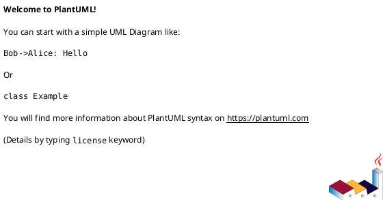

# 머신러닝 기반 데이터 카탈로그

## 1. 개요

본 문서는 작업 관리 설계 문서로 유스케이스, 인터페이스, 시퀀스, 클래스, 데이터베이스 설계서를 포함한다.

## 2. 요구사항

## 3. Usecase

```plantuml
@startuml
allowmixing
left to right direction

@enduml
```

## 3. 클래스

| 유형                    | 기호    | 목적                                                                   |
| ----------------------- | ------- | ---------------------------------------------------------------------- |
| 의존성(Association)     | `-->`   | 객체가 다른 객체를 사용함. ( A `-->` B)                                |
| 확장(Inheritance)       | `<\|--` | 계층 구조에서 클래스의 특수화. (부모 `<\|--` 자식)                     |
| 구현(Implementation)    | `<\|..` | 클래스에 의한 인터페이스의 실현. (Interface `<\|..` Class)             |
| 약한 의존성(Dependency) | `..>`   | 더 약한 형태의 의존성. A 클래스 메소스 파라미터로 B를 사용( A `..>` B) |
| 집합(Aggregation)       | `o--`   | 부분이 전체와 독립적으로 존재할 수 있음( 클래스 `o--` 부분 클래스)     |
| 컴포지션(Composition)   | `*--`   | 부분이 전체 없이 존재할 수 없음( 클래스 `*--` 부분 클래스)             |

```plantuml
@startuml
allowmixing
left to right direction

@enduml
```

## 4. 시퀀스



```plantuml
@startuml

@enduml
```

## 5. 인터페이스

현 시점(25.02.07)에서는 인터페이스를 모두 정의할 수 없어 개발 과정에서 추가한다.  

## 6. 데이터베이스

- 작업히스토리
  - 내 작업 상태  
    - 모니터링은 작업 정보를 수신하여 관리해주면 됨.
    - Job Create : service A : Monitoring
    - Job Success : service A : Monitoring
    - Job Error : service A : Monitoring
  - 상태 조회
    - UI <- Monitoring
  - 명령 수행  
    - start, restart, stop, remove  