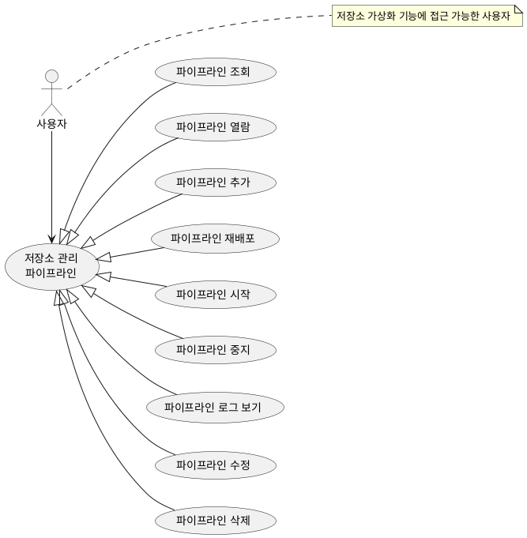
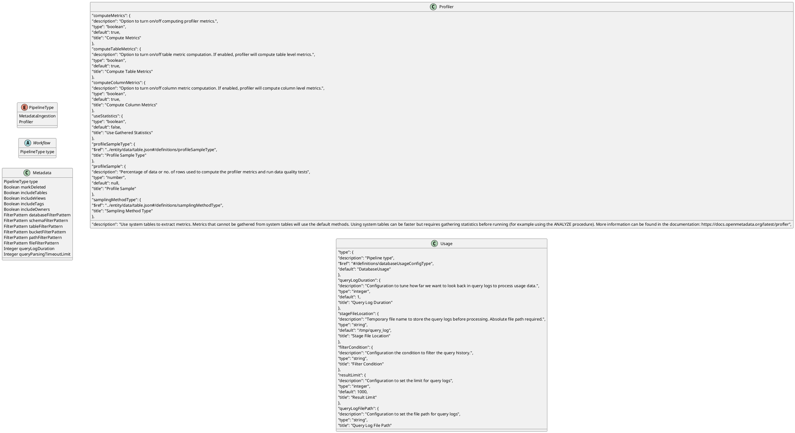
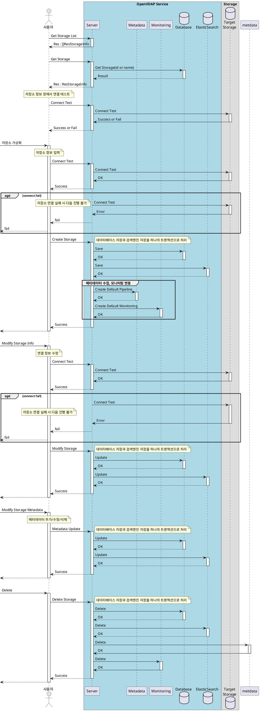
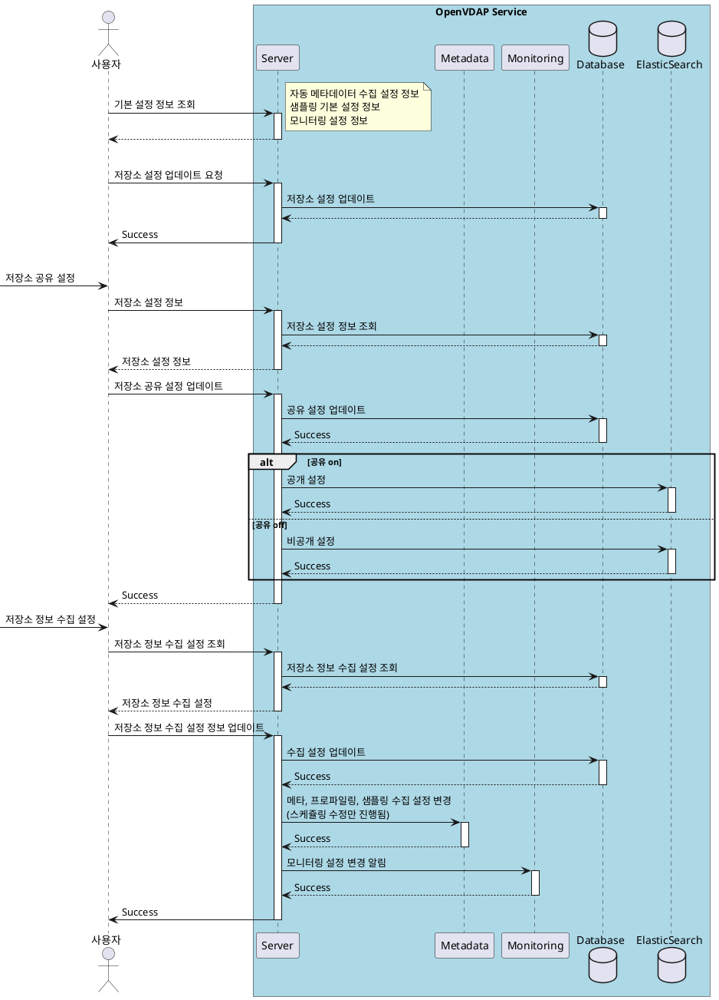

# 파이프라인

## 1. 개요

본 문서는 저장소로부터 메타데이터 수집하여 제공하는 프로세스의 설계 문서로 유스케이스,
인터페이스, 시퀀스, 클래스, 데이터베이스 설계서를 포함한다.

## 2. 요구사항

일반 요구사항

1. 다양한 데이터 저장소로부터 메타데이터를 수집하여 제공할 수 있는 기능  
   3차년도 목표 7종
   - MySQL
   - MariaDB
   - PostgreSQL
   - MinIO
   - Oracle
   - Hadoop
   - ...
2. 데이터 종류
   1. Table
   2. CSV
   3. WORD, HWP
   4. 이미지
   5. 영상
3. 메타데이터 수집
4. 데이터 메트릭 수집(프로파일링)
5. 데이터 퀄리티(테스트)
6. 샘플 데이터 수집
   1. 수집 방식
   2. 샘플 데이터 크기
7. 로그 수집(openmetadata 의 usage, lineage) - ??
   1. 이 기능의 경우 각 데이터베이스에 추가적인 설정이 필요함.

보안 요구사항

1. 거버넌스 : 접근 제어
   1. 저장소 관리(파이프라인) 기능에 대한 접근 제어  

- 데이터 샘플링  
  - 테이블
    - 라인, 퍼센트
    - random, system, ...
  - 문서
    - 페이지
    - first, random, ...
  - 이미지
    - ...
  - 영상
    - time
    - first, random, ...
  - 데이터 셋
    - ...
## 3. Usecase



## 4. 클래스

**참고용 OpenMetadata Pipeline 객체**  


| 유형                    | 기호    | 목적                                                                   |
| ----------------------- | ------- | ---------------------------------------------------------------------- |
| 의존성(Association)     | `-->`   | 객체가 다른 객체를 사용함. ( A `-->` B)                                |
| 확장(Inheritance)       | `<\|--` | 계층 구조에서 클래스의 특수화. (부모 `<\|--` 자식)                     |
| 구현(Implementation)    | `<\|..` | 클래스에 의한 인터페이스의 실현. (Interface `<\|..` Class)             |
| 약한 의존성(Dependency) | `..>`   | 더 약한 형태의 의존성. A 클래스 메소스 파라미터로 B를 사용( A `..>` B) |
| 집합(Aggregation)       | `o--`   | 부분이 전체와 독립적으로 존재할 수 있음( 클래스 `o--` 부분 클래스)     |
| 컴포지션(Composition)   | `*--`   | 부분이 전체 없이 존재할 수 없음( 클래스 `*--` 부분 클래스)             |

  - 메타데이터(프로파일링) 수집 설정  
    - Include / Exclude
  - 샘플 수집 설정  
    - 수집 방식
    - 샘플 데이터 사이즈  
  - 모니터링 설정  
    - 모니터링 방식  
    - 모니터링 주기  



```plantuml
@startuml
left to right direction

class CreateWorkflow {
  String name
  String displayName
  String description
    "workflowType": {
      "description": "Type of the workflow.",
      "$ref": "../../entity/automations/workflow.json#/definitions/workflowType"
    },
    "request": {
      "description": "Request body for a specific workflow type",
      "oneOf": [
        {
          "$ref": "../../entity/automations/testServiceConnection.json"
        }
      ]
    },
    "status": {
      "description": "Workflow computation status.",
      "$ref": "../../entity/automations/workflow.json#/definitions/workflowStatus",
      "default": "Pending"
    },
    "response": {
      "description": "Response to the request.",
      "oneOf": [
        {
          "$ref": "../../entity/services/connections/testConnectionResult.json"
        }
      ]
    },
    "owners": {
      "description": "Owners of this workflow.",
      "$ref": "../../type/entityReferenceList.json",
      "default": null
    },

  }
class  workflow {
  UUIR id
  String name
    "openMetadataWorkflowConfig": {
      "description": "OpenMetadata Ingestion Workflow Config.",
      "type": "object",
      "properties": {
        "source": {
          "$ref": "#/definitions/source"
        },
        "processor": {
          "$ref": "#/definitions/processor"
        },
        "sink": {
          "$ref": "#/definitions/sink"
        },
        "stage": {
          "$ref": "#/definitions/stage"
        },
        "bulkSink": {
          "$ref": "#/definitions/bulkSink"
        },
        "workflowConfig": {
          "$ref": "#/definitions/workflowConfig"
        },
        "ingestionPipelineFQN": {
          "description": "Fully qualified name of ingestion pipeline, used to identify the current ingestion pipeline",
          "type": "string"
        },
        "pipelineRunId": {
          "description": "Unique identifier of pipeline run, used to identify the current pipeline run",
          "$ref": "../type/basic.json#/definitions/uuid"
        }
      },
      "required": ["source", "workflowConfig"],
      "additionalProperties": false
    }
  },
}

@enduml
```

## 5. 시퀀스

- 저장소 관리  
  - 리스트 조회
  - 저장소 정보
    - 연결테스트  
  - 추가
    - 연결테스트  
  - 수정
    - 연결테스트  
  - 저장소 메타데이터 수정
  - 삭제  
  

  
- 설정  
  - 기본설정  
    - 조회  
    - 수정  
      - 메타데이터 수집  
      - 샘플링  
      - 모니터링  
  - 검색/공유 설정  
  - 메타데이터(프로파일링) 수집 설정  
  - 샘플 수집 설정  
  - 모니터링 설정  



## 6. 인터페이스 설계

> 본 문서에서는 현 시점(25.02.06)에서는 필요한 인터페이스만을 나열한다.
> 상세한 내용에 대해서는 Swagger를 활용하거나 본 문서에 내용을 업데이트 한다.  

### 6.1. 저장소 관리

**저장소 리스트**  
**저장소 정보 조회**  
**연결테스트**  
**추가**  
**연결정보 수정**  
**메타데이터 설정(업데이트)**  
**삭제**  

### 6.2. 저장소 설정

- 설정  
  - 기본설정  
    - 조회  
    - 수정  
      - 메타데이터 수집  
      - 샘플링  
      - 모니터링  
  - 검색/공유 설정  
  - 메타데이터(프로파일링) 수집 설정  
  - 샘플 수집 설정  
  - 모니터링 설정  

## 7. 데이터베이스

Database, Storage 가 분리되어 있었으나 통합.
UserDefine Driver를 사용할 수 있는 구조로 변경.

**StorageCommonConfiguration**  

| Column       | Data Type | Constraints                      | Desc                                   |
| ------------ | --------- | -------------------------------- | -------------------------------------- |
| `id`         | UUID      | PRIMARY_KEY                      | 아이디                                 |
| `json`       | JSON      | NOT NULL                         | 저장소 공통 설정 정보                  |
| `version`    | INT       | NOT NULL                         | 저장소 업데이트 정보 |
| `updated_at` | DATETIME  | NOT NULL, CURRENT_TIME ON UPDAET | 저장소 공통 설정 정보 업데이트 시간    |
| `updated_by` | UUID      | NOT NULL, FK('user.id')          | 저장소 공통 설정 정보 변경 사용자 정보 |

**Storage**  

| Column | Data Type | Constraints | Index | Desc               |
| ------ | --------- | ----------- | :---: | ------------------ |
| `id`   | CHAR(64)  | PRIMARY KEY |   v   | 저장소 고유 식별자 |
|        |           |             |       |                    |

**Driver**  
**Metadata**  
**Tag**  
**Glossary**  
