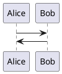
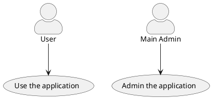
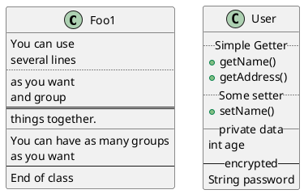

# VSCode를 이용한 문서 편집 환경 설정

## 개요

설계 문서를 작성하는데 마우스로 그림 그리다가 손목이 아파 키보드로 다 하고 싶었다.  
내가 기억하는 이미지는 `그림이 맘에 들지 않아` 였는데 이제는 괜찮아 보인다. (손목이 아파서 그런가?)  

## 설치

- 준비물  
  - VSCode  
  - Java  
    참고로 최근에는 Eclipse 재단의 Temurin을 설치하여 사용한다.  
  - graphviz  
    `brew install graphviz`  

- 플러그인  
  - Markdown All in One
  - Markdown Preview Enhanced
  - Markdown Table
  - Markdown Table Prettifier
  - Markdown TOC
  - PlantUML
  - PlantUML Grammar
  - PlantUML Syntax

- 경로설정  
    Markdown Preview 에서 `plantuml.jar` 파일의 위치를 필요로한다.
    `cmd + shift + p` 을 이용해 명령창을 열어 'open user setting json'을 검색해 JSON 다음 내용을 입력한다.  

    > `plantuml.jar` 는 수동으로 설치할 수 있으나, `PlantUML` 플러그인 섪치 과정에서 설치됨.
    > 따라서 `plantuml.jar` 는 `PlantUML` 가 설치된 vscode 의 extension 디렉토리에 위치한다.
    > ex > `/Users/${User}/.vscode/extension/jebbs.plantuml-{version}/plantuml.jar`
    > 업데이트되면 바뀔 수 있는데 그건 잘.. 알아서..

    ```json
    {
        "markdown-preview-enhanced.plantumlJarPath": "/Users/.../.vscode/extensions/jebbs.plantuml-2.18.1/plantuml.jar"
    }
    ```

## 사용

이제 markdown 작성 시 다음과 같이 codeblock 표시 백틱 뒤에 `plantuml`을 붙여준다.

````text


---



---



## PlantUML 작성 가이드

[PlantUML 사이트](https://plantuml.com/ko/)
