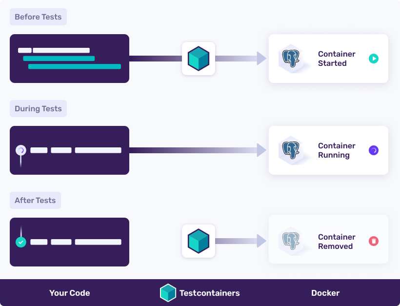
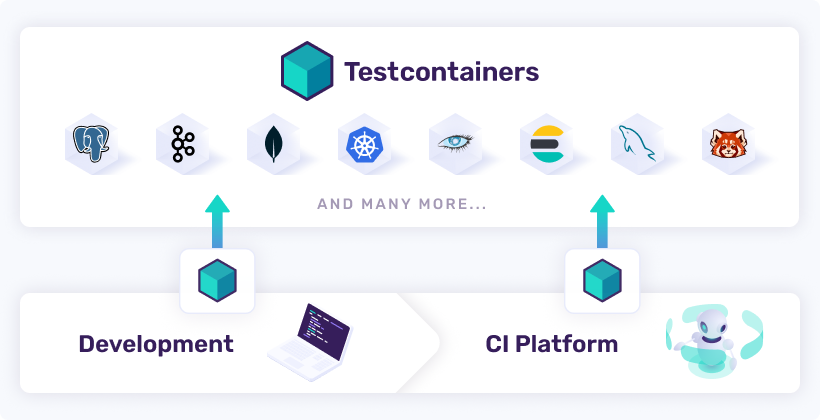

# Introducing Testcontainers

## 1. 개요  

현대 소프트웨어 시스템은 다양한 기술과 도구를 활용하여 복잡한 비즈니스 문제를 해결합니다. 요즘에는 어떤 소프트웨어 
시스템도 고립되어 작동하는 경우가 거의 없습니다. 그들은 일반적으로 데이터베이스, 메시징 시스템 및 캐시 공급자와 통신하고 
다른 많은 타사 서비스와 상호 작용합니다. 오늘날과 같이 경쟁이 치열한 시장에서는 시장 출시 시기가 매우 중요합니다. 
기업은 가능한 한 빨리 제품을 시장에 출시하고 피드백을 받고 이를 반복하기를 원합니다. 이러한 민첩성 측면을 달성하려면 견고한 
CI/CD(지속적 통합 및 지속적 배포) 프로세스가 있어야 합니다. CI/CD 프로세스의 중요한 부분은 애플리케이션 동작의 정확성을 
보장하기 위한 자동화된 테스트입니다.

단위 테스트는 데이터베이스, 메시징 시스템 등과 같은 외부 서비스로부터 격리하여 비즈니스 논리 및 구현 세부 사항을 테스트하는데 
도움이 되지만, 애플리케이션 코드의 대부분은 여전히 ​​해당 외부 서비스와 통합되어 있을 수 있습니다. 애플리케이션에 대해 완전히 
확신하려면 단위 테스트와 함께 통합 테스트를 작성하여 애플리케이션이 완벽하게 작동하는지 확인해야 합니다.

역사적으로 통합 테스트는 "통합 테스트 환경"을 유지하는 데 어려움이 있기 때문에 어려운 것으로 간주됩니다. 사전 프로비저닝된 
인프라와의 통합 테스트는 다음과 같은 이유로 어렵습니다.

* 테스트를 실행하기 전에 인프라가 가동되어 실행 중이고 데이터가 원하는 특정 상태로 사전 구성되어 있는지 확인해야 합니다.
* 여러 빌드 파이프라인이 병렬로 실행되는 경우 하나의 테스트 실행이 다른 테스트 데이터를 방해할 수 있으므로 불안정한 
  테스트 또는 기타 테스트 오염 문제가 발생할 수 있습니다.

위에서 언급한 문제로 인해 일부 사람들은 통합 테스트에 필요한 서비스의 메모리 내 또는 내장형 변형이 포함된 서비스를 사용하는 
쪽으로 기울었습니다. 예를 들어 애플리케이션이 Postgres 데이터베이스를 사용하는 경우 H2 인메모리 데이터베이스가 대신 사용됩니다. 
이는 통합 테스트를 전혀 작성하지 않는 것에 비해 개선된 것이지만 해당 서비스의 모의 또는 메모리 내 버전을 사용하면 다음과 같은 문제가 발생합니다.

* **인메모리 서비스에는 프로덕션 서비스의 모든 기능이 없을 수도 있습니다.** 예를 들어, 애플리케이션에서 Postgres/Oracle 
  데이터베이스의 고급 기능을 사용하고 있을 수 있습니다. 그러나 H2는 통합 테스트에 사용하기 위해 이러한 기능을 모두 지원하지 
  않을 수 있습니다. 최악의 경우 개발자는 해당 대체 기능을 사용하여 이 기능을 복제하는데 따른 문제로 인해 해당 시스템의 
  강력한 기능을 채택하는 데 주의를 기울이게 될 수도 있습니다.

* 인메모리 서비스는 피드백 주기를 지연시킵니다 . 예를 들어, SQL 쿼리를 작성하고 제대로 작동하는 H2 인메모리 데이터베이스로 
  테스트했을 수 있습니다. 그러나 애플리케이션을 배포한 후에 쿼리 구문이 H2에서는 제대로 작동하지만 프로덕션 데이터베이스 
  Postgres/Oracle에서는 작동하지 않는다는 것을 알 수 있습니다. 아니면 이 문제를 완화하기 위해 여러 가지 다른 구현을 
  유지해야 합니까? 이러한 종류의 테스트는 변경 사항에 대한 피드백 주기를 더 빠르게 하는 테스트의 목적을 사실상 무효화합니다.

이제 실제 서비스와의 통합 테스트가 가능할 뿐만 아니라 단위 테스트 작성만큼 쉬운 멋진 Testcontainers 세계에 오신 것을 환영합니다 🙂

## 2. 테스트 컨테이너란?

Testcontainers는 Docker 컨테이너에 래핑된 실제 서비스와의 통합 테스트를 부트스트래핑하기 위한 쉽고 가벼운 
API를 제공하는 테스트 라이브러리입니다. Testcontainers를 사용하면 모의 서비스나 메모리 내 서비스 없이 프로덕션에서 
사용하는 것과 동일한 유형의 서비스와 통신하는 테스트를 작성할 수 있습니다.

일반적인 Testcontainers 기반 통합 테스트는 다음과 같이 작동합니다.

* 테스트 전
  * Testcontainers API를 사용하여 필요한 서비스(데이터베이스, 메시징 시스템 등) Docker 컨테이너를 시작합니다.
  * 이러한 컨테이너화된 서비스를 사용하려면 애플리케이션 구성을 업데이트하세요.

* 테스트 중:
  * 테스트는 이러한 컨테이너화된 서비스를 사용하여 실행됩니다.

* 테스트 후:
  * 테스트 컨테이너는 테스트가 성공적으로 실행되었는지 또는 테스트 실패가 있는지 여부에 관계없이 해당 컨테이너를 삭제합니다.

Testcontainers 기반 테스트를 실행하기 위한 유일한 요구 사항은 Docker-API 호환 컨테이너 런타임이 있어야 한다는 것입니다. 
Docker Desktop이 설치되어 실행 중이면 바로 사용할 수 있습니다. Testcontainers가 지원하는 Docker 환경에 대한 자세한 내용은 
https://www.testcontainers.org/supported_docker_environment/ 를 참조하세요.

## 3. Testcontainers는 어떤 문제를 해결할 수 있나요?  

Testcontainers는 실제 서비스를 사용하여 애플리케이션을 테스트하고 코드 변경에 대한 신뢰 수준을 높여 위에서 언급한 
통합 테스트 문제를 해결합니다.

테스트 컨테이너를 사용하여:

* 사전 프로비저닝된 통합 테스트 인프라가 필요하지 않습니다. Testcontainers API는 테스트를 실행하기 전에 필요한 서비스를 제공합니다. 
  인프라를 정의하는 코드는 실제 테스트 코드 바로 옆에 있습니다.
* 각 파이프라인은 격리된 서비스 세트로 실행되므로 여러 빌드 파이프라인이 병렬로 실행되는 경우에도 데이터 충돌 문제가 없습니다.
* 단위 테스트를 실행하는 것처럼 IDE에서 바로 통합 테스트를 실행할 수 있습니다. 변경 사항을 푸시하고 CI가 통합 테스트를 실행할 때까지 
  기다릴 필요가 없습니다.
* 테스트 실행 후 Testcontainers는 자동으로 컨테이너를 정리합니다.

Java, .NET, Go, NodeJS, Rust, Python 등 널리 사용되는 프로그래밍 언어와 함께 Testcontainers를 사용할 수 있으며 
앞으로 더 많은 언어 지원도 가능합니다.