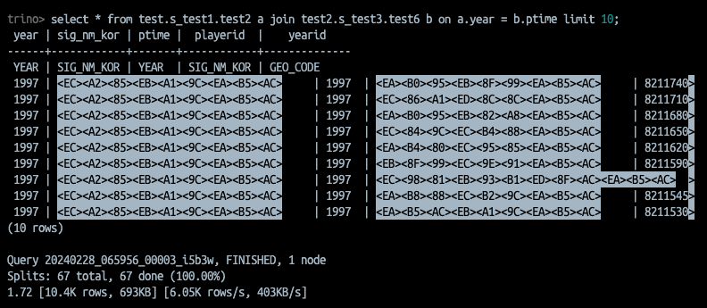

# Trino

기존 Presto 오픈소스를 리브랜딩 한 것

거대한 양의 데이터를 분산된 쿼리로 동작하기 위한, 분산 SQL 쿼리 엔진 툴

❖ 주의: 여러 커뮤니티에서 Trino 가 Database 라고 불리는 경우가 있는데, Trino 는 DB 를 대체하는게 아니다. Online Transaction Processing(OLTP) 를 조작하게 디자인
된것이 아니다.

❖ OLTP:

# Architecture

여러 서버를 통해 데이터를 분산 처리 하는 분산 쿼리 엔진

Server 에는 2가지 타입이 있다.

## Cluster

한개의 coordinator 와 여러 workers 로 cluster 한개 구성

User 는 Coordinator 와 연결한다.

## Server Type

- Coordinator
    - 구문 분석, 쿼리 계획, worker 노드 관리
- Worker
    - Tasks 실행, 데이터 처리

REST API 로 Worker, Coordinator 와 통신

연결된 커넥터에서 데이터를 가져오고 서로 중간 데이터를 교환

# DataSources

- Connector
    - 모든 카탈로그의 데이터는 특정 커넥터와 연결된다.
    - 둘 이상의 카탈로그가 동일한 커넥터를 사용하여 서로 다른 두 인스턴스를 연결 할 수 있다.
- Catalog
    - 카탈로그 안에 스키마가 있다.
    - 커넥터를 통해 데이터 소스를 참조한다.
- Schema
    - 스키마안에 테이블이 있다.
- Table
    - 테이블은 컬럼과 타입들이 있는 정렬되지 않은 행 집합

## Query Execution Model

- Statement
    - ANSI SQL 호환
    - Trino 에 전달되는 SQL 텍스트
- Query
    - statement 를 분석 할 때 쿼리로 변환하고 분산 쿼리 계획을 생성하면 Trino worker 에서 실제로 실행된다.
- Stage
    - 쿼리를 실행할 때 stage 로 분할하여 실행한다.
- Task
    - stage 자체는 Trino worker 에서 실행되지 않는다.
    - Stage 는 Task 로 분할되어 실제 Worker 에서 실행된다.
- Split
    - Task들은 분할 되어 동작한다.
    - 가장 낮은 단계에서 커넥터에서 split 을 통하여 데이터를 검색하고, 상위 수준의 중간단계는 그 아래 단계에서 데이터 검색한다.
- Driver
    - 드라이버는 하나의 입력과 하나의 출력이 있다.
    - Trino Architecture 에서 가장 낮은 수준에 있는 병렬 처리이다.
    - Task 에는 하나 이상의 병렬 드라이버가 포함된다.
- Operator
    - 데이터를 소비, 변환, 생성한다.
- Exchange
    - 쿼리에서 노드간의 데이터를 전송한다.

## Client

- CLI
- JDBC driver
- python, java, etc.

## States

| QUEUED    | 큐에 대기중인 상태                     |
|-----------|--------------------------------|
| PLANNING  | 쿼리 계획중인 상태                     |
| STARTING  | 쿼리 실행이 시작하는 상태                 |
| RUNNING   | 쿼리에 실행중인 Task 가 존재하는 상태        |
| BLOCKED   | 쿼리가 차단되고 메모리, 버퍼 공간 등을 기다리는 상태 |
| FINISHING | 쿼리가 커밋이 진행중이고 완료되는 상태          |
| FINISHED  | 쿼리 실행이 완료된 상태                  |
| FAILED    | 쿼리 진행이 실패한 상태                  |

# Install

## Docker

```bash
docker run --name trino -d \
    -p 8888:8888 \
    -v /Users/fwani/Documents/develop/Dolphin/config/trino:/etc/trino \
    trinodb/trino
```

## Config

docker 의 경우 `/etc/trino` 경로를 베이스로 아래 파일 세팅 필요

- Node Properties
    - 각 노드에 특정 환경 설정
    - `node.properties`
- JVM config
    - CLI option for JVM
    - `jvm.config`
- config properties
    - Trino server 의 설정 - [Properties reference](https://trino.io/docs/current/admin/properties.html)
    - `config.properties`
- catalog properties
    - Connectors (data sources) 의 설정
    - `catalog` directory 기준,`catalog/jmx.properties` , `catalog/...properties`

## Test

- CLI
    - cli 이용시 한글은 이상한 문자로 출력됨

```bash
# check version
trino --version

# connect
trino http://localhost:8888
```



# 의문점

- catalog, schema 가 짝을 이루지 않아도 되는가?
    - 짝을 이루지 않아도 된다.
    - ex) `A_catalog.a_schema, A_catalog.b_schema`  같이 조합 가능
    - catalog = 연결정보
    - schema = 유저?
- view 를 생성 할 때, catalog, schema 가 필요한데 구성을 어떻게?
- select 를 할때, catalog, schema 지정이 필수로 필요한 것으로 보이는데..
    - `select * from <catalog>.<schema>.<table or view>`
    - `모델명` - `<catalog>.<schema>.<table or view>` 를 매핑 할 수 있는 구조를 만들어야 함
- trino 는 hive 를 대체하려고 나온건데 connector 에 hive 가 왜 있는가?
    - trino 를 사용시 hive 의 server2 를 사용하는게 아니라, metastore 만 사용한다.
    - 실제로, Trino를 사용하는 경우, HiveMetastore만 따로 설치해, 스토리지는 S3, 테이블스키마는 Hivemetastore를 사용하는 경우가 많다.-
- `create view` 는 hive connector 에서만 동작한다?
    - 테스트는 postgresql, hive 두개만 해보았는데, postgresql 커넥터를 사용하는 경우 create view 기능을 쓸 수 없다.
    - hive 커넥터를 이용해서 view 를 생성하면 hive metastore TBLS 테이블에 에 등록이 된다.
