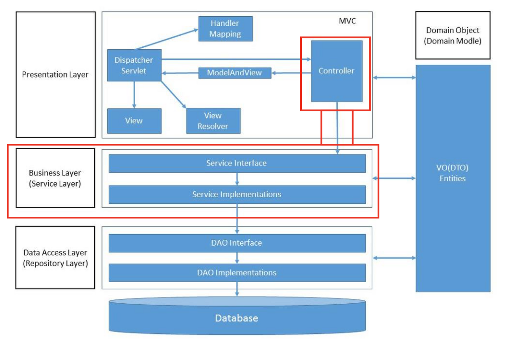
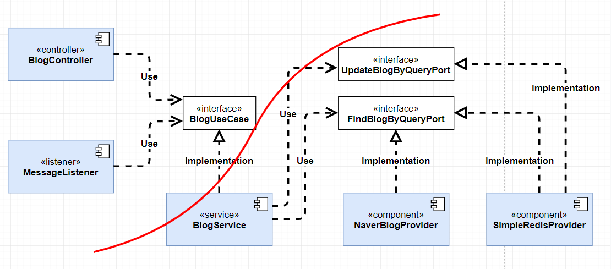

# Web-Server Platform Sample (Golang 1.16)

Go 언어를 이용한 웹서버 샘플  

## 개요  
---
설계 바탕이 된 레이어 구조, 적용 예, Test 까지를 다룬다. 

## Layered Architecture
---
레이어라는 말에서 알 수 있듯 각 레이어(계층)는 동일한 관심사(역할)의 집합으로 이루어져 있고, 
겹겹이 쌓아 올린 구조라는 것을 알 수 있을 것 입니다. 그리고 이 계층 구조가 의미하는 
다른 부분을 생각해 본다면 계층 간 접근/제어에 대한 부분으로 하위(종속) 계층으로만 
컨트롤될 수 있도록 하는 설계 단계에서부터의 제한이라고 볼 수 있습니다.   
예를 들어 상위 계층에서 하위 계층으로 접근은 가능하지만 하위 계층에서 상위 계층으로의 
조작 코드는 작성하면 안 됩니다.  

각 레이어를 분리하고 각 레이어의 역할을 구체화해 규칙을 준수한다면, 
기능/사람의 변경에도 유연하게 대처할 수 있어 어려움(비용)이 줄어들 수 있을 것 입니다.  

### Software Architecture is The Art Of Drawing Lines That I Call Boundaries. - 로버트C. 마틴  
---
소프트웨어 아키텍처는 경계라는 선을 그리는 예술이다. 이러한 경계들은 소프트웨어 요소들을 서로 
분리하고 디펜던시 의존성을 제한한다. 아키텍트의 목표는 필요한 시스템을 구축하고 유지하는 데 
필요한 인적 리소스를 최소화하는 것이다. 예를 들어서, 비즈니스 유스케이스와 데이터베이스 사이의 
경계선을 그릴 수 있다. 그 선은 비즈니스 규칙이 데이터베이스에 대해 전혀 알지 못하도록 막았다. 
그 결정은 데이터베이스의 선택과 실행을 뒤로 늦출 수 있었고, 데이터베이스에 의존한 문제가 
발생하지 않았다. 중요한 것과 중요하지 않은 것 사이에 선을 긋는다. UI는 비즈니스 규칙에 영향을 
미치지 않아야 하고, 데이터베이스는 UI에 영향을 미치지 않아야 한다. 물론, 대부분의 우리들은 
데이터베이스는 비즈니스 규칙과 불가피하게 연결되어 있다고 믿고 있다. 하지만, 데이터베이스는 
비즈니스 규칙이 간접적으로 사용할 수 있는 도구일 뿐이다. 그래서, 우리는 인터페이스 뒤에 
데이터베이스를 놓을 수 있도록 설계를 해야 한다. 실제로 소프트웨어 개발, 기술의 역사는 확장 
가능하고 유지 관리 가능한 시스템 아키텍처를 구축하기 위해 플러그인을 만드는 방법에 관한 
이야기이다. 핵심 비즈니스 규칙은 다른 컴포넌트들과 독립적으로 유지된다.  - 로버트 C. 마틴

## layered Architecture의 적용  
---
* 3tier Architecture : Clean architecture  
	전자정부 프레임워크로 국내에서 가장 많이 사용하는 구조  
	- presentation layer  
      controllers 폴더  
	- business layer  
      services 폴더  
	- data access layer  
      repositories폴더  
* Presentation layer  
	HTTP Framework(Echo, Gin?)로부터 최초로 호출되는 API엔드 포인트  
	- 클라이언트에서 보내온 데이터의 변환(Param Data)  
	- 기본적인 인증과 요청 내용 검증  
	- 수행 결과를 클라이언트에 반환  
* Business layer   
	- 비즈니스 로직을 작성한다.  
* Data access layer   
	- 데이터(데이터 정책(Unique, Max, Min))과 관련된 비즈니스 로직(메서드)  
* Entities => model 폴더  
    - 레이어 전체에서 사용되는 데이터의 구조  
    - 메서드를 포함하는 객체일 수도 있고, 단순 데이터 구조일 수도 있다.  
* Infrastructure ( Framework Drivers )  
	- 이 영역은 일반적으로 데이터베이스 및 웹 프레임워크와 같은 도구로 구성된다. 
	- HTTP Framework : Server  
	- Database(ORM) : datastore  
	- ETC...  

참고용 그림( 이 프로젝트 코드와 관계는 없다. )

## 클린 아키텍처, 디펜던시 의존성  
---
클린 아키텍처에서 가장 중요한 개념은 디펜던시(의존성) 규칙이다.  
우리는 이 문서에서 설명한 계층 외 추가 계층을 필요로 할 수 있다. 그러나, 디펜던시 규칙은 항상 
적용이 된다. 규칙을 준수하는 것은 어렵지 않으며, 앞으로 많은 고민들을 해결해 줄 것이다. 
소프트웨어를 계층으로 분리하고, 디펜던시 규칙을 준수함으로써, 데이터베이스나 웹 프레임워크와 같은 
시스템이 외부 부분들이 쓸모없게 될 때, 그러한 쓸모없는 요소들을 최소한의 작업으로 대체할 수 있을 것이다. 

### 예제코드와 설명  
[코드 작성 방법](Sample.md)  
DB에서부터 PATH등록까지 일련의 과정을 설명한다.  

- 참고용 그림  
    
	위와 같이 상위 계층은 UseCase를 통해 하위 계층을 잘 알고 있어야 하지만 
	UseCase를 구현하는 하위 계층에서는 기능 구현에 초점이 맞추어지며 상위 계층에 대해서 
	인지하지 않게 된다. 그리고 Golang 특성 상 이런 구조로 작성 시 각 레이어(패키지 디렉토리)에서 
	다른 계층(패키지) Import가 발생하지 않는다.  

